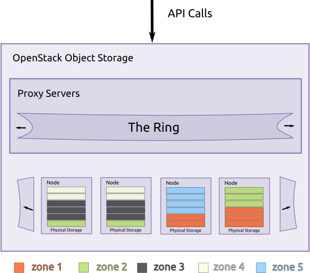
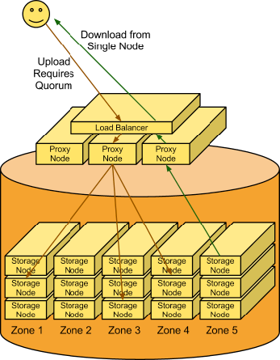

# Introduction to Object Storage

OpenStack Object Storage (swift) được sử dụng cho redundant, scalable data storage sử dụng các cụm máy chủ được tiêu chuẩn hóa để lưu trữ hàng petabytes dữ liệu có thể truy cập. Nó là 1 hệ thống kho lưu trữ dài hạn cho 1 khối lượng lớn dữ liệu tĩnh, thứ mà có thể được thu thập và cập nhật. Object Storage sử dụng 1 kiến trúc phân tán và không có điểm trung tâm để điều khiển, cung cấp khả năng co giãn linh hoạt hơn, khả năng chịu lỗi cao hơn, và hiệu năng tốt hơn. Objects được ghi lên nhiều thiết bị phần cứng, với OpenStack chịu trách nhiệm cho việc đảm bảo nhân bản dữ liệu và tính chính xác xuyên suốt cluster. Storage clusters co giãn theo chiều ngang bằng cách thêm/bớt các nodes mới. Khi 1 node fail, OpenStack nhân bản nội dung của nó sang 1 node healthy khác. Vì OpenStack sử dụng software logic để đảm bảo nhân bản và phân tán dữ liệu giữa nhiều thiết bị, các phần cứng rẻ tiền do đó có thể thay thế cho các thiết bị đắt tiền.

Object Storage là lý tưởng cho việc tiết kiệm chi phí, mở rộng theo chiều ngang. Nó cung cấp 1 nền tảng lưu trữ hoàn toàn phân tán, có thể truy cập API, mà có thể được tích hợp thẳng vào các ứng dụng hoặc sử dụng cho backup, archiving, và data retention.

# Feature and Benefits

|Fetures|Benefits|
|:-|:-|
|Leverages commodity hardware|No lock-in, lower price/GB|
|HDD/node failure agnostic|Self-healing, reliable, data redundancy protects from failures|
|Unlimited storage|Large and flat namespace, highly scalable read/write access, able to serve content directly from storage system|
|Multi-dimensional scalability|Scale-out architecture: Scale vertically and horizontally-distributed storage. Backs up nd archives large amounts of data with linear performance|
|Account/container/object structure|No nesting, not a traditional file system: Optimized for scale, it scales to multiple petabytes and bilions of objects|
|Built-in replication 3X + data redundancy (RAID is 2X)|A configurable number of accounts, containers and object copies for high availability|
|Easily add capacity (unlike RAID resize)|Elastic data scaling with ease|
|No central database|Higher performance, no bottlenecks|
|RAID not required|Handle many small, random reads and writes efficiently|
|Built-in management utilities|Account management: Create, add, verify, and delete users; Container management: Upload, download, and verify; Monitoring: Capacity, host, network, log, trawling, and cluster health|
|Drive auditing|Detect drive failures preempting data corruption|
|Expiring objects|Users can set an expiration time or a TTL on an object to control access|
|Direct object access|Enable direct browser access to content, such as for a control panel|
|Realtime visibility into client requests|Know what users are requesting|
|Supports S3 API|Utilize tools that were designed for the popular S3 API|
|Restrict containers per account|Limit access to control usage by user|

# Object Storage characteristics

Đặc tính của Object Storage phải bao gồm những điểm sau:

1. Tất cả objects lưu trữ trong Object Storage đều có 1 URL

2. "Storage Policies" có thể được sử dụng để định nghĩa các level khác nhau của độ bền cho objects lưu trữ trong cụm. Những chính sách này không chỉ hoàn toàn hỗ trợ replicated mà còn cả erasure-coded fragments

3. Tất cả replicas hoặc fragments cho 1 object được lưu trữ ở các zones độc nhất để tăng độ bền và độ sẵn sàng

4. Tất cả objects đều phải có metadata của nó

5. Lập trình viên tương tác với object storage system thông qua RESTful HTTP API

6. Object data có thể được đặt ở bất kỳ đâu trong cluster

7. Cluster mở rộng bằng cách thêm vào các nodes mới mà không phải hy sinh hiệu năng, thứ mà cho phép 1 lối mở rộng storage tuyến tính tiết kiệm chi phí hơn nhiều khi so với fork-lift upgrades

8. Dữ liệu không nhất thiết phải bị chuyển sang 1 hệ thống lưu trữ hoàn toàn mới

9. Các nodes mới có thể được thêm vào cluster mà không bị downtime

10. Các nodes và disks lỗi có thể được thay thế mà không bị downtime

11. Chạy trên nền phần cứng chuẩn doanh nghiệp, chẳng hạn Dell, HP, và Supermicro

Lập trình viên có thể ghi thẳng vào Swift API hoặc sử dụng 1 trong nhiều loại thư viện client mà tồn tại cho tất cả các ngôn ngữ lập trình phổ biến ngày nay, chẳng hạn như Java, Python, Ruby, và C#. Người dùng Amazon S3 và RackSpace Cloud Files có thể rất quen thuộc với Object Storage. Người dùng mới với object storage sẽ phải thay đổi 1 chút về hướng tiếp cận và mindset so với filesystem truyền thống.

# Components

Object storage sử dụng các thành phần sau đây để đem lại tính sẵn sàng cao, độ bền cao, và tính nhất quán cao:

- **Proxy servers**: Xử lý tất cả các API requests đến
- **Rings**: Ánh xạ tên logic của dữ liệu đến vị trí cụ thể trên disks
- **Zones**: Cô lập dữ liệu từ các zones khác nhau. 1 failure trong 1 zone không ảnh hưởng đến các phần còn lại của cluster do dữ liệu nhân bản giữa các zone
- **Accounts and Containers**: Mỗi account và container là các databases riêng biệt mà được phân tán xuyên suốt cluster. 1 account database chứa danh sách các containers trong account đó. 1 container database chứa danh sách các objects trong container đó
- **Objects**: Là dữ liệu đó
- **Partitions**: 1 partition lưu trữ các objects, account databases, và container databases và giúp quản lý vị trí nơi dữ liệu tồn tại trong cluster



## Proxy servers

Proxy servers có thể coi là khuôn mặt đại diện của Object Storage và nó xử lý tất cả các API requests đến. Khi 1 proxy server nhận 1 request, nó xác định storage node dựa trên object's URL, VD: ```https://swift.example.com/v1/account/container/object```. Proxy servers cũng định vị response, xử lý failure, và xác định timestamps.

Proxy servers sử dụng 1 kiến trúc shared-nothing và có thể được mở rộng bao nhiêu cũng được dựa trên projected workloads. Tối thiểu là 2 proxy servers nên được deploy đằng sau 1 bộ cân bằng tải. Nếu 1 proxy server lỗi, cái còn lại sẽ thay thế.

## Rings

1 ring đại diện cho 1 ánh xạ giữa tên của thực thể lưu trữ trong cluster và vị trí vật lý của nó trên disks. Có nhiều rings riêng biệt cho accounts, containers, và objects. Khi các thành phần của hệ thống cần thực hiện 1 hành động trên 1 object, container, hay account, chúng cần phải tương tác với ring tương ứng để xác định vị trí chính xác của dữ liệu trong cluster.

Ring duy trì ánh xạ này sử dụng zones, devices, partitions, và replicas. Mỗi Partition trong ring được nhân bản, theo mặc định, là 3 bản xuyên suốt cluster, và vị trí của partition được lưu trong ánh xạ duy trì bởi ring. Ring cũng chịu trách nhiệm xác định thiết bị nào được sử dụng làm thiết bị chuyển trong trường hợp xảy ra lỗi.

Dữ liệu có thể được cô lập vào các zones trong ring. Mỗi partition replica sẽ cố để nằm tại các zones khác nhau. 1 zone có thể đại diện cho 1 drive, 1 server, 1 tủ rack, 1 switch, hay thậm chí là 1 datacenter.

Các parititons của ring được phân tán giữa tát cả các thiết bị trong Object Storage. Khi các partitions cần được di chuyển (ví dụ, nếu 1 device được thêm vào cluster), ring sẽ đảo bảo rằng ít nhất 1 partition được di chuyển trong 1 thời điểm, và chỉ có 1 replica của 1 partition được di chuyển cùng lúc.

Bạn có thể sử dụng weights để cân bằng sự phân tán của partitions trên các drives trong cluster. Điều này có thể hữu dụng trong những trường hợp như trong cụm có các drives dung lượng khác nhau.

Ring được sử dụng bởi proxy server và một vài tiến trình background (như replication)


Những rings này được quản lý ngoại bộ. Các tiến trình của server không tự mình thay đổi rings, chúng thay vào đó được đưa cho những rings mới đã được sửa đổi bởi các công cụ khác.

Ring sử dụng 1 số lượng bits có thể cấu hình được từ 1 hàm băm MD5 cho 1 path như 1 partition index mà biểu thị cho 1 device. Số lượng bit lưu giữ từ mã băm được biết tới như partition power, và 2 đến partition power chỉ thị partition count. Phân vùng toàn bộ MD5 hash ring cho phép các phần khác của cluster hoạt động theo nhóm items cùng 1 lúc, thứ mà đem lại hiệu suất cao hơn hoặc chí ít là bớt phức tạp hơn là làm việc theo từng item riêng biệt (hoặc với cả cluster 1 lúc)

Một giá trị có thể cấu hình khác là replica count, chỉ thị số lượng partition-device được giao để tạo nên 1 ring. Với 1 partition index, mỗi device của replica sẽ không ở cùng 1 zone với bất kỳ replica device nào khác. Zones có thể được sử dụng để nhóm các devices dựa trên vị trí vật lý, công suất, network, hay bất kỳ thuộc tính nào khác mà có thể cải thiện tính sẵn sàng của nhiều replicas cùng 1 lúc.

## Zones

Object Storage cho phép cấu hình zones để cô lập failure boundaries. Nếu có thể, mỗi data replica sẽ đặt tại 1 zone khác nhau. Ở cấp nhỏ nhất, 1 zone có thể là 1 drive hoặc 1 nhóm của 1 vài drives. Nếu có 5 object storage servers, vậy thì mỗi server sẽ đại diện cho zone của nó. Với các triển khai lớn hơn thì mỗi rack (hoặc nhiều racks) của object servers, sẽ đại diện cho 1 zone. Mục tiêu của zones là cho phép cluster có thể chịu 1 số lượng trường hợp outage nhất định mà không mất đi bất kỳ replica nào của dữ liệu.


## Accounts and containers

Mỗi account và container là 1 SQLite database riêng biệt mà phân tán xuyên suốt cluster. 1 account database chứa 1 danh sách các containers trong account đó. 1 container database chứa danh sách các objects trong container đó.


Để theo dõi vị trí của object data, mỗi account trong hệ thống có 1 database mà tham chiếu đến tất cả các container của nó, và mỗi container database lại tham chiếu đến mỗi object của nó.

## Partitions

1 partition là 1 tập các dữ liệu đã lưu trữ. Điều này bao gồm account databases, container databases, và objects. Partitions là lõi của hệ thống nhân bản (replication system).

Ta có thể tưởng tượng 1 partition như 1 chiếc thùng di chuyển trong kho trung tâm hoàn thiện đơn hàng. Các đơn hàng riêng lẻ sẽ được ném vào trong thùng. Hệ thống coi chiếc thùng này như 1 thực thể gắn kết khi nó di chuyển trong hệ thống. Một thùng thì dễ xử lý hơn nhiều thứ nhỏ lẻ, nó làm giảm số lượng thành phần phải chuyển động hơn trong hệ thống.

System replicators và object uploads/downloads vận hành trên các partitions. Khi mà hệ thống mở rộng lên, hành vi của nó tiếp tục có thể được tiên đoán vì số lượng partition là cố định.

Triển khai 1 partition có thể khá đơn giản về mặt ý tưởng: 1 partition chỉ là 1 đường dẫn nằm trên 1 disk với bảng băm tương ứng với những gì nó chứa bên trong.


## Replicators

Để đảm bảo 3 copies của dữ liệu ở mọi nơi, replicators liên tục phân tích mỗi partition. Với mỗi partition cục bộ, replicator so sánh nó với các replicated copies ở các zones khác để xem có khác biệt gì không.

Replicator biết được replication nào cần thay thế bởi việc phân tích các hàm băm. 1 tệp băm được tạo ra cho mỗi partition, thứ mà chứa các mã băm của mỗi đường dẫn trong partition. Với mỗi 1 partition nhất định, các tệp băm cho mỗi copies của partition được đưa ra so sánh. Nếu các mã băm khác nhau, vậy thì đã đến lúc để nhân bản rồi.

Đây là lúc mà partitions trở nên có ích. Với ít thứ hơn trong hệ thống, các khối dữ liệu lớn hơn sẽ được vận chuyển (thay vì nhiều kết nối TCP nhỏ nhặt, như vậy sẽ làm giảm hiệu suất) và cũng có 1 số lượng mã băm nhất quán để so sánh.

Cluster đồng bộ dữ liệu một cách dần dần, tức là các dữ liệu cũ có thể được phục vụ từ những partitions mà bỏ lỡ các bản updates, nhưng replication sẽ khiến tất cả các partitions dần hội tụ về dữ liệu mới nhất.


Nếu 1 zone outage, 1 trong những nodes chứa 1 replica sẽ chú ý và chủ động copy dữ liệu đến các vị trí chuyển giao khác.

## Use cases

Phần sau sẽ giới thiệu 1 vài use case cho object uploads và downloads và giới thiệu về các thành phần trong đó.

### Upload

1 client sử dụng REST API để tạo 1 HTTP request PUT 1 object vào 1 container đang tồn tại. Sau khi nhận request, đầu tiên hệ thống sẽ phải tìm ra nơi mà dữ liệu đang an tọa. Để làm điều này, account name, container name, và object name đều được sử dụng để xác định partition chứa dữ liệu đó.

Sau đó 1 lookup trong ring tìm ra storage nodes, nơi chứa partition đang cần. Data sau đó được gửi đến mỗi storage node mà chứa partition này. Ít nhất 2 trong số 3 writes phải được thành công trước khi client được báo rằng Upload này đã thành công.

Tiếp đến, container database được cập nhật bất đồng bộ để phản ánh rằng có 1 object mới ở trong đó.



### Download

1 request gửi tới cho 1 account/container/object. Sử dụng mã băm, partition index sẽ được xác định. 1 lookup trong ring đưa ra storage nodes mà chứa partition cần tìm. 1 request được tạo đến 1 trong các storage nodes để lấy object, và nếu request này fail, request sẽ được gửi đến các nodes khác.