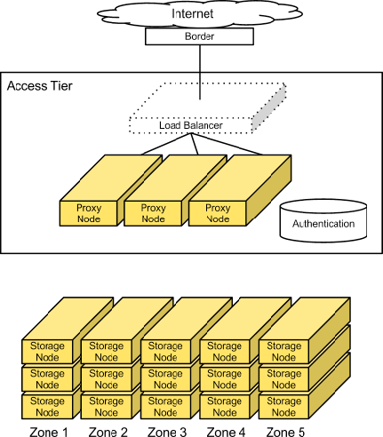
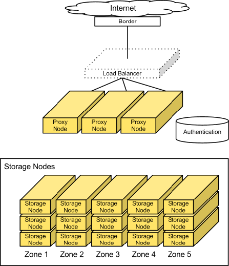

# Cluster Architecture

## Access tier

Các triển khai quy mô lớn sẽ tách ra một tầng truy cập, được coi là cổng trung tâm của hệ thống Object Storage. Tầng truy cập này xử lý các API requests từ clients và di chuyển dữ liệu vào và ra khỏi hệ thống. Tầng này bao gồm các bộ cân bằng tải front-end, ssl-terminators, và authentication services. Nó chạy (phân tán) bộ não của hệ thống Object Storage: các tiến trình proxy server.

Vì các access servers được sắp xếp theo tier của chúng, bạn có thể mở rộng truy cập read/write mà không cần quan tâm tới dung lượng storage. Ví dụ, nếu 1 cluster ở public Internet, yêu cầu SSL termination và thông lượng truy cập dữ liệu lớn, bạn có thể cung cấp nhiều access servers. Tuy vậy, nếu cluster ở private network và sử dụng chủ yếu để lưu trữ dữ liệu dài hạn, bạn có thể chỉ cần 1 ít access servers.

Do đây là 1 dịch vụ storage HTTP có thể đánh địa chỉ, bạn có thể kết hợp với 1 load balancer vào tầng access.

Thông thường, tầng access bao gồm 1 tập các 1U servers. Những máy chủ này chú trọng vào dung lượng RAM và băng thông Internet. Do những hệ thống này xử lý mỗi API request đến, bạn nên cung cấp cho chúng 2 10GbE interfaces, trong đó 1 dành cho incoming front-end requests và cái còn lại cho backend access đến object storage nodes để put và fetch data.

### Factors to consider

Trong đa số các triển khai public (và ngay cả private deployments), bạn nên sử dụng SSL để mã hóa traffic đến client. SSL sẽ tăng kha khá tải của server để hình thành phiên giữa server và clients, thứ mà sẽ phải khiến bạn cung cấp nhiều tài nguyên hơn cho tầng access. SSL có thể không cần thiết trong các triển khai private.

## Storage nodes

Một số điểm cần lưu ý về storage nodes:

- Trong đa số các cấu hình, mỗi zone đều nên có dung lượng lưu trữ tương đồng.
- Storage nodes sử dụng 1 lượng RAM và CPU "hợp lý"
- Meatadata cần phải được sẵn sàng để trả về các objects một cách nhanh chóng
- Object stores chạy services không chỉ để xử lý các request tới từ tầng access, mà còn để chạy replicators, auditors, và reapers
- Bạn có thể cung cấp cho storage nodes 1 interface 1GbE hay 10GbE đều được, tùy thuộc vào hiệu suất mong muốn. Ngoài ra bạn cũng có thể tách riêng 1 interface dùng cho replication traffic

### Factors to consider

Bạn nên ghi nhớ hiệu suất I/O mong muốn cho 1 yêu cầu đơn luồng. Hệ thống này không sử dụng RAID, vì vậy 1 disk xử lý mỗi request cho 1 object. Hiệu suất disk ảnh hưởng đến tỉ lệ phản hồi đơn luồng.

Để đạt được thông lượng cao hơn, hệ thống object storage phải được thiết kế để xử lý nhiều uploads/downloads đồng thời hơn, điều này được ảnh hưởng chủ yếu bởi network I/O capacity.