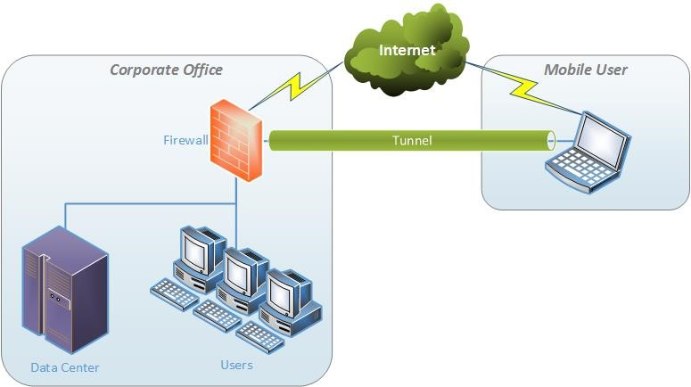
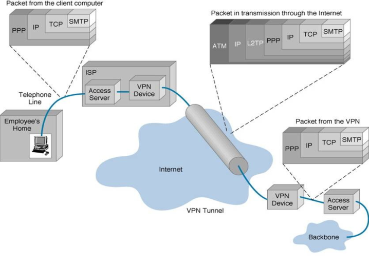
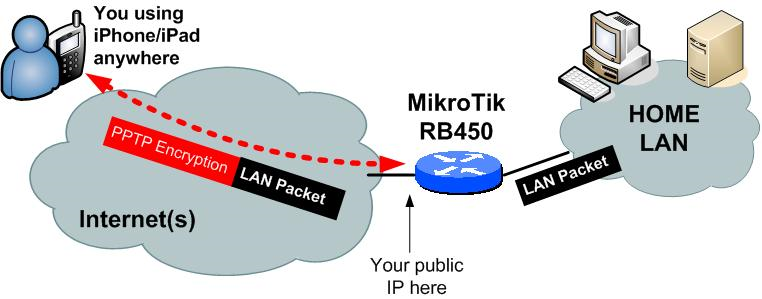
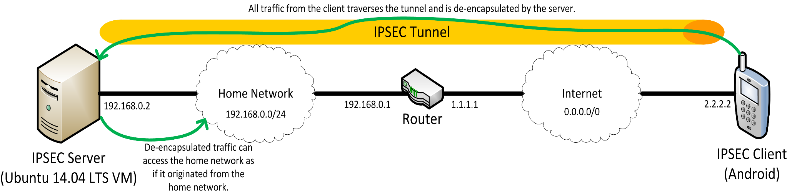
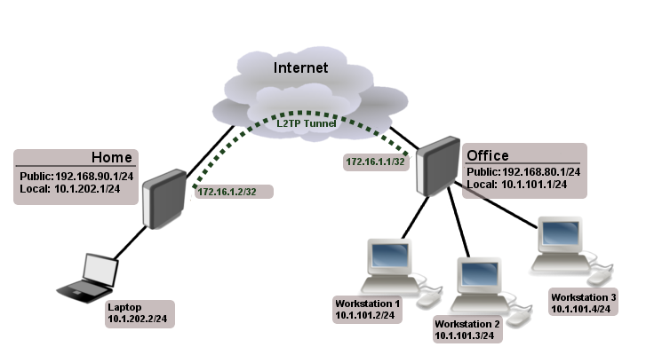

# VPN

## I. Giới thiệu VPN

Nhu cầu truy cập từ xa (ngoài văn phòng) mạng nội bộ để trao đổi dữ liệu hay sử dụng ứng dụng ngày càng phổ biến. Đây là nhu cầu thiết thực, tuy nhiên do vấn đề bảo mật và an toàn thông tin nên các công ty ngại mở mạng hệ thống nội bộ của mình để cho phép nhân viên truy cập từ xa

Trước đây, để truy cập từ xa vào hệ thống mạng, người ta thường sử dụng Remote Access quay số dựa trên mạng điện thoại. Phương thức này vừa tốn kém vừa không an toàn. Hiện nay, để giải quyết vấn đề này, các cá nhân và tổ chức sử dụng công nghệ VPN - công nghệ xây dựng hệ thống mạng riêng ảo nhằm đáp ứng nhu cầu chia sẻ thông tin, truy cập từ xa và tiết kiệm chi phí

VPN cho phép các máy tính truyền thông với nhau thông qua một môi trường chia sẻ nhu mạng Internet nhưng vẫn đảm bảo được tính riêng tư và bảo mật dữ liệu

VPN (Virtual Private Network - Mạng riêng ảo) là công nghệ cung cấp cho người dùng khả năng truy cập vào một mạng riêng (LAN) của các máy tính cá nhân và máy chủ trong mạng riêng đó từ một điểm bên ngoài của mạng đó, và không làm ảnh hưởng đến an ninh bảo mật của mạng

Trong thực tế, VPN là 1 mạng dành riêng để kết nối các máy tính với nhau thông qua đường truyền Internet, là 1 dịch vụ mạng ảo được triển khai trên cơ sở hạ tầng của hệ thống mạng Internet. VPN được dùng để kết nối các văn phòng, chi nhánh, người dùng làm việc ở xa trụ sở chính. Máy tính thông qua mạng riêng ảo (VPN) sẽ nhìn thấy nhau như 1 mạng LAN

VPN có thể được sử dụng để gửi bất kỳ loại dữ liệu nào như voice, video, data

VPN sử dụng kỹ thuật Tunneling Protocols - Đây là kỹ thuật đóng gói một gói tin dữ liệu bên trong một gói tin khác để tạo ra một kênh truyền an toàn. Để cung cấp kết nối giữa các máy tính, các gói thông tin được bao bọc bằng một header có chứa những thông tin định tuyến, cho phép dữ liệu có thể gửi từ máy truyền qua môi trường mạng chia sẻ và đến được máy nhận, như truyền trên các đường ống riêng được gọi là tunnel. Để đảm bảo tính riêng tư và bảo mật trên môi trường chia sẻ này, các gói tin được mã hóa và chỉ có thể giải mã với những khóa thích hợp, ngăn ngừa trường hợp trộm gói tin trên đường truyền

### Ưu điểm của VPN

Tiết kiệm chi phí: chi phí thiết lập mạng VPN tương đối thấp, do sử dụng chung hạ tầng Internet

Tính linh hoạt: khả năng tương thích với công nghệ băng thông rộng - VPN cho phép các nhân viên di động và telecommuters tận dụng các kết nối băng thông rộng tốc độ cao như DSL và cáp để truy cập mạng của tổ chức. Kết nối băng thông rộng cung cấp tính linh hoạt và hiệu quả. Các kết nối băng thông rộng tốc độ cao cũng cung cấp giải pháp hiệu quả về chi phí để kết nối các văn phòng từ xa. VPN xóa bỏ mọi rào cản về vật lý, sẵn sàng kết nối các mạng với nhau thông qua Internet => cho phép khả năng mở rộng lớn

Tính bảo mật: Các dữ liệu quan trọng sẽ được che giấu đối với những người được phép truy cập VPN. VPN sử dụng các giao thức, thuật toán mã hóa các phương pháp chứng thực để bảo mật dữ liệu trong quá trình truyền tin

Bảo mật về địa chỉ IP: Các thông tin được gửi đi trên VPN đã được mã hóa, do đó, địa chỉ IP bên trong mạng riêng được che giấu, và chỉ sử dụng các IP public ở bên ngoài Internet

## II. Chức năng của VPN

Dù nghe có vẻ đơn giản, nhưng trên thực tế VPN lại ứng dụng để làm rất nhiều thứ:
- Truy cập vào mạng doanh nghiệp khi ở xa: VPN thường được sử dụng bởi những người kinh doanh đẻ truy cập vào mạng lưới kinh doanh của họ, bao gồm tất cả tài nguyên trên mạng cục bộ, trong khi đang đi trên đường, đi du lịch,... Các tài nguyên trong mạng nội bộ không cần phải tiếp xúc trực tiếp với Internet, nhờ đó làm tăng tính bảo mật
- Truy cập mạng gia đình dù không ở nhà: Bạn có thể thiết lập VPN riêng để truy cập khi không ở nhà. Thao tác này sẽ cho phép truy cập Windows từ xa thông qua Internet, sử dụng tập tin được chia sẻ trong mạng nội bộ, chơi game trên máy tính qua Internet giống như đang ở trong cùng 1 mạng LAN
- Duyệt web ẩn danh: Nếu đang sử dụng WIFI công cộng, duyệt web trên những trang web không phải https, thì tính an toàn của dữ liệu tra đổi trong mạng sẽ dễ bị lộ. Nếu muốn ản hoạt động duyệt web của mình để dữ liệu được bảo mật hơn thì bạn nên kết nối VPN. Mọi thông tin truyền qua mạng lúc này sẽ được mã hóa
- Truy cập đến những website bị chặn giới hạn địa lý, bỏ qua kiểm duyệt Internet, vượt tường lửa,...
- Tải tập tin: tải Torrent trên VPN giúp tăng tốc độ tải file. Điều này cũng có ích với các traffic mà ISP của bạn có thể gây trở ngại

Nhược điểm:
- VPN không có khả năng quản lý QoS qua môi trường Internet, do vậy các gói dữ liệu - Data package vẫn có nguy cơ thất lạc, rủi ro.
- Khả năng quản lý của các đơn vị cung cấp VPN là có hạn, không ai có thể ngờ trước được những gì có thể xảy ra với khách hàng của họ

## III. Phân loại VPN

VPN là khái niệm cung cho việc thiết lập kênh truyền ảo, nhưng còn tùy thuộc vào mô hình mạng và nhu cầu sử dụng mà chọn loại thiết kế cho phù hợp. Công nghệ VPN có thể được phân thành 2 loại cơ bản: Site to Site VPN và Remote Access to Site VPN (Client to Site)

### 1. VPN Site-to-Site

Là mô hình dùng để kết nối các hệ thống mạng ở các nơi khác nhau tạo thành 1 hệ thống mạng thống nhất. Ở loại kết nối này thì việc chứng thực ban đầu phụ thuộc vào thiết bị đầu cuối ở các Site, các thiết bị này hoạt động như Gateway và đây là nơi đặt nhiều chính sách bảo mật nhằm truyền dữ liệu một cách an toàn giữa các Site

Trong VPN site-to-site, các host cuối không biết về kết nối VPN, chúng vẫn gửi và nhận lưu lượng TCP/IP bình thường thông qua một "gateway" VPN. Cổng VPN có trách nhiệm đóng gói và mã hóa lưu lượng đi ra cho tất cả lưu lượng truy cập từ một trang web cụ thể. Sau đó VPN gateway sẽ gửi nó qua 1 đường hầm VPN qua Internet tới một cổng VPN ngang hàng tại đích đến. Khi nhận được, cổng VPN ngang hàng giải tiêu đề, giải mã nội dung và chuyển tiếp gói tin tới máy chủ đích bên trong mạng riêng của nó.

VPN site-to-site có thể được sử dụng khi muốn kết nối 2 site của cùng 1 công ty (2 văn phòng với nhau). Lúc này, mọi nhân viên, thiết bị ở cả 2 văn phòng có thể trao đổi mọi thông tin với nhau thông qua kết nối VPN

### 2. Remote Access VPN (Client-to-site VPN)

Remote Access VPN (Client to site) cho phép truy cập bất cứ lúc nào bằng Remote, mobile, và các thiết bị truyền thông của nhân viên các chi nhánh kết nối đến tài nguyên của tổ chức

Remote Access VPN mô tả việc các người dùng ở xa sử dụng phần mềm VPN để truy cập vào mạng Intranet của công ty thông qua gateway hoặc VPN concentreator (bản chất là một server). Vì lý do này, giải pháp này thường được gọi là client/server. Trong giải pháp này, các người dùng thường sử dụng các công nghệ WAN truyền thống để tạo lại các tunnel về mạng HO của họ

Loại này thường áp dụng cho nhân viên làm việc lưu động hay làm việc ở nhà mà muốn kết nối vào mạng công ty một cách an toàn. Cũng có thể áp dụng cho văn phòng nhỏ ở xa kết nối vào văn phòng trung tâm của công ty

Remote Access VPN còn được xem như dạng User-to-LAN, cho phép người dùng ở xa dùng phần mềm VPN Client kết nối với VPN Server

Một hướng phát triển khá mới trong remote access VPN là dùng wireless VPN, trong đó một nhân viên có thể truy cập về mạng của họ thông qua kết nối không dây. Trong thiết ké này, các kết nối không dây cần phải kết nối về 1 trạm wireless (wireless terminal) và sau đó về mạng của công ty. Trong cả 2 trường hợp, phần mềm client trên máy PC đều cho phép khởi tạo các kết nối bảo mật, còn được gọi là tunnel.

## IV. Cách thức hoạt động

Quá trình làm việc của VPN bao gồm các bước sau:
- Tunneling: tạo đường hầm
- Encryption: mã hóa dữ liệu truyền
- Encapsulation: đóng gói dữ liệu
- Authentication: xác thực người dùng

### 1. Tunneling - tạo đường hầm

Công nghệ VPN dựa trên ý tưởng về tunneling. Quá trình tạo đường hầm của VPN là thiết lập và duy trì một kết nối mạng logic

Thiết lập đường hầm là quá trình xử lý của việc đưa toàn bộ gói tin vào một gói tin khác trước khi vận chuyển nó thông qua mạng Internet. Phần bên ngoài gói tin (phần gói tin bọc gói tin chính cần chuyển) bảo vệ nội dung của nó khỏi mạng public và đảm bảo gói tin được chuyển trong một đường hầm ảo

Việc xây dựng các gói tin trong một định dạng giao thức VPN cụ thể là đóng gói nó dựa trên giao thức chuyển vận trong tunnel, và chuyển giữa 2 đầu VPN, rồi cuối cùng bóc lớp đóng gói ở bên nhận
- Cho phép người gửi đóng gói dữ liệu trong gói tin IP và tránh khỏi sự định tuyến và chuyển mạch trong Internet
- Đảm bảo toàn vẹn dữ liệu trước những người dùng không mong muốn hoặc hacker

Có 2 kiểu tunnel:
- **Voluntary**: đường hầm kiểu tự nguyện: phía client quản lý việc thiết lập đường truyền. Client đầu tiên tạo kết nối từ ứng dụng VPN client của nó. Client tự yêu cầu để cấu hình và thiết lập đường hầm
- **Compulsory**: đường hầm kiểu bắt buộc: người dùng không được quyền thiết lập và tạo đường truyền. Việc thiết lập đã được thực hiện bởi nhà cung cấp hoặc quản trị. Chi tiết về việc có VPN ở giữa 2 bên tunnel bị che giấu bởi người dùng

Một số giao thức sử dụng để thiết lập đường hầm:
- **PPTP** (Point-to-Point): là phương thức tạo VPN được sử dụng rộng rãi với người dùng Windows. So sánh với các phương pháp khác thì PPTP nhanh hơn và cũng có sẵn trên Linux và Mac. Là kiểu đường hầm tự nguyện.
- **L2TP** (Layer 2 Tunneling Protocol): Điểm khác biệt so với PPTP là không chỉ cung cấp sự bảo mật mà còn đảm bảo tính toàn vẹn dữ liệu. Được phát triển bởi Microsoft và Cisco như sự kết hợp giữa PPTP và L2F (Layer 2 Forwarding)
- **IPSec** (Internet Protocol Security): Có thể được sử dụng như 1 giải pháp VPN hoàn chỉnh hoặc đơn giản là được sử dụng để mã hóa trong L2TP và PPTP

### 2. Encryption

Mã hóa là quá trình mã hóa dữ liệu để chỉ máy tính mà có khả năng giải mã đúng mới có thể đọc và sử dụng nó

VPN client ở mỗi cuối tennel mã hóa dữ liệu gửi đi và giải mã dữ liệu nhận được của nhau

Một số phương pháp mã hóa:
- Mã hóa đối xứng: DES, 3DES, AES
- Mã hóa phi đối xứng: RSA

### 3. Encapsulation

Là quá trình đóng gói các gói tin dữ liệu ban đầu vào trong một giao thức khác để ẩn giấu dữ liệu thật sự bên trong

VPN dựa trên một số công nghệ như GRE, IPSec, L2F, PPTP và L2TP để thực hiện quá trình này, trong đó IPSec và PPTP được sử dụng phổ biến hơn cả

### 4. Authentication

Quá trình xác thực sẽ quyết định xem người gửi có phải là người dùng được ủy quyền truy cập hay không, và dữ liệu có bị chuyển hướng hay bị ngắt không

## Một số giao thức được sử dụng trong VPN

Để bảo mật các dữ liệu trong hệ thống VPN, có một số giao thức phổ biến được áp dụng trong các mô hình VPN như sau:

### 1. PPTP (Point to Point Tunneling Protocol)

Là giao thức kết nối điểm - điểm, đây là phương pháp cấu hình đơn giản nhất của VPN, độ bảo mật kém nhất

Ưu điểm của giao thức này là dễ cấu hình, client kết nối nhanh đến server. PPTP là sự mở rộng của giao thức Internet chuẩn Point to Point và sử dụng cùng kiểu xác thực như PAP, SPAP, CHAP, MS-CHAP, EAP

Là phương pháp VPN được hỗ trợ rộng rãi giữa các máy trạm chạy Windows

PPTP thiết lập đường hầm (tunnel) nhưng không mã hóa

Ưu điểm khi sử dụng PPTP là nó không yêu cầu hạ tầng mã khóa công khai (public key infrastructure)

PPTP sử dụng 2 kênh, 1 kênh điều khiển để thiết lập kết nối và 1 kênh để truyền dữ liệu. Kênh điều khiển được khởi tạo thông qua TCP cổng 1723. Kênh dữ liệu sử dụng giao thức GRE, giao thức IP 47

PPTP client có thể hoạt động trên nhiều nền tảng hđh như Windows, Linux, Unix-based, IOS, Android

Ưu điểm: phần mềm VPN client có thể xây dựng trên hầu hết các hđh. Thời gian khởi động cho kết nối PPTP VPN cũng khá nhanh

Nhược điểm: thiếu bảo mật và các tùy chọn cấu hình cả 2 phía client và server. PPTP sử dụng giao thức GRE - không tương thích tốt với các thiết bị NAT

### 2. IPSec VPN

Là một hệ thống bao gồm các giao thức để bảo mật quá trình truyền tin. IPSec được IETF (Internet Engineering Task Fore) phát triển. IPSec là một phần bắt buộc của IPv6, có thể được lựa chọn khi sử dụng IPv4. Trong khi các chuẩn đã được thiết kế cho các phiên bản IP giống nhau. Phổ biến hiện nay là áp dụng và triển khai trên nền tảng IPv4. Giao thức IPSec thực hiện việc xác thực và mã hóa cho mỗi IP packet trong quá trình truyền thông tin, điều khiển truy nhập, bảo vệ chống phát lại và bảo mật

IPSec được sử dụng như một chức năng xác thực và được gọi là Authentication Header (AH). Được dùng trong việc chứng thực/mã hóa, kết hợp chức năng (authentication và intergrity) gọi là Encapsulating Security Payload (ESP)

Đảm bảo tính nguyên vẹn của dữ liệu

Chống quá trình replay trong các phiên bảo mật

Truyền được nhiều loại dữ liệu: ICMP, VoIP, SQL,...

Giống PPTP, IPSec sử dụng 2 kênh: một kênh điều khiển để thiết lập kết nối và kênh còn lại để truyền dữ liệu. Kênh điều khiển được khởi tạo qua UDP cổng 500 hoặc 4500. Kênh dữ liệu sử dụng giao thức ESP, giao thức IP 50.

Trong các phạm vi sử dụng của IPSec thì việc xác thực và mã hóa được chú ý và quan tâm nhiều nhất khi ứng dụng trên mạng riêng ảo (VPN). Để đảm bảo tính bảo mật cao cho người sử dụng.

Ưu điểm: bảo mật mạnh mẽ, hỗ trợ nhiều nhà cung cấp và nhiều nền tảng khác nhau, bao gồm cả xDSL và router Wifi, cũng như là khả năng sử dụng các chính sách bảo mật mạnh mẽ để điều khiển luồng lưu lượng

Nhược điểm: khó cấu hình và xử lý sự cố, không tương thích tốt với các mạng đã NAT

### 3. L2TP (Layer 2 Tunneling Protocol)

Là giao thức kết hợp giữa PPTP của Microsoft và Cisco. L2TP giống như PPTP không cung cấp thêm các cơ chế mã hóa thông tin mà chỉ dựa vào PTPP để mã hóa lớp dữ liệu (thông qua Preshared key). Do đó L2TP thường được sử dụng kết hợp với IPSec để mã hóa dữ liệu truyền tạo thành L2TP/IPSec

Kết hợp các tính năng của cả PPTP và L2F, L2TP cũng hỗ trợ đầy đủ IPSec

L2TP có thể được sử dụng làm giao thức tunneling cho mạng VPN site-to-site và VPN truy cập từ xa (remote access)

Trên thực tế, L2TP có thể tạo ra một tunnel giữa máy client và router, NAS và router, router và router

So với PPTP thì L2TP có nhiều đặc tính mạnh và an toàn hơn

### 4. SSTP (Secure Socker Tunneling Protocol)

Là một dạng của kết nối VPN bằng HTTPS sử dụng port 443, SSTP sử dụng các kết nối HTTP đã được mã hóa SSL để thiết lập 1 kết nối VPN đến VPN gateway

SSTP là một giao thức rất an toàn vì các thông tin quan trọng của người dùng không được gửi cho tới khi có 1 đường hầm SSL an toàn được thiết lập với VPN gateway

SSTP cũng được biết đến với tư cách là PPP trên SSL, chính vì thế nó cũng có nghĩa là bạn có thể sử dụng các cơ chế chứng thực PPP và EAP để đảm bảo cho các kết nối SSTP được an toàn

SSTP sử dụng SSL để xác thực server và client và dựa vào PPP để xác thực client và server. Nghĩa là Client xác thực server bằng certificate và server xác thực client thông qua giao thức hiện có được hỗ trợ bởi PPP. Khi client kết nối với Remote Access Server bằng cách sử dụng SSTP làm giao thức tạo lập đường hầm, SSTP thiết lập Session HTTPs với server từ xa tại port 443 ở 1 địa chỉ URL riêng biệt. Các xác lập proxy HTTP được cấu hình thông qua IE sẽ được sử dụng để thiết lập kết nối này. Với session HTTPs, client đòi hỏi server cung cấp certificate để xác thực. Khi thiết lập quan hệ SSL hoàn tất, các session HTTP được thiết lập trên đó. Sau đó, SSTP được sử dụng để thương lượng các tham số giữa Client và Server. Khi lớp SSTP được thiết lập, việc thương lượng SSTP được bắt đầu nhằm cung cấp cơ chế xác thực client với server và tạo đường hầm cho dữ liệu truyền qua.

### 5. OpenVPN

**OpenVPN** là phần mềm mã nguồn mở tạo các kết nối và thực hiện bảo mật mạng ở lớp 2 và 3. Sử dụng SSL/TLS để tạo ra kênh truyền bảo mật (đã được sử dụng rộng rãi trên thế giới và các hãng đang bắt đầu hỗ trợ VPN qua giao thức này như Microsoft, Cisco,...). Sử dụng thư viện SSL API để thực hiện mã hóa, do đó ta có thể linh động thay đổi bằng những thuật toán khác.

OpenVPN là giải pháp SSL VPN mã nguồn mở và tích hợp đầy đủ tính năng có thể cấu hình nhiều kiểu, bao gồm: VPN remote access, site-to-site, Wifi bảo mật, và các giải pháp truy cập từ xa với cân bằng tải, chuyển đổi dự phòng, và điều khiển truy nhập mạnh mẽ.

OpenVPN cung cấp một giải pháp thay thế với mức chi phí thấp so với các công nghệ VPN khác, được nhắm tới thị trường SME và doanh nghiệp

OpenVPN kết hợp giữa bảo mật và dễ sử dụng

OpenVPN làm giảm rất nhiều phức tạp so với triển khai các công nghệ VPN khác. Mô hình bảo mật

OpenVPN dựa trên SSL - chuẩn công nghệp cho truyền dữ liệu an toàn thông qua Internet. OpenVPN thực hiện mở rộng OSI lớp 2 hoặc lớp 3 sử dụng giao thức SSL/TLS - hỗ trợ các phương pháp xác thực client linh hoạt dựa trên các chứng chỉ, thẻ thông minh hoặc xác thực 2 yếu tố, và cho phép người dùng hoặc nhóm truy cập cụ thể điều khiển các chính sách của firewall áp dụng cho các giao diện VPN ảo

OpenVPN không phải là proxy ứng dụng web và không hoạt động thông qua trình duyệt