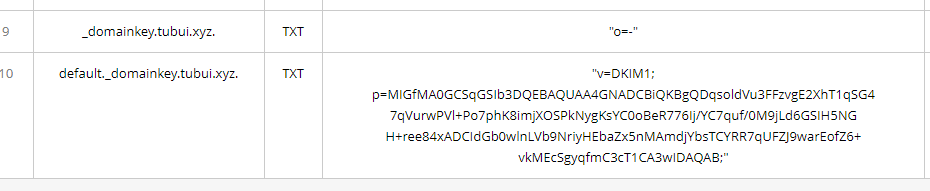
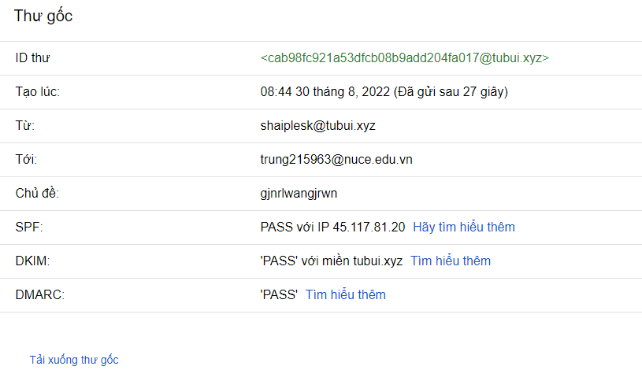

# Email trong Plesk

### Giao diện quản lý tài khoản Email

- Ở Control Panel của Plesk, chọn ```Mail```


- Tại đây, ta có thể thực hiện 1 số thao tác cơ bản như thêm, sửa, xóa tài khoản email cũng như vào ```Mail Settings``` để thay đổi 1 số thiết lập

- Tạo địa chỉ email: chọn ```Create Email``` và nhập các thông tin cơ bản để tạo Email account


- Ngoài ra, ta cũng có thể thiết lập Forwarding (chuyển tiếp), Email Aliases (bí danh), Auto-Reply (tự động trả lời) cho tài khoản Email trong Plesk

### Webmail trên Plesk

- Plesk sử dụng Roundcube làm Mail Client, mặc định nằm ở địa chỉ ```webmail.domain/roundcube```


- Đăng nhập với tài khoản email đã tạo


- Thử gửi 1 email


- Thử nhận 1 email


### Tạo bản ghi DKIM trong Plesk

- Vào mục ```Mail Settings```, tích chọn ```Use DKIM spam protection system to sign outgoing email messages```


- Sau khi active xong, truy cập vào phần ```DNS Settings``` của Host sẽ xuất hiện 2 bản ghi TXT như sau:


- Thêm 2 bản ghi trên vào máy chủ quản lý tên miền



- Kiểm tra

