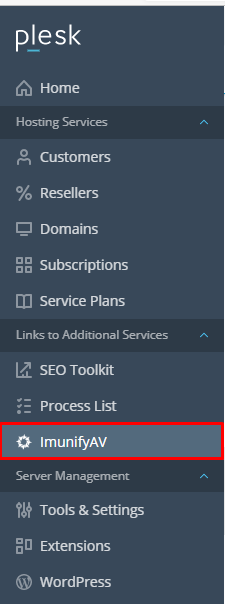

# ImunifyAV trên Plesk

ImmunifyAV là phiên bản miễn phí của Imunify360 - phần mềm bảo mật Linux

### Các tính năng của ImunifyAV

- Phát hiện bất kỳ loại tệp độc hại nào bao gồm backdoor, web-shell, virus, các trang lừa đảo và những thứ khác...
- Dọn dẹp phần mềm độc hại tự động bằng 1 cú click, quét trang web theo lịch trình và yêu cầu
- Luồng giao diện người dùng được tối ưu hóa để giám sát bảo mật của hàng trăm người dùng và hàng nghìn tên miền mỗi máy chủ
- Quyền truy cập có thể cấu hình vào Antivirus cho các đăng ký khác nhau

### Sử dụng ImunifyAV

- Để quét các phần mềm độc hại trên trang web bằng ImunifyAV, tại giao diện ```Hosting Provider```, chọn ```ImunifyAV``` (nếu không có, hãy vào ```Extensions``` để cài đặt ImunifyAV)



- Sau đó, chọn ```Scan``` từng trang web hoặc ```Scan All``` để quét tất cả: Imunify sẽ xếp hàng đợi các tác vụ quét nhanh trang web để tìm virus, backdoor, web-shell, hacker's scripts, các trang lừa đảo và các phần mềm độc hại khác


- Quá trình quét trang web tùy thuộc vào số luồng quét dồng thời được chỉ định trong tab ```Setting```. Ngoài ra, ImunifyAV sẽ kiểm tra từng tên miền để biết trạng thái danh sách đen trong các công cụ tìm kiếm và dịch vụ chống virus
- Khi quá trình quét kết thúc, hãy kiểm tra trạng thái lây nhiễm của các trang web. Nếu hiện dấu tích xanh bên cạnh thì có nghĩa là không bị xâm nhập/nhiễm/nằm trong danh sách đen


- Nếu kết quả là cảnh báo màu cam, rất có thể trang web đã bị nằm trong danh sách đen của các công cụ tìm kiếm hoặc dịch vụ chống virus. Nhấn vào nút xem báo cáo để biết thêm thông tin chi tiết
- Nếu nhận cảnh báo màu đỏ, hãy kiểm tra lại mã nguồn website, có thể có mã độc trong trang web

