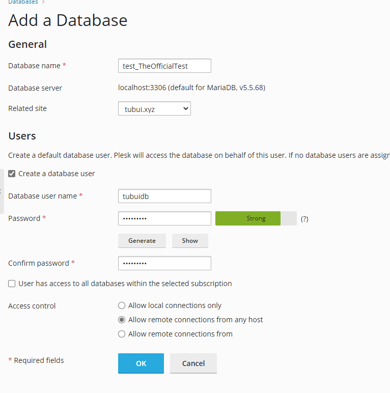
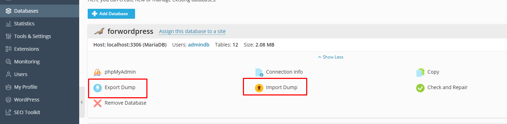
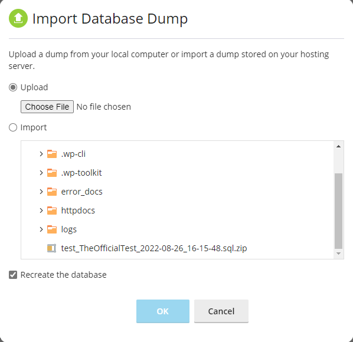

# Databases trên Plesk

## Tạo Databases

- Tại Control Panel, chọn ```Databases``` -> ```Add Database```


- Nhập thông tin cơ bản để tạo database



- Thông tin và 1 vài thao tác cơ bản của database được hiện ở đây


- Các thao tác bao gồm:
    - ```phpMyAdmin```: quản lý database bằng giao diện quản trị phpMyAdmin
    - ```Export Dump```: xuất 1 bản copy của database thành 1 file, phục vụ cho việc backup
    - ```Remove Database```: xóa database
    - ```Connection Info```: thông tin cơ bản về database, bao gồm tên host, tên database, tên user
    - ```Import Dump```: import 1 file database đã được copy từ trước vào database này, phục vụ cho việc restore database
    - ```Copy```: tạo 1 bản copy chính xác của database hoặc copy nội dung của database này sang 1 database khác
    - ```Check and Repair```: kiểm tra các vấn đề, như việc bảng hay cấu trúc nào đó bị hỏng và sửa nó

## Backup/Restore Databases

Tại giao diện quản lý ```Databases```, ta có thể chọn ```Export Dump``` để tạo file backup database hoặc ```Import Dump``` để restore database



- Backup: chọn ```Automatically download dump after creation``` để tự động download file backup sau khi tạo file xong


- Restore: có 2 option là upload file backup đã tải về máy từ trước hoặc import file backup ở trong vps


