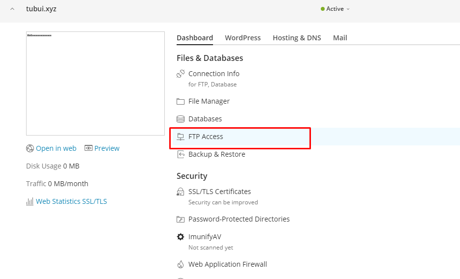
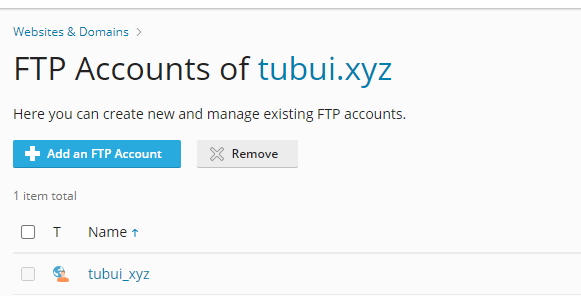
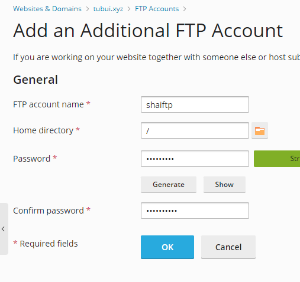
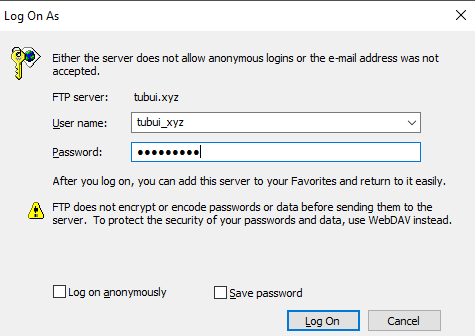
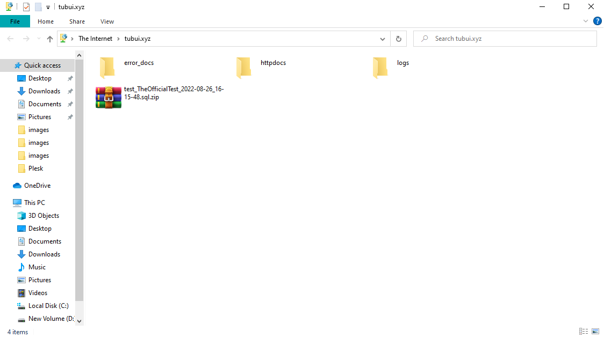

# FTP Access trên Plesk

- Tại Control Panel, chọn ```Websites & Domains``` -> ```FTP Access```



- Chọn ```Add an FTP Account```



- Nhập thông tin cần thiết để tạo account



- Truy cập thử bằng cách vào File Explorer, nhập đường dẫn ```ftp://tubui.xyz```, sau đó đăng nhập vào tài khoản vừa tạo



- OK



