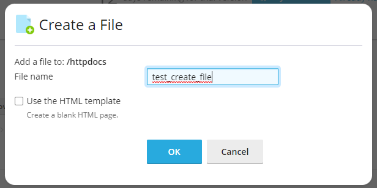
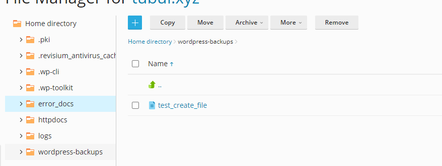
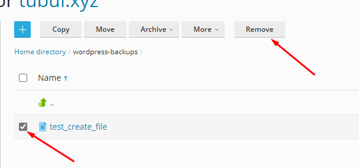

# File Manager trong Plesk

### Upload dữ liệu

- Tại giao diện quản lý **Domains**, chọn ```File Manager```


- Nhấn vào dấu cộng và chọn ```Upload File```


- Chọn file cần tải lên hosting và nhấn ```Open```


### Tạo, di chuyển, xóa file/directory

- Vẫn tại giao diện ```File Manager```, nhấn vào dấu cộng và chọn ```Create File```


- Nhập tên file 



- Di chuyển file: chọn file cần di chuyển rồi chọn ```Move```


- Chọn nơi muốn chuyển file đến




- Xóa file: chọn file cần xóa rồi chọn ```Remove```



- Xác nhận xóa


