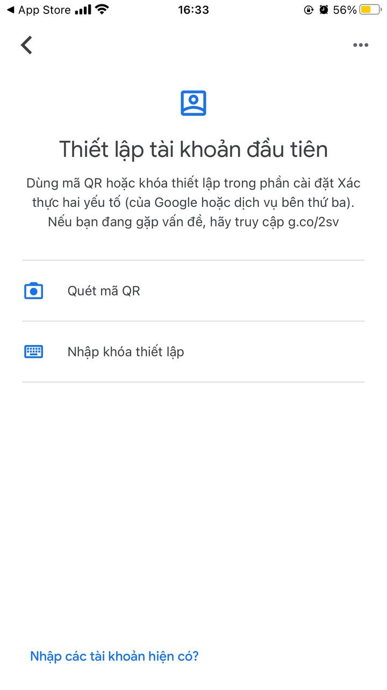
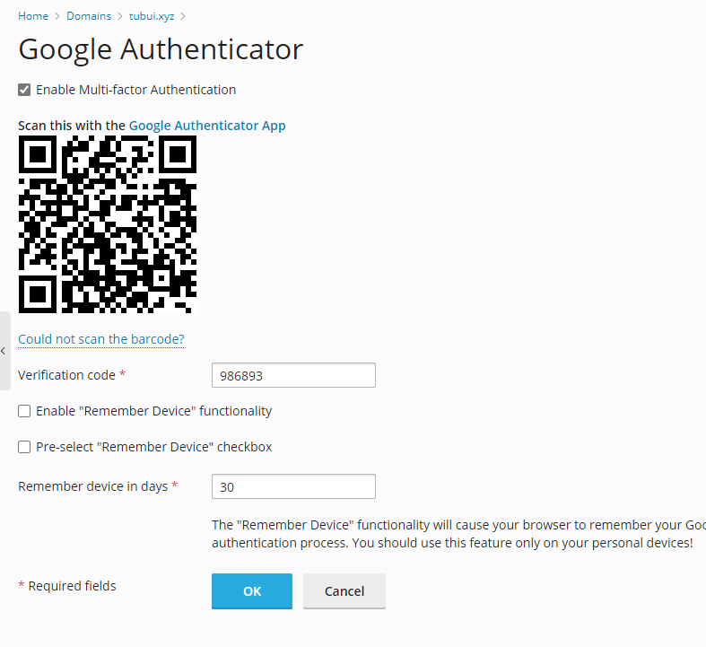

# Google Authenticator trong Plesk

Bảo mật 2 bước là 1 trong những giải pháp hữu hiệu nhất giúp bảo vệ tài khoản trước nguy cơ bị tin tặc tấn công và đánh cắp quyền truy cập. Bởi vì cho dù tin tặc có sử dụng thủ thuật nào đó để đánh cắp được username và password thì vẫn không thể có được mã bí mật để đăng nhập bước 2. Mã này được thay đổi tự động và thường xuyên (mỗi 30s) nên mức độ an toàn là gần như tuyệt đối 

### Thiết lập GG Authenticator trong Plesk

- Đầu tiên, ta cần cài đặt ứng dụng ```Google Authenticator``` trên điện thoại, ứng dụng này có thể dễ dàng tìm kiếm trên các app store của cả IOS hay Android




- Để đăng nhập bằng mã QR, ta vào trang quản trị của Plesk, chọn ```Google Authenticator``` (ở giao diện quản trị Domains, nếu không có thì vào ```Exxtensions``` cài), sau đó dùng đt quét mã QR và nhập mã 6 số hiện trên màn hình đt vào



- Sau khi thiết lập thành công, khi đăng nhập vào tài khoản quản trị sẽ cần phải nhập mã xác minh 2 bước

