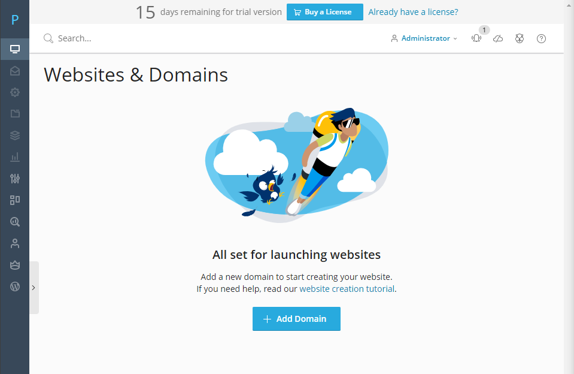

# Giới thiệu chung về Plesk

## Plesk là gì?

- Plesk là một công cụ hay hệ thống quản trị website cao cấp, được ưa chuộng nhất trong thời điểm hiện tại. Phần mềm này có khả năng quản trị hosting, tên miền và thiết kế website, giao diện... cùng mọi tác vụ có liên quan đến trang web

- Bên cạnh đó, Plesk còn có khả năng điều chỉnh tên miền và bảo mật website SSL. Giúp tối ưu hóa cùng với thao tác đơn giản nhằm giảm thời gian thực hiện. Tính tự động hóa của Plesk cũng là lý do khiến nó được ưu ái hơn

- Plesk được người dùng tin cậy bởi những chức năng được tối ưu riêng cho mục đích của người sử dụng - từ cấ nhân đến tổ chức:
    - Phân cấp người dùng: quản trị viên (Administrator), đại lý (Reseller), khách hàng cá nhân (User)
    - Tính bảo mật cao
    - Hỗ trợ chăm sóc khách hàng 1 cách tự động nhanh chóng
    - Khả năng tự động hóa cao cấp, giúp người dùng tiết kiệm thời gian trong việc quản lý
    - Dễ dàng mở rộng mạng lưới kết nối kinh doanh, tăng doanh thu thông qua Parallels Storefront
    - Liên tục cập nhật các tính năng mới nhất phục vụ nhu cầu và mục đích của từng người sử dụng

## Các phiên bản của Plesk

Hiện Plesk có 2 phiên bản là Plesk Onyx và Plesk Obsidian

### Plesk Onyx

Plesk Onyx là phiên bản quản lý website cơ bản và đầu tiên từ Plesk. Plesk Onyx bao gồm các tính năng cơ bản trong việc quản lý và hiệu chỉnh các ứng dụng cho Website như:
- Quản lý các dữ liệu file tiêu chuẩn
- Bảo mật website và dữ liệu
- Điều chỉnh hiệu suất hoạt động
- Tự động cập nhật các dữ liệu và tính năng mới

### Plesk Obsidian

- Plesk Obsidian là phiên bản quản lý website mới nhất ra mắt vào 25/09/2019 của Plesk
- Phiên bản mới này tập trung giải quyết tối đa các vấn đề liên quan đến bảo mật, hiệu suất và tiện dụng
- Plesk phiên bản Obsidian có những tính năng được tối ưu vượt hẳn so với Plesk Onyx ở những điểm sau:
    - Có khả năng giám sát nâng cao thông qua việc tích hợp Grafana - hỗ trợ quá trình kiểm soát tình trạng máy chủ và số liệu thống kê từ website dễ dàng hơn
    - Chia quyền kiểm soát tên miền dựa trên bản đăng ký gốc từ người dùng
    - Tiện ích mở rộng PHP Composer version 2: thực thi lệnh PHP mà không cần truy cập SSH, cài đặt các lệnh chạy chỉ với 1 cú nhấp chuột và tự động cập nhật các phiên bản PHP một cách dễ dàng
    - Quản lý tệp UX hiệu quả hơn nhờ tính năng tải lên hàng loạt
    - Tự động phát hiện và giải quyết sự cố trong Plesk với Repair Kit
    - Kiểm soát sát sao hơn với chế độ truy cập hạn chế (Server-side)
    - Quản lý SSL đơn giản
    - Thiết lập Email dễ dàng cho người dùng dù họ sử dụng nhiều tên miền khác nhau
    - Tối ưu việc sao lưu dữ liệu vào bộ nhớ đám mây của Google
    - Giao diện được tối ưu hóa giúp người dùng dễ dàng thao tác

### Những người nên sử dụng Plesk

- Plesk hướng đến đa dạng các đối tượng khách hàng sử dụng, chẳng hạn như:
    - Người dùng là quản trị viên website
    - Người dùng là khách hàng trực tiếp của doanh nghiệp
    - Các đại lý cung cấp hosting từ các nhà cung cấp chính
    - Kỹ thuật viên

### Ưu điểm của Plesk

Plesk là một trong những phần mềm thân thiện với người dùng nhất hiện nay nhờ những tính năng nổi bật:
- Tương thích cả Linux và Windows
- Có độ ổn định và tin cậy cao cùng nhiều phần mềm tích hợp hữu ích 
- Có đầy đủ các tính năng từ cơ bản đến nâng cao, hữu ích trong việc quản lý hosting và website
- Giao diện đơn giản, thân thiện với người dùng
- Tính linh hoạt và tiện dụng cao: phần mềm Plesk là hệ thống quản lý hosting duy nhất có tích hợp thiết kế website, thanh toán tự động và giao diện storefront SaaS 
- Có khả năng thiết lập nhiều hosting cùng lúc dễ dàng dựa trên cấu hình định sẵn
- Có thể tạo nhiều tài khoản FTP kết hợp với cấu trúc web linh hoạt 


## Cài đặt Plesk trên CentOS 7

- Cập nhật hệ thống và cài đặt Plesk

```sh
yum -y update
sh <(curl https://autoinstall.plesk.com/one-click-installer || wget -O - https://autoinstall.plesk.com/one-click-installer)
```

- Sau khi cài đặt xong ta vào trang quản trị bằng liên kết ```<tên_miền/địa_chỉ_IP>:8443```


- Đăng nhập bằng tài khoản root của VPS


- Nhập thông tin tài khoản Admin và nhập license (hoặc chọn bản trial 15 ngày)

