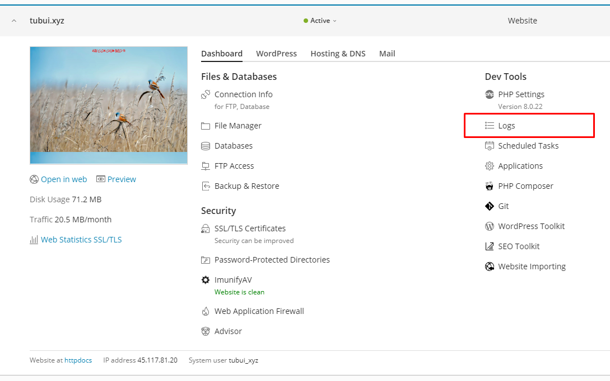
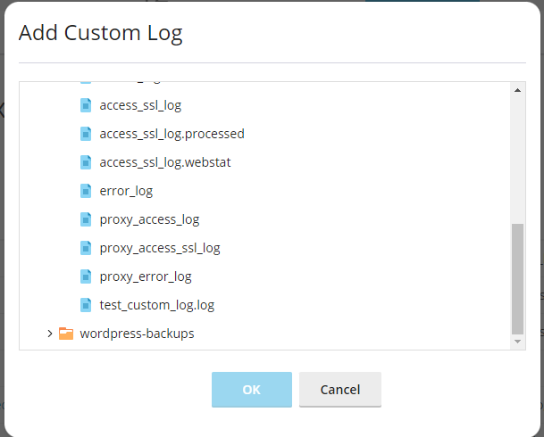

# Log Files trong Plesk

Check Log có thể giúp ích rất nhiều trong việc tìm ra nguyên nhân của nhiều vấn đề xảy ra với website của bạn. Giao diện Log của Plesk lấy dữ liệu từ log của web server và hiển thị những cảnh báo (warning) và lỗi (error) ở trên trang quản trị của mình

Ở Linux, mặc định những thông tin sau từ file log sẽ được hiển thị:
- Apache access (access_log): những dòng log này ghi lại tất cả những truy vấn http được thực hiện bởi Apache web server
- Apache ssl access (access_ssl_log): log này ghi lại tất cả những truy vấn https thực hiện bởi Apache web server
- Apache error (error_log): log này bao gồm thông tin chuẩn đoán lỗi. Nó cũng ghi lại bất kỳ lỗi nào mà Apache web server gặp phải trong khi thực hiện truy vấn
- nginx access (proxy_access_log): log này ghi lại tất cả truy vấn http được thực hiện bởi nginx proxy web server
- nginx ssl access (proxy_access_ssl_log): log này ghi lại tất cả truy vấn https được thực hiện bởi nginx proxy web server
- nginx error (proxy_error_log): log này bao gồm thông tin chuẩn đoán lỗi. Nó cũng ghi lại bất kỳ lỗi nào mà nginx proxy web server gặp phải trong khi thực hiện truy vấn

### Truy cập log file

- Ở Linux, Log file của Plesk nằm ở ```/var/log```, hoặc ở ```/var/www/vhosts/domain/logs``` chứa log file của "domain" đó. 1 cách thuận tiện hơn đó là đọc log ở giao diện bằng cách vào phần quản trị Domains -> ```Logs```




- Ở giao diện này ta có thể làm được nhiều thứ như: lọc, tìm kiếm, sắp xếp, lựa chọn log nào được hiển thị, làm mới log, theo dõi log trong thời gian thực, quản lý file log:


- Ở giao diện quản lý log file này, ta có thể click vào tên log file để xem nội dung của nó trực tiếp ở browser, click vào icon file màu xanh dương để xem nội dung ở 1 cửa sổ tách biệt, click vào dấu mỗi tên xanh lá để download log về

- Để tiết kiệm không gian ổ đĩa, ta có thể chọn ```Log Rotation``` trước khi down log về. Log Rotation sẽ tự động nén và/hoặc xóa những log hết hạn

- Ta có thể xóa những file log đã được Rotate, tuy nhiên, những file log mà chưa Rotate thì sẽ không thể xóa được

### Thêm file log tùy chỉnh

Ta có thể thêm bất kỳ file log tùy chỉnh nào vào thư mục website để theo dõi những thay đổi của nó ở Log Browser. Để làm được điều này, ta chọn ```Add custom log``` ở trang ```Manage Log Files```. Cây thư mục của domain hiện tại sẽ được hiện ra, ta chọn file log cần hiển thị và nhấn ```OK```




Để ngừng theo dõi file custom log, ta chọn biểu tượng ngay bên phải kích thước file. Điều này sẽ làm file log đó ko còn xuất hiện ở giao diện ```Manage Log Files``` nữa, nhưng vẫn còn ở server

