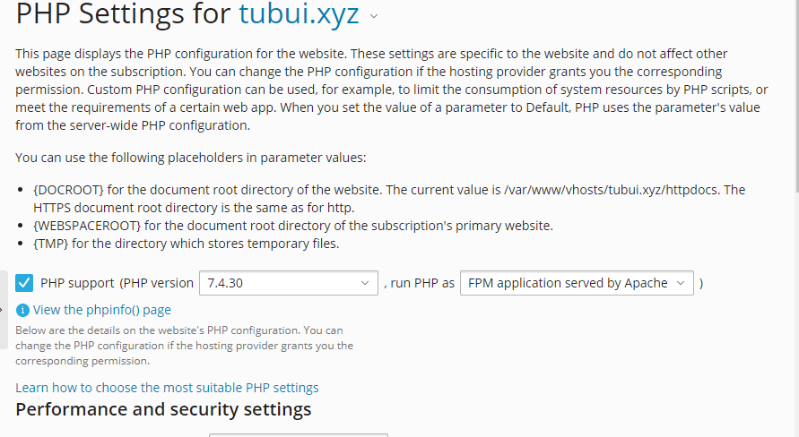
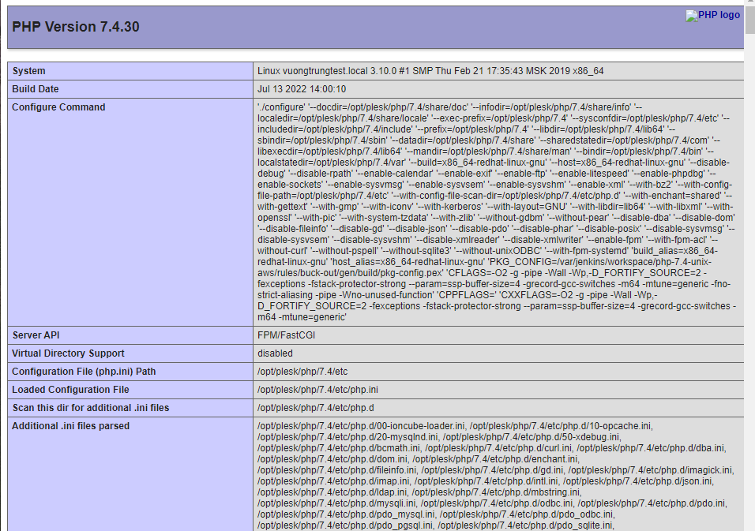
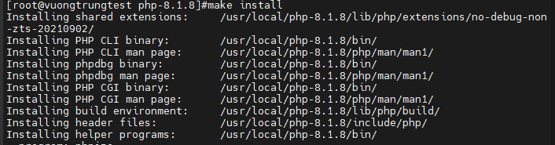

# PHP version trên Plesk

- Mỗi loại mã nguồn (plug-ins, tools,...) khác nhau cần có cấu hình phiên bản PHP tương ứng để có thể hoạt động ổn định
- Để tùy chỉnh phiên bản PHP riêng cho mỗi website của mình, tại giao diện quản lý **Domains**, chọn ```PHP Settings```


- Chọn phiên bản PHP muốn thiết lập, loại PHP Handler và nhấn ```OK``` để lưu cấu hình



- Đợi vài phút để các thay đổi trong cấu hình được áp dụng



### Cài đặt thêm phiên bản PHP

- Download source PHP từ trang https://www.php.net/releases/

```sh
yum -y install wget
wget https://www.php.net/distributions/php-8.1.8.tar.gz
```

- Giải nén file vừa down

```sh
tar -xzvf php-8.1.8.tar.gz
```

- Chuyển file chứa source PHP vừa giải nén đến đường dẫn /usr/local/src

```sh
mv php-8.1.8 /usr/local/src
cd /usr/local/src/php-8-1-8
```

- Cài đặt các package cần thiết cho PHP

```sh
yum -y install libxml2-devel openssl-devel bzip2-devel curl-devel libjpeg-devel libpng-devel freetype-devel gmp-devel mysql-devel ncurses-devel unixODBC-devel net-snmp-devel mhash-devel libc-client-devel libicu-devel gcc postgresql-devel aspell-devel libxslt-devel gcc-c++ openldap-devel sqlite-devel
```

- Cấu hình và xây dựng PHP

```sh
./configure -prefix /usr/local/php-8.1.8
```

- Chạy lệnh ```make```

```sh
make
```

- Chạy ```make install``` để cài đặt PHP

```sh
make install
```

- Lưu lại những đường dẫn cần thiết



- Cài đặt php.ini

```sh
cp php-ini-development /usr/local/php.ini
```

- Đăng ký phiên bản PHP mới vừa cài đặt bằng câu lệnh ```/usr/local/psa/bin/php_handler --add -displayname <NN> -path <path to php cgi> -phpini <path to php.ini> -type <php handler> -id <NN-custom>```

```sh
/usr/local/psa/bin/php_handler --add -displayname php-8.1.8 -path /usr/local/php-8.1.8/bin/php-cgi -phpini /usr/local/php-8.1.8/php.ini -type fastcgi -id fastcgi-8.1.8 -clipath /usr/local/php-8.1.8/bin/php
```

- Sau khi đăng ký thành công, chạy lệnh sau để kiểm tra các phiên bản php của hệ thống

```sh
/usr/local/psa/bin/php_handler --list
```

- Trên Plesk:

