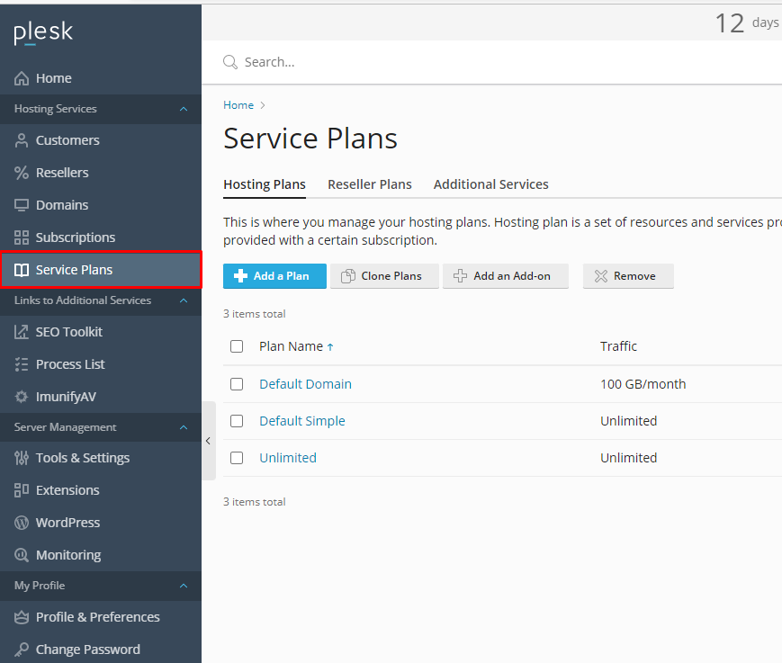
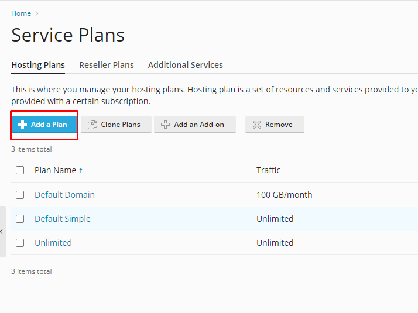
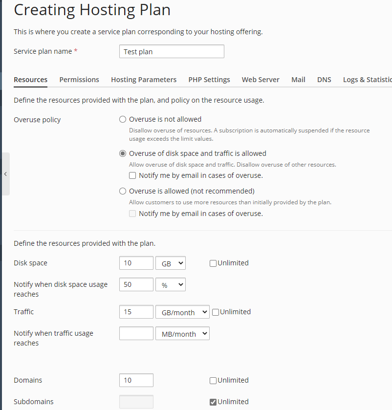
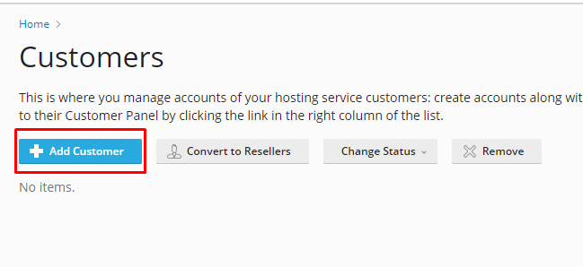
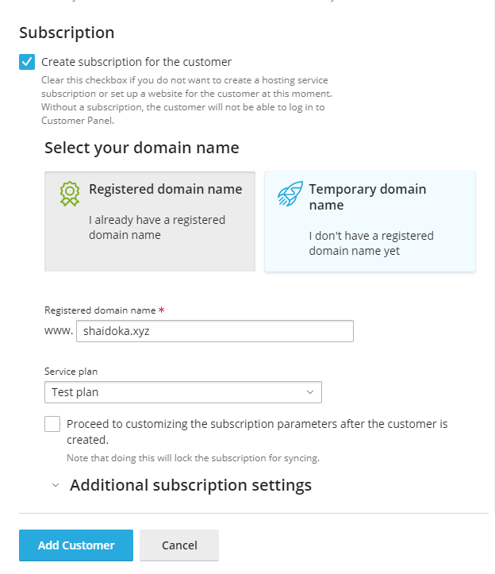
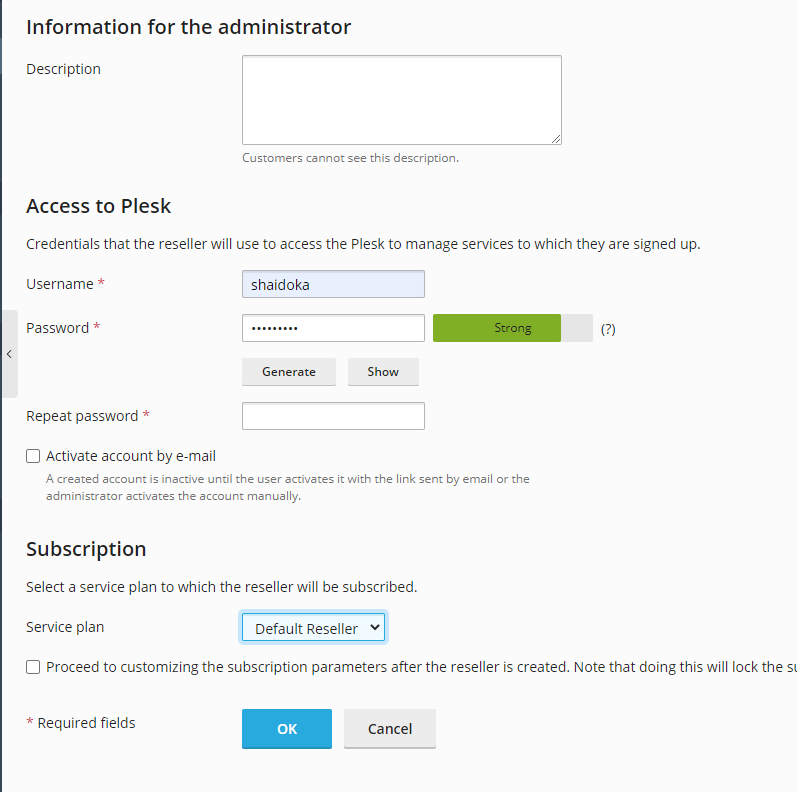

# Service Plans, Customers và Resellers trong Plesk

### Tạo Service Plan

- Trong phần giao diện dành cho **Hosting Provider**, chọn ```Service Plans```



- Chọn ```Add a Plan```



- Nhập thông tin để tạo 1 plan



### Tạo Customer và gán Plan

- Trong phần giao diện dành cho **Hosting Provider**, chọn ```Customers```


- Chọn ```Add Customer```



- Nhập thông tin Customer và gán plan




### Tạo Reseller

- Trong phần giao diện dành cho **Hosting Provider**, chọn ```Reseller```


- Nhập thông tin và tạo Reseller


