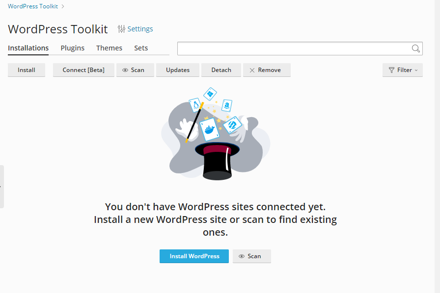
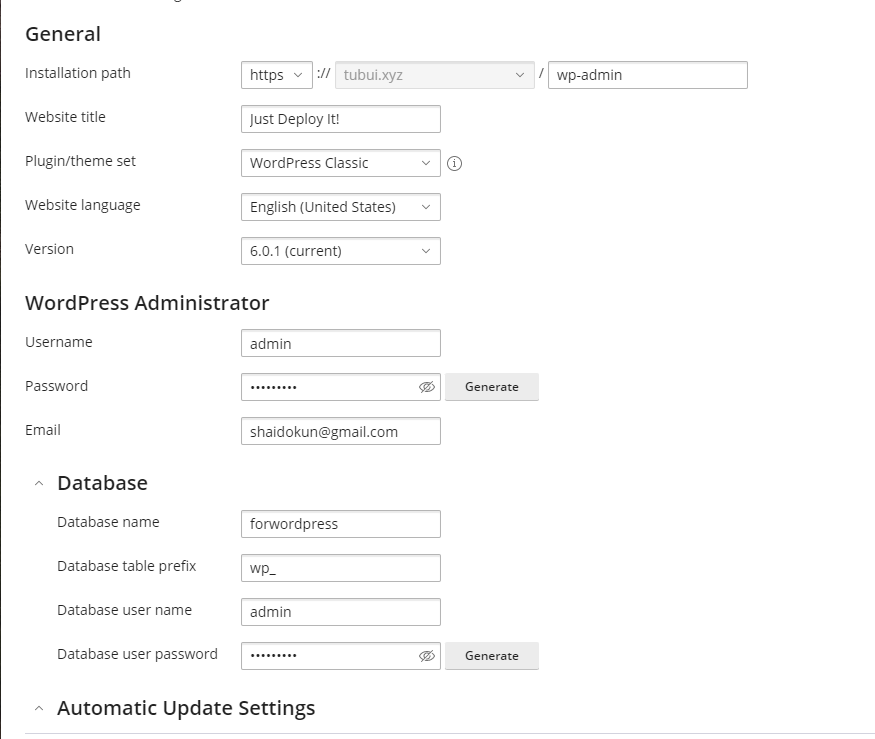
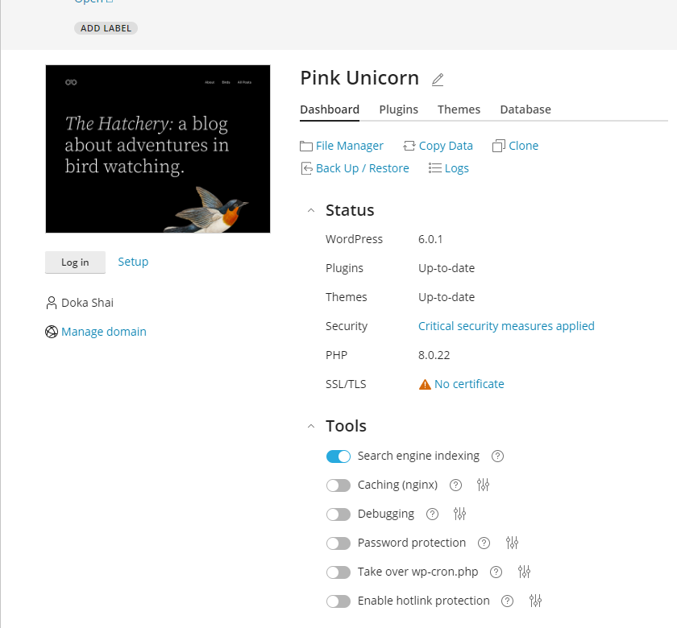
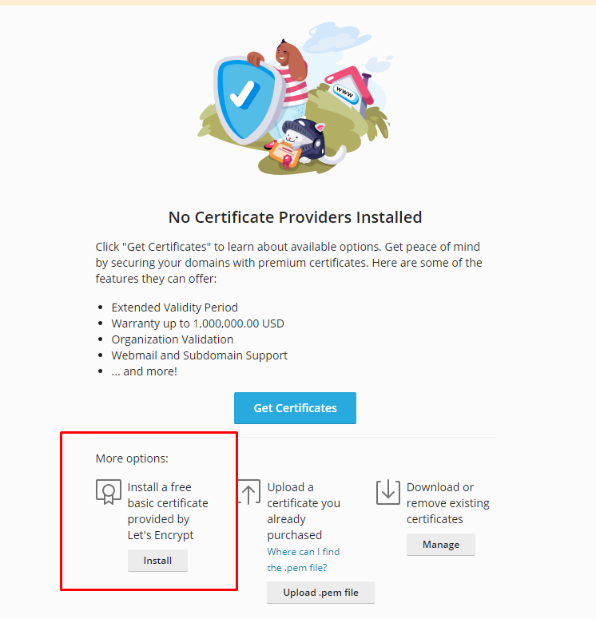

# Cài đặt WordPress và cài SSL Let's Encrypt trêm Plesk

## Cài đặt WordPress

- Tại Control Panel, chọn ```WordPress``` -> ```Install WordPress```



- Điền các thông tin cơ bản để tạo wordpress



- Thông tin về WordPress được hiển thị



- Trang quản trị WordPress


## Cài đặt SSL Let's Encrypt trên Plesk

- Trong Plesk Control Panel, vào ```Websites & Domains``` -> ```SSL/TLS Certificate```


- Chọn "Install a free basic certificate provided by Let's Encrypt"



- Lựa chọn domain và subdomain muốn chứng nhận rồi nhấn ```Get it free```


- Thêm bản ghi TXT vào máy chủ DNS theo hướng dẫn và nhấn ```Reload```

- Chứng nhận thành công:


- Kiểm tra


