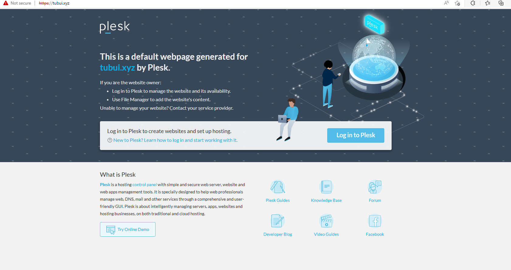
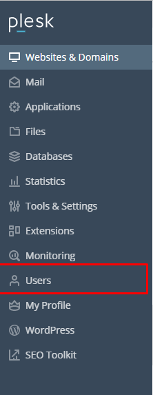
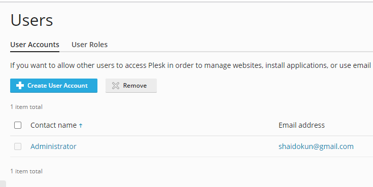
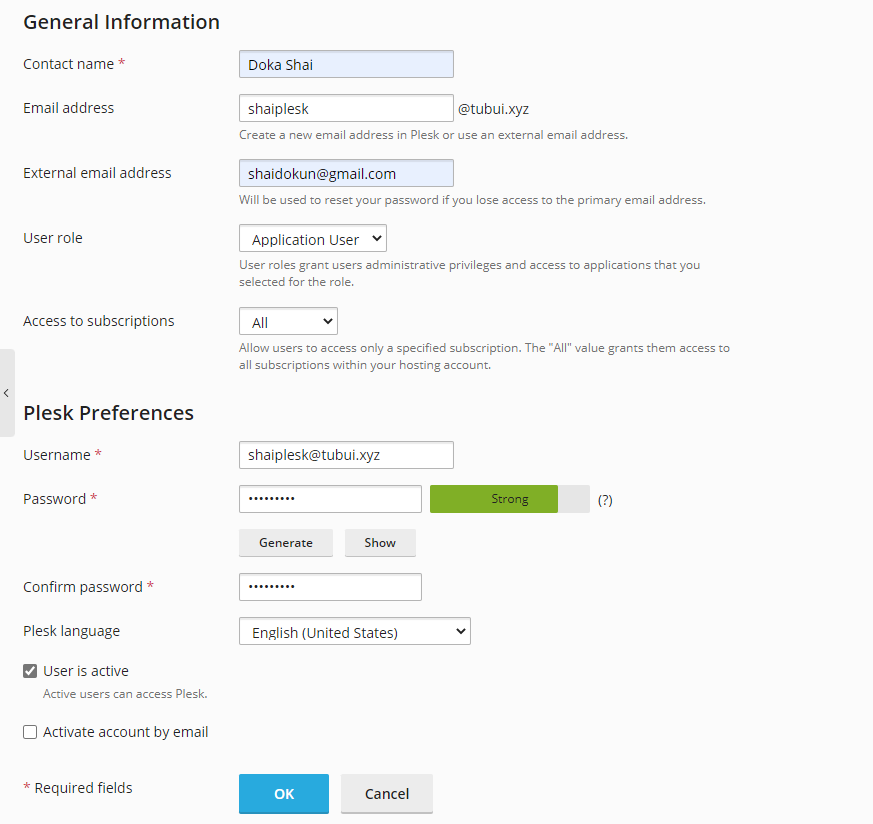

# Tạo thêm domain/user trong Plesk

### Add Domain

- Tại giao diện ```Websites & Domains```, chọn ```Add Domain```

- Nhập thông tin cơ bản cho domain và chọn ```Add Domain```


- Thông tin về domain được hiển thị:


- Vào thử để kiểm tra



### Add User

- Tại giao diện quản trị, vào phần ```Users``` -> ```Create User Account```





- Nhập thông tin user



- Nhấn ```OK``` để lưu

