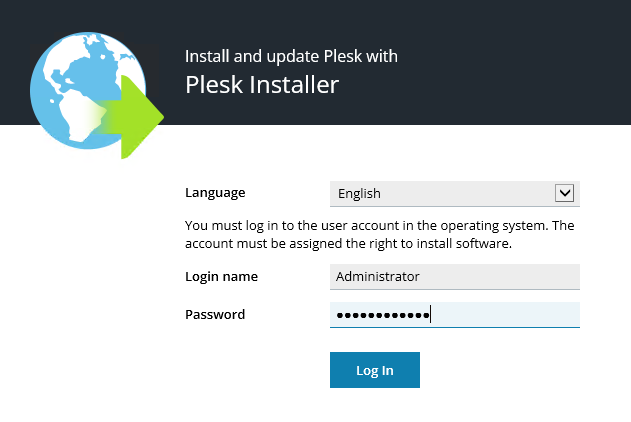
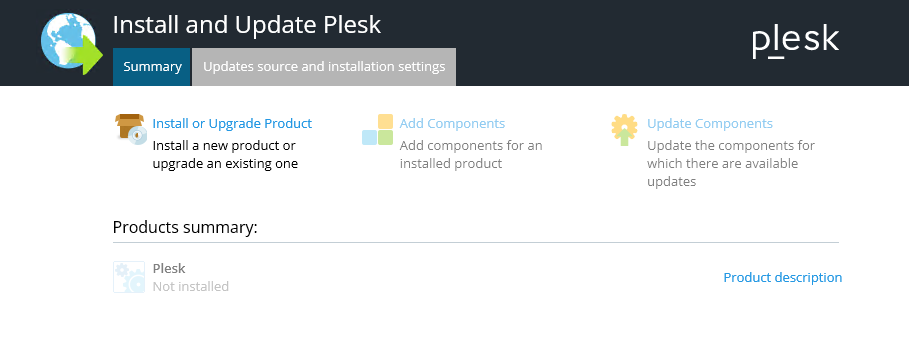
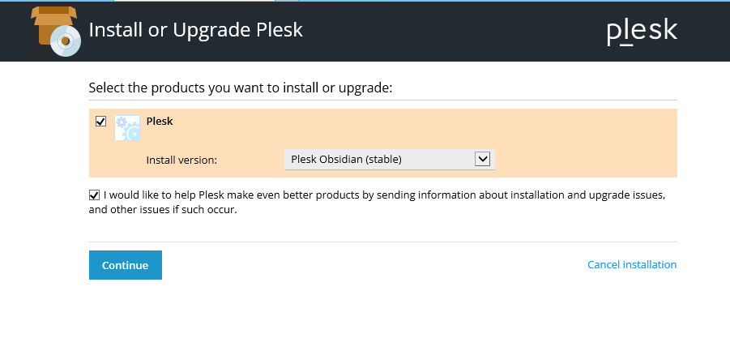
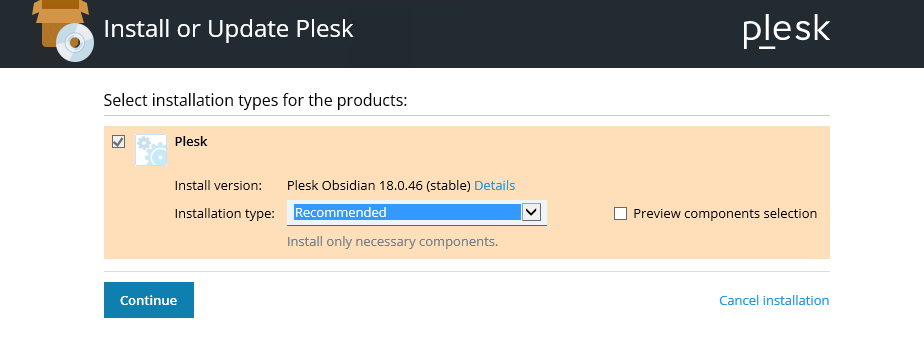
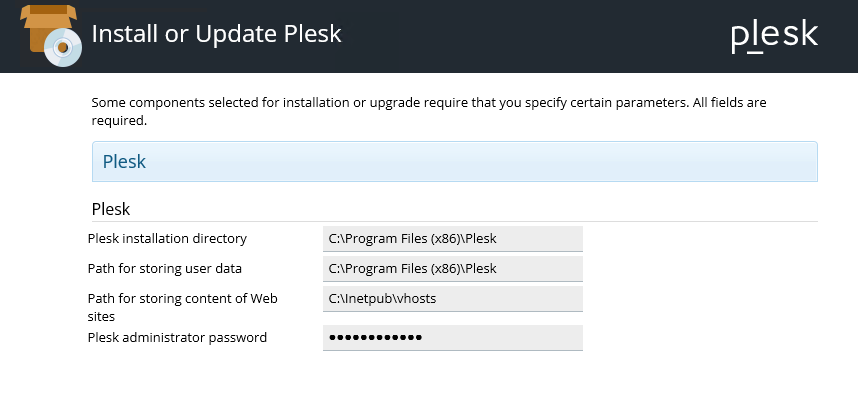
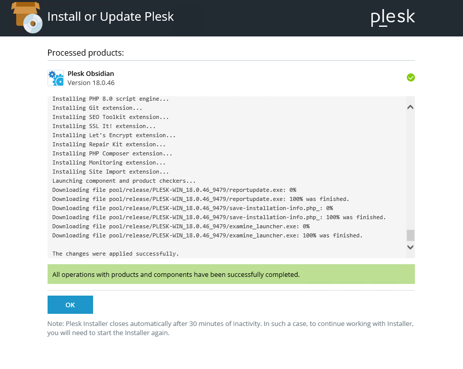
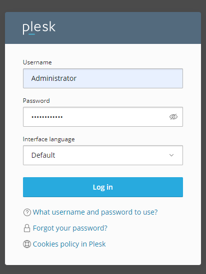
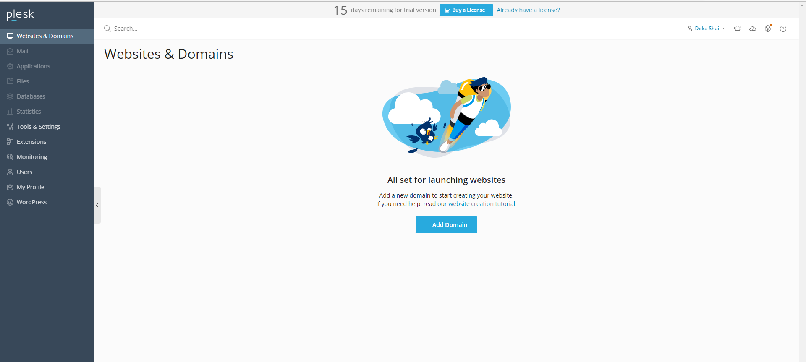

# Cài đặt Plesk trên Windows Server

### Tải file cài Plesk

Bộ cài đặt của Plesk có thể tải ở đây [Plesk Web Installer](https://get.plesk.com/)

### Cài đặt Plesk

- Click đúp vào bộ cài đặt hoặc truy cập vào đường dẫn ```localhost:8447``` trên trình duyệt
- Chọn ngôn ngữ và đăng nhập bằng tài khoản admin của Windows Server



- Lựa chọn cài đặt mới hay nâng cấp bản Plesk có sẵn, ở đây ta chọn cài mới



- Lựa chọn cài đặt Plesk bản Obsidian và nhấn ```Continue```



- Chọn kiểu cài đặt



- Nhập mật khẩu administrator như bước 1



- Ngủ 1 giấc là quá trình cài đặt hoàn tất



- Truy cập vào trang quản trị bằng đường dẫn ```localhost:8443``` và đăng nhập bằng tài khoản admin vừa tạo lúc cài đặt



- Trang quản trị chính

