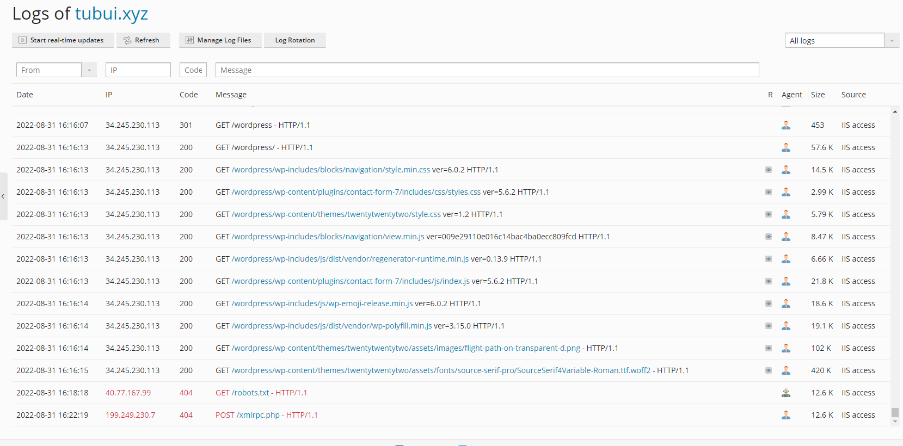

# File Log trong Plesk Windows

### Plesk Management Service

- Access Log: %plesk_dir%admin\logs\W3VC<IIS site ID>ex<date>.log
- PHP errors (panel log): %plesk_dir%admin\logs\php_error.log
- Debug Log: %plesk_dir%admin\logs\plesklog_debugXXXXXXXX.log (create DWORD value Debug = 1 in HKLM\SOFTWARE\Wow6432Node\PLESK\PSA Config\Config)

### Plesk SQL Server (MySQL)

- %plesk_dir%MySQL\Data\*.err

### Plesk Installer

- C:\ParallelsInstaller\autoinstaller3.log
- C:\ProgramData\Plesk\Installer\autoinstaller3.log

### phpMyAdmin

- %plesk_dir%admin\logs\W3SVC<IIS site ID>\ex<date>.log

### MailEnable (mail server)

- %plesk_dir%Mail Servers\Mail Enable\Logging
- Các cài đặt mới: C:\Program Files (x86)\Mail Enable\Logging (for new insallations)

### MySQL (local)

- %plesk_dir%Databases\MySQL\Data*.err

### FTP

- %plesk_vhosts%Servers\<ID>\logs

### Backup Manager

- Backup logs: %plesk_dir%PMM\logs\backup-<datetime>
- Restore logs: %plesk_dir%PMM\logs\restore-<datetime>
- Additional logsL %plesk_dir%PMM\logs\pmmcli.log, %plesk_dir%PMM\logs\pmmcli_daemon.log

### Wordpress Toolkit

- %plesk_dir%admin\logs\php_error.log

### Log tại giao diện quản lý

- ```Domains``` -> ```Logs```



