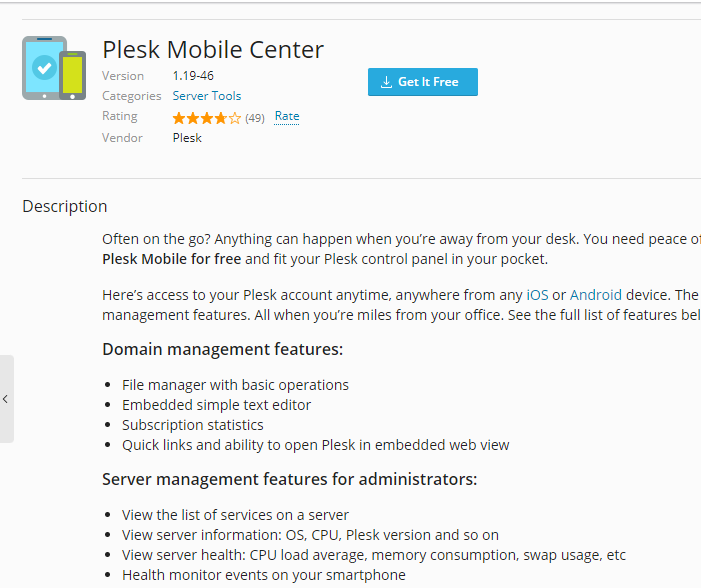
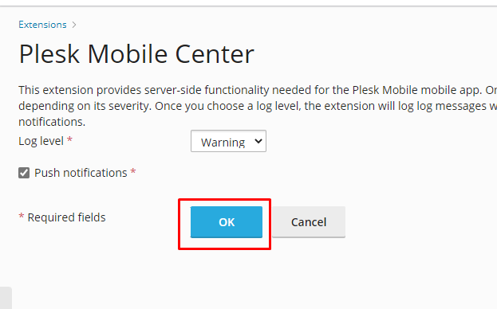
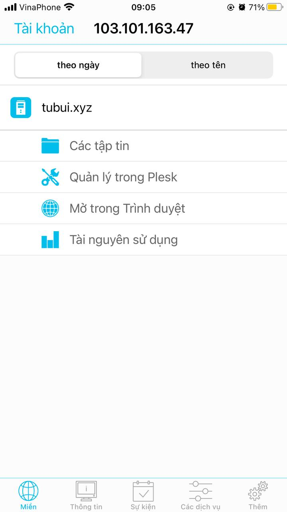
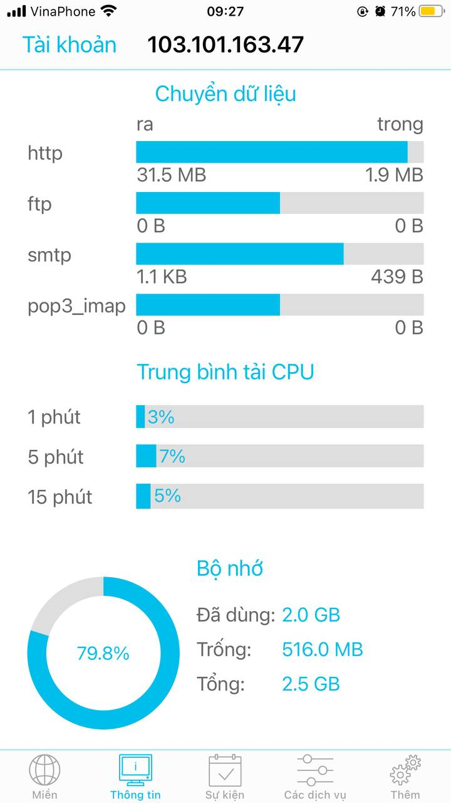
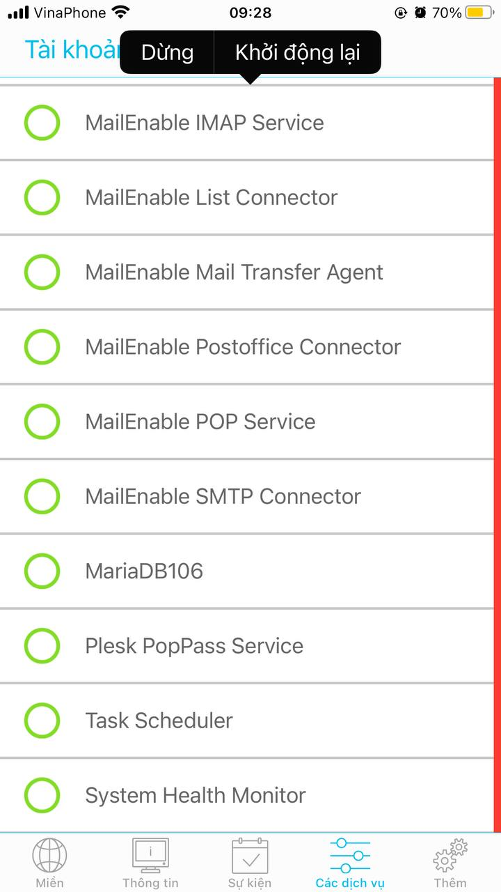
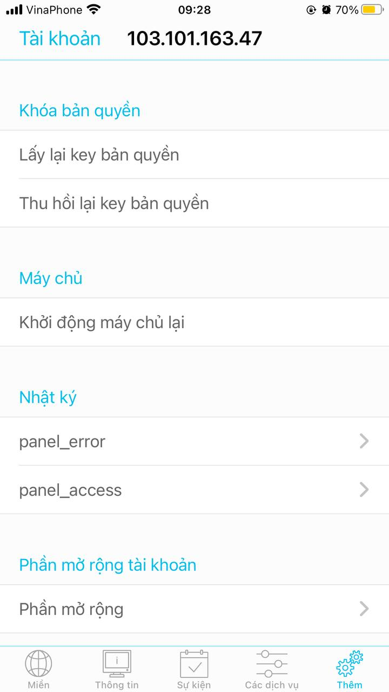

# Quản lý Plesk từ thiết bị di động

- Ứng dụng Plesk Mobile dành cho IOS và Android cho phép truy cập tài khoản Plesk mọi lúc và mọi nơi từ điện thoại
- Sử dụng Plesk Mobile, ta có thể dễ dàng quản lý các miền của mình trên 1 số máy chủ Plesk, chuyển đổi dễ dàng giữa chúng. Nếu là quản trị viên, ta có thể truy cập 1 số tính năng quan trọng

### Chức năng

Plesk Mobile cung cấp 1 số các chức năng chính sau:
- Quản lý miền 1 cách minh bạch, điều hướng giao diện Plesk hoặc sử dụng trình quản lý tệp
- Xem thông tin máy chủ, bao gồm số liệu thống kê và sử dụng tài nguyên
- Quản lý các dịch vụ trên một máy chủ cụ thể
- Đăng ký các sự kiện Plesk
- Quản lý giấy phép Plesk trên 1 máy chủ cụ thể
- Duyệt giao diện Plesk trong chế độ xem web được nhúng mà không cần xác thực

### Cài đặt ứng dụng

Plesk hỗ trợ cả IOS và Android. Ta đều có thể tìm kiếm chúng ở trên các cửa hàng ứng dụng của từng nền tảng

### Plesk Mobile Extension

- Ta cần cài đặt tiện ích mở rộng ```Plesk Mobile Center``` trên mọi máy chủ Plesk mà ta muốn quản lý bằng ứng dụng





### Sử dụng ứng dụng

- Khi chạy ứng dụng lần đầu tiên, ta phải thêm tài khoản. Nhập tên máy chủ hoặc địa chỉ IP của máy chủ với Plesk, thông tin đăng nhập và mật khẩu

- Nếu ta đăng nhập với tư cách là chủ sở hữu trang web, ta sẽ chỉ có quyền truy cập vào chức năng quản lý miền. Nếu ta đăng nhập với tư cách là quản trị viên Plesk, ta cũng có thể sử dụng các tính năng quản lý máy chủ

### Quản lý trang web

- Đối với chủ sở hữu và quản trị viên trang web, Plesk Mobile cung cấp chức năng quản lý trang web. Quản trị viên có thể quản lý các trang web trên tab ```Miền```

- Đối với mỗi trang web, ta có các thao tác:
    - Quản lý tệp trang web bằng trình quản lý tệp
    - Quản lý trang web của domain 1 cách rõ ràng khi điều hướng giao diện người dùng Plesk
    - Mở trang web của bạn trong trình duyệt web
    - Xem việc sử dụng tài nguyên của trang web, bao gồm cả dung lượng ổ đĩa và lưu lượng truy cập, Ngoài ra, có thể thấy số lượng miền, miền phụ, hộp thư, danh sách gửi thư, cơ sở dữ liệu và người dùng web đã sử dụng trong đăng ký của mình



### Xem thông tin máy chủ

- Trên tab thông tin, ta có thể xem thông tin máy chủ
    - Số liệu thống kê của máy chủ, bao gồm thời gian hoạt động và mức độ sử dụng CPU
    - Truyền dữ liệu cho các giao thức khác nhau: HTTP, FTP, SMTP, POP3, IMAP
    - Thông tin máy chủ chung như phiên bản, hđh, CPI, ID vùng chứa (nếu Plesk được cài đặt trong vùng chứa Virtuozzo)



### Quản lý dịch vụ

- Ta có thể xem, bắt đầu, dừng và khởi động lại các dịch vụ trên tab ```Các dịch vụ```



### Chức năng bổ sung

- Một số tính năng hữu ích có sẵn trên tab ```Thêm```
    - Lấy lại key bản quyền
    - Thu hồi lại key bản quyền
    - Khôi phục key bản quyền
    - Khởi động lại máy chủ
    - Duyệt lỗi Plesk và truy cập log
    - Hạn chế quyền truy cập vào máy chủ (trên Android)
    - Định cấu hình thông báo sự kiện (trên Android)
    - Xem thông tin về ứng dụng, xếp hạng hoặc báo cáo sự cố

