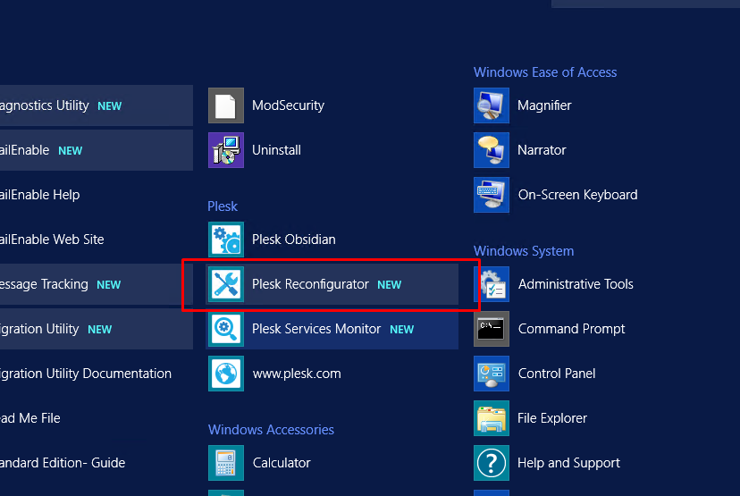
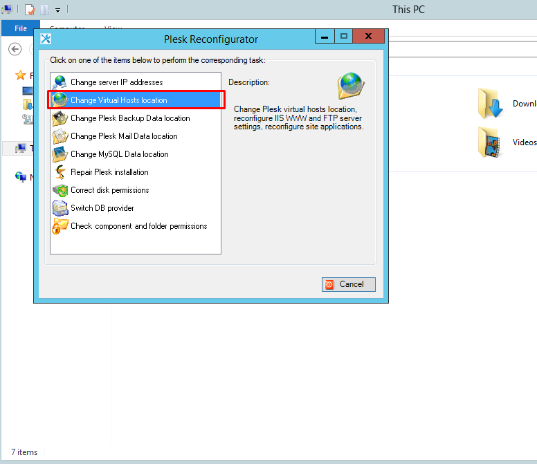
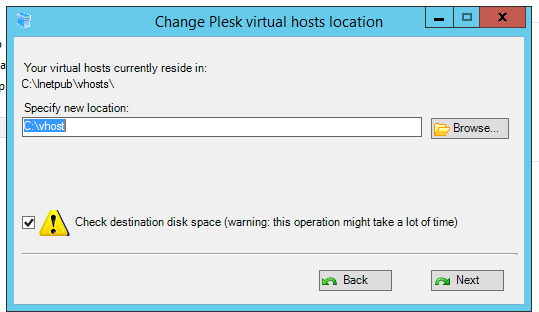

# Di chuyển thư mục vhost

Khi muốn chuyển vhost đến một ổ đĩa khác lớn hơn thay cho ổ đĩa gần hết dung lượng hiện tại (hoặc đơn giản là thích thì chuyển), ta có thể sử dụng tính năng này của Plesk. Tùy chọn này cho phép di chuyển thư mục nơi chứa các máy chủ ảo đến một vị trí trên cùng một phân vùng hoặc một phân vùng khác.

Để di chuyển thư mục máy chủ ảo đến 1 vị trí mới, ta làm theo các bước sau:

- Đăng nhập vào Plesk với quyền quản trị
- Trong menu ```Start``` của Windows Server, chọn ```Plesk``` -> ```Plesk Reconfigurator```



- Chọn ```Change Virtual Hosts location```



- Chỉ định 1 vị trí mới cho vhost và nhấn vào ```Next```. Tất cả dữ liệu trang web hiện có cũng sẽ được chuyển sang vị trí mới
    - Lưu ý: trong thời gian này, các trang web sẽ bị dừng hoạt động, sau khi xong thì chúng sẽ được khởi động lại
    - Thư mục vị trí mới phải trống


