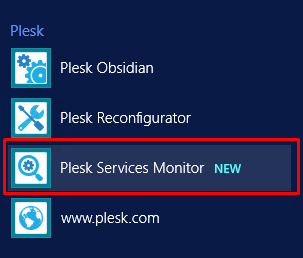
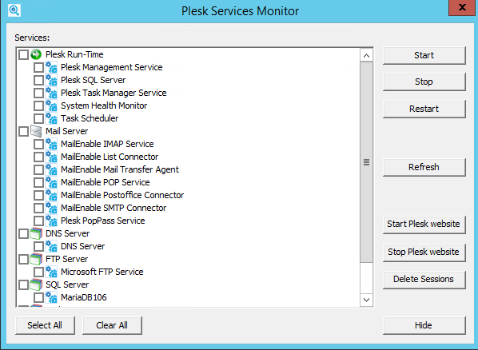

# Kiểm tra trạng thái của dịch vụ hệ thống

Ta có thể theo dõi trạng thái của máy chủ do Plesk quản lý mà không cần đăng nhập vào Plesk

Để thực hiện điều này, ta truy cập vào máy chủ thông qua Remote Desktop. Tại menu ```Start```, chọn ```Plesk Services Monitor```



```Plesk Services Monitor``` được tải tự động mỗi khi Plesk khởi động. Để quản lý trạng thái của các dịch vụ của Plesk, ta mở Plesk Service Monitor bằng cách nhấn đúp vào biểu tượng của nó trên thanh tác vụ

Sau khi mở ```Plesk Service Monitor```, ta có thể thấy trạng thái của tất cả các dịch vụ quan trọng của Plesk



Các thao tác có thể làm với Service:
- ```Stop```: dừng 1 dịch vụ
- ```Restart```: khởi động lại 1 dịch vụ
- ```Start```: bắt đầu 1 dịch vụ
- ```Refresh```: làm mới danh sách dịch vụ và trạng thái của chúng
- ```Delete Sessions```: xóa tất cả thông tin về phiên Plesk khỏi cơ sở dữ liệu của Plesk và ngắt kết nối tất cả người dùng khỏi Plesk, Điều này hữu ích khi bạn cần khởi động lại Plesk, nhưng 1 số người dùng vẫn kết nối với nó và bạn muốn tránh mất dữ liệu hoặc hỏng tệp có thể xảy ra
- ```Hide```: để ẩn màn hình dịch vụ trở lại thanh tác vụ