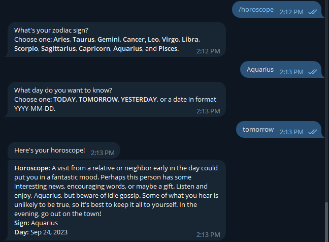

# How to create a Horoscope API with Beautiful Soup and Flask

## Giới thiệu

Bạn đã bao giờ đọc tử vi trên báo hay xem chúng trên TV chưa? Có lẽ điều này khá được giới trẻ quan tâm đến. 

Và đó là lý do bài hướng dẫn này sẽ sử dụng đề tài về tử vi làm phương tiện truyền tải kiến thức.

Trong bài viết này, chúng ta sẽ sử dụng Beautiful Soup và Flask để tạo API. API này, nếu được triển khai trên 1 server public, có thể được sử dụng bởi các lập trình viên khác tạo ra website hay ứng dụng tử vi của họ.

## Thiết lập Project

Trước hết, chúng ta sẽ tạo 1 virtual environment nơi mà tất cả dependency cần thiết được cài đặt.

Python giờ đã được cài đặt sẵn thư viện ```venv```. Do đó, để tạo 1 môi trường ảo, sử dụng lệnh sau:

```sh
python -m venv env
```

Để kích hoạt môi trường ảo tên ```env```, sử dụng lệnh:

```sh
# Trên Linux và MacOS
source env/bin/activate
```

Hoặc

```sh
# Trên windows
env\Scripts\activate.bat
```

Để vô hiệu hóa nó, có thể sử dụng:

```sh
deactivate
```

Giờ chúng ta đã sẵn sàng để cài đặt các phụ thuộc. Modules và thư viện mà chúng ta sẽ sử dụng là:
- **requests**: Requests cho phép ta gửi HTTP/1.1 requests một cách đơn giản. Module này sẽ không được cài đặt sẵn với Python, do đó chúng ta cần cài thêm

```sh
pip install requests
```

- **bs4**: Beautiful Soup là 1 thư viện Python để lấy dữ liệu từ các tệp HTML và XML. Để cài đặt, ta sử dụng:

```sh
pip install bs4
```

- **flask**: Flask là 1 microframework đơn giản cho Python mà có thể giúp xây dựng ứng dụng web có tính co giãn và bảo mật:

```sh
pip install flask
```

- **flask-restx**: Flask-RESTX cho phép ta tạo APIs với Swagger Documentation:

```sh
pip install flask-restx
```

- **python-decouple**: Chúng ta cũng sẽ sử dụng biến môi trường trong project này. Vì vậy, chúng ta sẽ cài đặt thêm module python-decouple để xử lý việc này:

```sh
pip install python-decouple
```

## Thiết lập Flask project

Sau khi đã có đủ thư viện, ta sẽ cần tạo 1 Flask project. Nếu bạn kiểm tra [documentation](https://flask.palletsprojects.com/en/2.0.x/quickstart/) của Flask, bạn sẽ tìm thấy cách tạo 1 ứng dụng tối giản ở đầu tiên.

Nhưng, chúng ta sẽ không làm theo như vậy. Chúng ta sẽ viết 1 ứng dụng có tính mở rộng tốt hơn với cấu trúc phù hợp.

Ứng dụng của chúng ta sẽ ở bên trong 1 package gọi là **core**. Để chuyển đổi 1 đường dẫn thông thường thành 1 Python package, đơn giản chỉ cần thêm vào trong đó 1 file ```__init__.py```. Vì vậy, hãy tạo core package như sau:

```sh
mkdir core
```

Sau đó, tạo ```__init__.py``` file bên trong core directory:

```sh
touch core/__init__.py
```

Trong đường dẫn ```/``` **của project**, tạo 1 file gọi là ```config.py```. Chúng ta sẽ lưu trữ các cấu hình cho project ở file này. Bên trong file, thêm nội dung như sau:

```sh
from decouple import config

class Config(object):
  SECRET_KEY = config('SECRET_KEY', default='guess-me')
  DEBUG = False
  TESTING = False
  CSRF_ENABLED = True

class ProductionConfig(Config):
  DEBUG = False
  MAIL_DEBUG = False

class StagingConfig(Config):
  DEVELOPMENT = True
  DEBUG = True

class DevelopmentConfig(Config):
  DEVELOPMENT = True
  DEBUG = True

class TestingConfig(Config):
  TESTING = True
```

Trong đoạn script bên trên, chúng ta đã tạo 1 lớp **Config** và định nghĩa các thuộc tính của nó. Cùng với đó, chúng ta đã tạo các lớp con (dựa trên các stage khác nhau của phát triển ứng dụng) mà thừa kế lớp **Config**

Lưu ý rằng chúng ta có **SECRET_KEY** thiết lập ở trong biến môi trường có tên **SECRET_KEY**. Tạo 1 file tên ```.env``` trong ở đường dẫn root và thêm vào nội dung sau:

```sh
APP_SETTINGS=config.DevelopmentConfig
SECRET_KEY=NhanHoaToBeTheBest
```

Bên cạnh **SECRET_KEY**, chúng ta có **APP_SETTINGS** mà liên quan đến 1 trong các classes chúng ta đã tạo trong file ```config.py```. Chúng ta thiết lập nó thành stage hiện tại của project



Bây giờ, chúng ta có thể thêm nội dung sau vào file ```__init__.py```:

```sh
from flask import Flask
from decouple import config
from flask_restx import Api

app = Flask(__name__)
app.config.from_object(config("APP_SETTINGS"))
api = Api(
    app,
    version='1.0',
    title='Horoscope API',
    description='Get horoscope data easily using the below APIs',
    license="It's free dudes",
    contact='TrungVB',
    contact_url='baotrung.xyz',
    contact_email='trungvb@nhanhoa.com.vn',
    doc='/',
    prefix='/api/v1'
)
```

