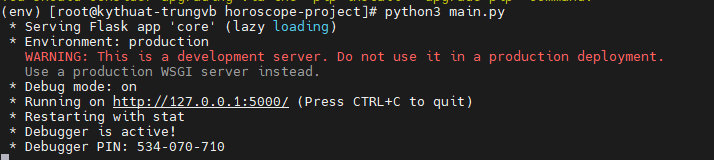
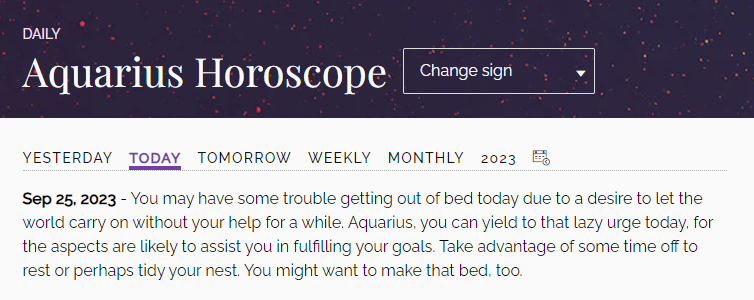

# How to create a Horoscope API with Beautiful Soup and Flask

## Giới thiệu

Bạn đã bao giờ đọc tử vi trên báo hay xem chúng trên TV chưa? Có lẽ điều này khá được giới trẻ quan tâm đến. 

Và đó là lý do bài hướng dẫn này sẽ sử dụng đề tài về tử vi làm phương tiện truyền tải kiến thức.

Trong bài viết này, chúng ta sẽ sử dụng Beautiful Soup và Flask để tạo API. API này, nếu được triển khai trên 1 server public, có thể được sử dụng bởi các lập trình viên khác tạo ra website hay ứng dụng tử vi của họ.

## Thiết lập Project

Trước hết, chúng ta sẽ tạo 1 virtual environment nơi mà tất cả dependency cần thiết được cài đặt.

Python giờ đã được cài đặt sẵn thư viện ```venv```. Do đó, để tạo 1 môi trường ảo, sử dụng lệnh sau:

```sh
python -m venv env
```

Để kích hoạt môi trường ảo tên ```env```, sử dụng lệnh:

```sh
# Trên Linux và MacOS
source env/bin/activate
```

Hoặc

```sh
# Trên windows
env\Scripts\activate.bat
```

Để vô hiệu hóa nó, có thể sử dụng:

```sh
deactivate
```

Giờ chúng ta đã sẵn sàng để cài đặt các phụ thuộc. Modules và thư viện mà chúng ta sẽ sử dụng là:
- **requests**: Requests cho phép ta gửi HTTP/1.1 requests một cách đơn giản. Module này sẽ không được cài đặt sẵn với Python, do đó chúng ta cần cài thêm

```sh
pip install requests
```

- **bs4**: Beautiful Soup là 1 thư viện Python để lấy dữ liệu từ các tệp HTML và XML. Để cài đặt, ta sử dụng:

```sh
pip install bs4
```

- **flask**: Flask là 1 microframework đơn giản cho Python mà có thể giúp xây dựng ứng dụng web có tính co giãn và bảo mật:

```sh
pip install flask
```

- **flask-restx**: Flask-RESTX cho phép ta tạo APIs với Swagger Documentation:

```sh
pip install flask-restx
```

- **python-decouple**: Chúng ta cũng sẽ sử dụng biến môi trường trong project này. Vì vậy, chúng ta sẽ cài đặt thêm module python-decouple để xử lý việc này:

```sh
pip install python-decouple
```

## Thiết lập Flask project

Sau khi đã có đủ thư viện, ta sẽ cần tạo 1 Flask project. Nếu bạn kiểm tra [documentation](https://flask.palletsprojects.com/en/2.0.x/quickstart/) của Flask, bạn sẽ tìm thấy cách tạo 1 ứng dụng tối giản ở đầu tiên.

Nhưng, chúng ta sẽ không làm theo như vậy. Chúng ta sẽ viết 1 ứng dụng có tính mở rộng tốt hơn với cấu trúc phù hợp.

Ứng dụng của chúng ta sẽ ở bên trong 1 package gọi là **core**. Để chuyển đổi 1 đường dẫn thông thường thành 1 Python package, đơn giản chỉ cần thêm vào trong đó 1 file ```__init__.py```. Vì vậy, hãy tạo core package như sau:

```sh
mkdir core
```

Sau đó, tạo ```__init__.py``` file bên trong core directory:

```sh
touch core/__init__.py
```

Trong đường dẫn ```/``` **của project**, tạo 1 file gọi là ```config.py```. Chúng ta sẽ lưu trữ các cấu hình cho project ở file này. Bên trong file, thêm nội dung như sau:

```sh
from decouple import config

class Config(object):
  SECRET_KEY = config('SECRET_KEY', default='guess-me')
  DEBUG = False
  TESTING = False
  CSRF_ENABLED = True

class ProductionConfig(Config):
  DEBUG = False
  MAIL_DEBUG = False

class StagingConfig(Config):
  DEVELOPMENT = True
  DEBUG = True

class DevelopmentConfig(Config):
  DEVELOPMENT = True
  DEBUG = True

class TestingConfig(Config):
  TESTING = True
```

Trong đoạn script bên trên, chúng ta đã tạo 1 lớp **Config** và định nghĩa các thuộc tính của nó. Cùng với đó, chúng ta đã tạo các lớp con (dựa trên các stage khác nhau của phát triển ứng dụng) mà thừa kế lớp **Config**

Lưu ý rằng chúng ta có **SECRET_KEY** thiết lập ở trong biến môi trường có tên **SECRET_KEY**. Tạo 1 file tên ```.env``` trong ở đường dẫn root và thêm vào nội dung sau:

```sh
APP_SETTINGS=config.DevelopmentConfig
SECRET_KEY=NhanHoaToBeTheBest
```

Bên cạnh **SECRET_KEY**, chúng ta có **APP_SETTINGS** mà liên quan đến 1 trong các classes chúng ta đã tạo trong file ```config.py```. Chúng ta thiết lập nó thành stage hiện tại của project

Bây giờ, chúng ta có thể thêm nội dung sau vào file ```__init__.py```:

```sh
from flask import Flask
from decouple import config
from flask_restx import Api

app = Flask(__name__)
app.config.from_object(config("APP_SETTINGS"))
api = Api(
    app,
    version='1.0',
    title='Horoscope API',
    description='Get horoscope data easily using the below APIs',
    license="It's free dudes",
    contact='TrungVB',
    contact_url='baotrung.xyz',
    contact_email='trungvb@nhanhoa.com.vn',
    doc='/',
    prefix='/api/v1'
)
```

Trong đoạn script trên, chúng ta đầu tiên import Flask class từ Flask module, sau đó tạo 1 object ```app``` thuộc lớp Flask. Chúng ta sử dụng đối số ```__name__``` để chỉ định module hoặc package của app nhờ đó Flask biết được nơi để tìm các tệp khác như các templates.

Tiếp đến, chúng ta thiết lập cấu hình app vào ```APP_SETTINGS``` theo biến môi trường trong tệp ```.env```.

Bên cạnh đó, chúng ta đã tạo 1 object của Api class. Chúng ta truyền vào nó 1 vài đối số, như việc Swagger documentation ở ```/```, hay ```/api/v1``` là prefix của mọi API route.

Bây giờ, hãy tạo 1 file gọi là ```routes.py``` ở trong ```core``` package và thêm namespace sau vào

```sh
from core import api
from flask import jsonify

ns = api.namespace('/', description='Horoscope APIs')
```

Chúng ta cần import file routes vừa tạo vào file ```__init__.py```:

```sh
from flask import Flask
from decouple import config
from flask_restx import Api

app = Flask(__name__)
app.config.from_object(config("APP_SETTINGS"))
api = Api(
    app,
    version='1.0',
    title='Horoscope API',
    description='Get horoscope data easily using the below APIs',
    license="It's free dudes",
    contact='TrungVB',
    contact_url='baotrung.xyz',
    contact_email='trungvb@nhanhoa.com.vn',
    doc='/',
    prefix='/api/v1'
)

from core import routes
```

Tiếp tục, tạo 1 file gọi là ```main.py``` ở ngoài root directory của project với nội dung:

```sh
from core import app

if __name__ == '__main__':
    app.run()
```

Lúc này, nếu chúng ta thực thi lệnh ```python3 main.py``` sẽ nhận được kết quả có dạng:



Vậy là ta đã sẵn sàng để đào sâu vào dữ liệu từ Horoscope website để xây dựng API của ta rồi!

## Thu thập dữ liệu từ Horoscope.com

Nếu ta mở **Horoscope.com** và chọn cung hoàng đạo, dữ liệu tử vi cho ngày hôm đó của bạn sẽ được hiển thị



Trong hình ảnh trên, bạn có thể thấy là có cả dữ liệu tử vi của cả ngày hôm qua, ngày mai, của tuần, tháng hay 1 ngày bất kỳ nữa. Chúng ta sẽ sử dụng tất cả thông tin đó.

Nhưng đầu tiên, nếu bạn để ý đến URL của trang hiện tại, nó sẽ có dạng như sau:

```sh
https://www.horoscope.com/us/horoscopes/general/horoscope-general-daily-today.aspx?sign=11
```

URL có 2 biến, đó là **sign** và **today**. Trong đó **sign** tương ứng với cung hoàng đạo, còn **today** để chỉ ngày muốn xem tử vi.

Cung hoàng đạo được thể hiện ở các số, do đó ta sẽ cần 1 dictionary để lưu trữ giá trị này:

```sh
ZODIAC_SIGNS = {
    "Aries": 1,
    "Taurus": 2,
    "Gemini": 3,
    "Cancer": 4,
    "Leo": 5,
    "Virgo": 6,
    "Libra": 7,
    "Scorpio": 8,
    "Sagittarius": 9,
    "Capricorn": 10,
    "Aquarius": 11,
    "Pisces": 12
}
```

Điều này có nghĩa là nếu cung hoàng đạo của bạn là Aquarius (Bảo Bình) thì biến **sign** ở trên URL phải là **10**.

Tiếp đó, nếu chúng ta muốn lấy dữ liệu của ngày cụ thể, URL sẽ có dạng:

```sh
https://www.horoscope.com/us/horoscopes/general/horoscope-archive.aspx?sign=11&laDate=20230923
```

Nó có cùng biến **sign**, nhưng có biến khác là **laDate** mà sẽ là ngày tháng dưới định dạng **YYYYMMDD**.

Giờ, chúng ta đã sẵn sàng để tạo các hàm khác nhau để thu thập horoscope data. Tạo 1 file ```utils.py``` và làm theo các bước sau.

### Lấy dữ liệu tử vi cho ngày

```sh
import requests
from bs4 import BeautifulSoup


def get_horoscope_by_day(zodiac_sign: int, day: str):
    if not "-" in day:
        res = requests.get(f"https://www.horoscope.com/us/horoscopes/general/horoscope-general-daily-{day}.aspx?sign={zodiac_sign}")
    else:
        day = day.replace("-", "")
        res = requests.get(f"https://www.horoscope.com/us/horoscopes/general/horoscope-archive.aspx?sign={zodiac_sign}&laDate={day}")
    soup = BeautifulSoup(res.content, 'html.parser')
    data = soup.find('div', attrs={'class': 'main-horoscope'})
    return data.p.text
```

Bên trên là hàm chức năng đầu tiên, thứ mà sẽ sử dụng 2 đối số: 1 integer thể hiện cho cung hoàng đạo và 1 string thể hiện ngày cần lấy dữ liệu. String này có thể là **today**, **tomorrow**, **yesterday**, hoặc 1 ngày cụ thể dưới định dạng **YYYY-MM-DD**

Nếu **day** không phải là 1 ngày cụ thể, nó sẽ không có ký tự gạch ngang "-" trong đó. Nhờ vậy mà ta có thể phân biệt và gọi đến API tương ứng.

Sau đó, chúng ta lấy dữ liệu HTML từ nội dung phản hồi về với BeautifulSoup. Giờ ta đã có dữ liệu tử vi nằm ở đâu đó trong đoạn code HTML này. Dữ liệu tử vi được chứa trong 1 div với class là **main-horoscope**. Theo đó, chúng ta sử dụng hàm ```soup.fine()``` để trích xuất xâu dữ liệu này ra.

### Lấy dữ liệu tử vi theo Tuần

```sh
def get_horoscope_by_week(zodiac_sign: int):
    res = requests.get(f"https://www.horoscope.com/us/horoscopes/general/horoscope-general-weekly.aspx?sign={zodiac_sign}")
    soup = BeautifulSoup(res.content, 'html.parser')
    data = soup.find('div', attrs={'class': 'main-horoscope'})
    return data.p.text
```

Hàm bên trên khá tương tự với cái trước đó. Chúng ta chỉ đơn giản là thay đổi URL cho phù hợp mà thôi.

### Lấy dữ liệu tử vi theo Tháng

```sh
def get_horoscope_by_month(zodiac_sign: int):
    res = requests.get(f"https://www.horoscope.com/us/horoscopes/general/horoscope-general-monthly.aspx?sign={zodiac_sign}")
    soup = BeautifulSoup(res.content, 'html.parser')
    data = soup.find('div', attrs={'class': 'main-horoscope'})
    return data.p.text
```

Tương tự, chúng ta chỉ cần thay URL.

## Tạo API Routes

Chúng ta sẽ sử dụng Flask-RESTX để tạo API routes. Ý tưởng cho routes sẽ như thế này:
- Cho dữ liệu theo ngày: ```/api/v1/get-horoscope/daily?day={day}&sign={zodiac_sign}``` hoặc ```api/v1/get-horoscope/daily?day={custom_day}&sign={zodiac_sign}```
- Cho tuần: ```api/v1/get-horoscope/weekly?sign={zodiac_sign}```
- Cho tháng: ```api/v1/get-horoscope/monthly?sign={zodiac_sign}```

Chúng ta có 2 tham số truy vấn trong URLs là **day** và **sign**. Tham số **day** có thể là today, yesterday, hay ngày cụ thể như đã đề cập. Tham số **sign** sẽ là tên cung hoàng đạo, các ký tự có thể là viết hoa hay viết thường, không quan trọng.

Để parse tham số truy vấn từ URL, Flask-RESTX có hỗ trợ để truy vấn dữ liệu sử dụng thư viện tương tự như **argparse** gọi là **reqparse**. Để thêm những đối số vào URL, chúng ta sẽ sử dụng phương thức  **add_argument** cho **RequestParser** class.

```sh
parser = reqparse.RequestParser()
parser.add_argument('sign', type=str, required=True)
```

Tham số ```type``` sẽ thể hiện loại của tham số, trong khi đó ```required=True``` khiến tham số truy vấn bắt buộc phải được truyền vào.

Bây giờ, chúng ta cần 1 tham số truy vấn khác cho ```day```. Nhưng tham số này sẽ được sử dụng chỉ trong URL tử vi hàng ngày.

Thay vì viết lại đối số, chúng ta có thể viết 1 parent parser chứa tất cả các đối số chia sẻ và sau đó mở rộng parser này với ```copy()```.

```sh
parser_copy = parser.copy()
parser_copy.add_argument('day', type=str, required=True)
```

```parser_copy``` sẽ không chỉ chứa **day** mà còn cả **sign** nữa. Đó là những gì chúng ta cần cho tử vi hàng ngày.

Main building block của Flask-RESTX là resources. Resources được xây dựng trên nền **Flask pluggable views*, cho phép bạn dễ dàng truy nhập vào nhiều phương thức HTTP chỉ bằng cách định nghĩa phương thứ trên resource của bạn.

Hãy tạo DailyHoroscopeAPI class mà kế thừa Resource class từ ```flask-restx```

```sh
@ns.route('/get-horoscope/daily')
class DailyHoroscopeAPI(Resource):
  # Shows daily horoscope of zodiac signs
  @ns.doc(parser=parser_copy)
  def get(self):
    args = parser_copy.parse_args()
    day = args.get('day')
    zodiac_sign = args.get('sign')
    try:
      zodiac_num = ZODIAC_SIGNS[zodiac_sign.capitalize()]
      if "-" in day:
        datetime.strptime(day, '%Y-%m-%d')
      horoscope_data = get_horoscope_by_day(zodiac_num, day)
      return jsonify(success=True, data=horoscope_data, status=200)
    except KeyError:
      raise NotFound('No such zodiac sign exists')
    except AttributeError:
      raise BadRequest('Something went wrong, please check the URL and arguments.')
    except ValueError:
      raise BadRequest('Please enter day in correct format: YYYY-MM-DD')
```

Chỉ dẫn ```@ns.route()``` thiết lập API route. Bên trong *DailyHoroscopeAPI* class, chúng ta có phương thức **get** mà sẽ xử lý các yêu cầu **GET**. Chỉ dẫn ```@ns.doc()``` sẽ hỗ trợ chúng ta thêm tham số truy vấn lên URL.

Để lấy giá trị của tham số truy vấn, chúng ta sẽ sử dụng **parse_args()** method mà sẽ trả về 1 dictionary có dạng:

```sh
{"sign": "aquarius", "day": "2023-9-26"}
```

Sau đó chúng ta có thể lấy giá trị của 2 key **day** và **sign**

Như đã định nghĩa ở đầu, chúng ta có dictionary **ZODIAC_SIGNS**. Chúng ta sử dụng 1 khối **try-except** để xử lý request. Nếu cung hoàng đạo không nằm trong dictionary, 1 ngoại lệ tên là ```KeyError``` sẽ được raise. Trong trường hợp này, chúng ta phản hồi là ```NotFoundError``` (404)

Tương tự, nếu tham số **day** có chứa dấu gạch ngang trong đó, chúng ta sẽ cố khớp nó với định dạng ngày YYYY-MM-DD. Nếu không ở định dạng đó, chúng ta raise lỗi ```BadRequest``` (400). Nếu **day** không chứa dấu gạch ngang, chúng ta gọi trực tiếp ```get_horoscope_by_day()``` với đối số **sign** và **day**.

Nếu có giá trị không hợp lệ được truyền vào, 1 ```AttributeError``` sẽ được raise, trong trường hợp này, chúng ta raise ```BadRequest``` error.

2 routes còn lại khá tương đồng với route bên trên. Điểm khác nhau là, chúng ta không cần 1 tham số **day**. Vì vậy, thay vì sử dụng ```parser_copy```, ```parser``` sẽ được truyền vào ở đây.

```sh
@ns.route('/get-horoscope/weekly')
class WeeklyHoroscopeAPI(Resource):
  @ns.doc(parser=parser)
  def get(self):
    args = parser.parse_args()
    zodiac_sign = args.get('sign')
    try:
      zodiac_num = ZODIAC_SIGNS[zodiac_sign.capitalize()]
      horoscope_data = get_horoscope_by_week(zodiac_num)
      return jsonify(success=True, data=horoscope_data, status=200)
    except KeyError:
      raise NotFound('No such zodiac sign exists')
    except AttributeError:
      raise BadRequest('Something went wrong, please check the URL and arguments.')

@ns.route('/get-horoscope/monthly')
class MonthlyHoroscopeAPI(Resource):
  @ns.doc(parser=parser)
  def get(self):
    args = parser.parse_args()
    zodiac_sign = args.get('sign')
    try:
      zodiac_num = ZODIAC_SIGNS[zodiac_sign.capitalize()]
      horoscope_data = get_horoscope_by_month(zodiac_num)
      return jsonify(success=True, data=horoscope_data, status=200)
    except KeyError:
      raise NotFound('No such zodiac sign exists')
    except AttributeError:
      raise BadRequest('Something went wrong, please check the URL and arguments.')
```

Giờ routes của ta đã hoàn thành. Để kiểm tra APIs, ta có thể sử dụng Swagger documentation ở ```/``` route, hoặc sử dụng ```Postman```.

Ta cũng có thể deploy project ở 1 public server, nhờ đó API có thể được sử dụng công khai bởi các người dùng hay ứng dụng khác.

