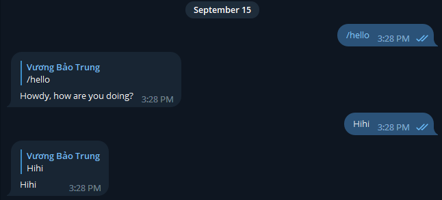

# Create a telegram bot using Python

Các chatbots tự động khá hữu dụng cho các tương tác giả lập ở Slack, Discord, hay nhiều nền tảng khác.

Trong bài viết này, chúng ta sẽ tìm hiểu cách để xây dựng 1 Telegram chatbot với ```pyTelegramBotAPI```. Hãy cùng bắt đầu ngay thôi!

## Lấy bot token

Hướng dẫn ở ...

## Thiết lập môi trường coding

Trong khi có nhiều thư viện cung cấp khả năng tạo 1 Telegram bot, chúng ta sẽ sử dụng ```pyTelegramBotAPI```. Đây là 1 thư viện đơn giản nhưng có tính mở rộng cao cho Telegram Bot API với cả phương thức đồng bộ hay không đồng bộ.

Cài đặt thư viện ```pyTelegramBotAPI``` sử dụng pip

```sh
pip install pyTelegramBotAPI
```

Tiếp theo, mở code editor bất kỳ và tạo 1 file tên ```.env``` để lưu trữ token như bên dưới

```sh
export BOT_TOKEN=insert-token-here
```

Sau đó, chạy lệnh ```source .env``` để đọc biến môi trường từ file ```.env```

## Tạo bot với pyTelegramBotAPI

Tất cả triển khai API đều được lưu trữ trong 1 class gọi là ```TeleBot```. Nó cung cấp nhiều cách thức để lắng nghe những tin nhắn đến bằng các phương thức như ```send_message()```, ```send_document()```,...

Tạo 1 tệp ```bot.py``` với nội dung như sau

```
import os
import telebot

BOT_TOKEN = os.environ.get('BOT_TOKEN')

bot = telebot.TeleBot(BOT_TOKEN)
```

Ở code bên trên, chúng ta sử dụng thư viện ```os``` để đọc biến môi trường lưu trữ trong hệ thống.

Chúng ta đã export 1 biến môi trường gọi là ```BOT_TOKEN``` ở bước trước đó. Ở dòng tiếp theo, chúng ta sử dụng ```TeleBot``` class để tạo 1 bot instance và đưa ```BOT_TOKEN``` vào nó.

Chúng ta sau đó cần register những message handlers. Những message handlers chứa các bộ lọc mà 1 message phải truyền vào. Nếu 1 mesage truyền vào bộ lọc, hàm đã được thiết lập sẽ được gọi và message tới được cung cấp như 1 đối số.

Hãy định nghĩa 1 message handler mà xử lý các lệnh ```/start```, ```/hello``` gửi đến.

```sh
@bot.message_handler(commands=['start', 'hello'])
def send_welcome(message):
  bot.reply_to(message, "Howdy, how are you doing?")
```

Có thể đặt bất kỳ tên nào cho 1 function mà dành cho message handler, nhưng nó chỉ có thể có 1 tham số (là cái ```message```)

Hãy thêm 1 handler khác mà vọng lại tất cả text message cho người gửi

```sh
@bot.message_handler(func=lambda msg: True)
def echo_all(message):
  bot.reply_to(message, message.text)
```

Code bên trên sử dụng ```lambda``` expression để kiểm thử 1 message. Vì chúng ta cần vọng lại tất cả message, chúng ta luôn trả về ```True``` từ ```lambda``` function

Giờ ta đã có 1 bot đơn giản để phản hồi lại các lệnh ```/start``` và ```/hello``` với 1 static message và vọng lại tất cả các message khác. Thêm dòng sau vào file để khởi chạy bot

```sh
bot.infinity_polling()
```

Vậy đó, chúng ta đã có 1 Telegram bot, hãy chạy file Python và quay trở lại Telegram để kiểm tra.



Bạn có thể tìm hiểu thêm thông tin về thư viện ```pyTelegramBotAPI``` tại [documentation](https://github.com/eternnoir/pyTelegramBotAPI) của họ

## Lập trình Bot dự đoán tử vi

Ở phần này, chúng ta sẽ cần sử dụng message chaining cho bot. Đầu tiên con bot sẽ hỏi cung hoàng đạo của bạn và ngày muốn xem tử vi, sau đó nó sẽ trả về dự đoán tử vi của ngày hôm đó.

### Fetch horoscope data

Đầu tiên, hãy viết 1 function để fetch dữ liệu tử vi cho ngày cụ thể

```sh
import requests

def get_daily_horoscope(sign: str, day: str) -> dict:
  """Get daily horoscope for a zodiac sign.
  Keyword arguments:
  sign: str - Zodiac sign
  day: str - Date in format (YYYY-MM-DD) or TODAY/TOMORROW/YESTERDAY
  Return: dict - JSON data
  """
  url = "https://horoscope-app-api.vercel.app/api/v1/get-horoscope/daily"
  params = {"sign": sign, "day": day}
  response = requests.get(url, params)

  return response.json()
```

Trong đoạn code bên trên , chúng ta tạo 1 hàm mà chấp nhận 2 đối số là string: ```sign``` và ```day``` và trả về JSON data. Chúng ta gửi GET request trên API URL và truyền vào ```sign``` với ```day``` như tham số truy vấn

Nếu kiểm thử hàm bên trên, ta sẽ nhận về kết quả đầu ra có dạng:

```sh
{
   "data":{
      "date": "Dec 15, 2022",
      "horoscope_data": "Lie low during the day and try not to get caught up in the frivolous verbiage that dominates the waking hours. After sundown, feel free to speak your mind. You may notice that there is a sober tone and restrictive sensation today that leaves you feeling like you will never be able to break free from your current situation. Don't get caught in this negative mindset."
   },
   "status": 200,
   "success": true
}
```

Lưu ý: Thư viện ```request``` được đề cập chi tiết hơn ở bài viết [này](https://ashutoshkrris.hashnode.dev/how-to-interact-with-web-services-using-python)

### Add a message handler

Giờ chúng ta đã có 1 function trả về dữ liệu tử vi, hãy tạo 1 message handler cho con bot để nó hỏi cung hoàng đạo của người dùng

```sh
@bot.message_handler(commands=['horoscope'])
def sign_handler(message):
  text = "What's your zodiac sign?\nChoose one: *Aries*, *Taurus*, *Gemini*, *Cancer,* *Leo*, *Virgo*, *Libra*, *Scorpio*, *Sagittarius*, *Capricorn*, *Aquarius*, and *Pisces*."
  sent_msg = bot.send_message(message.chat.id, text, parse_mode="Markdown")
  bot.register_next_step_handler(sent_msg, day_handler)
```

Hàm bên trên có 1 chút khác biệt với các hàm mà ta sử dụng ở phần trước. Bot sẽ phản ứng dự đoán tử vi với lệnh ```/horoscope```. Chúng ta gửi 1 text message đến người dùng, nhưng chú ý rằng chúng ta có thiết lập ```parse_mode``` thành **Markdown** trong khi gửi message

Vì chúng ta sẽ sử dụng message chaining, ở code bên trên có phương thức ```register_next_step_handler()```. Phương thức này chấp nhận 2 tham số: message gửi bởi người dùng và hàm callback mà sẽ được gọi sau message này. Theo đó, chúng ta truyền biến ```sent_msg``` và 1 hàm ```day_handler``` mà chúng ta sẽ định nghĩa ở phần tiếp theo

```sh
def day_handler(message):
  sign = message.text
  text = "What day do you want to know?\nChoose one: *TODAY*, *TOMORROW*, *YESTERDAY*, or a date in format YYYY-MM-DD."
  sent_msg = bot.send_messsage(message.chat.id, text, parse_mode="Markdown")
  bot.register_next_step_handler(sent_msg, fetch_horoscope, sign.capitalize())
```

Chúng ta lấy dữ liệu cung hoàng đạo từ thuộc tính ```message.text```. Nó cũng hỏi ngày mà bạn muốn xem tử vi.

Ở đoạn cuối, chúng ta sử dụng cùng phương thức ```register_next_step_handler()``` và truyền nó vào ```sent_msg```, hàm callback ```fetch_horoscope``` và biến ```sign```

Cuối cùng, định nghĩa hàm ```fetch_horoscope``` mà đưa vào các đối số là ```message``` và ```sign```

```sh
def fetch_horoscope(message, sign):
  day = message.text
  horoscope = get_daily_horoscope(sign, day)
  data = horoscope["data"]
  horoscope_message = f'*Horoscope:* {data["horoscope_data"]}\\n*Sign:* {sign}\\n*Day:* {data["date"]}'
  bot.send_message(message.chat.id, "Here's your horoscope!")
  bot.send_message(message.chat.id, horoscope_message, parse_mode="Markdown")
```

Hàm cuối này là nơi ta lấy cung hoàng đạo từ tham số hàm và ngày tử vi từ thuộc tính ```message.text```. Tiếp đến, ta fetch dữ liệu tử vi từ hàm ```get_daily_horoscope``` và viết tin nhắn sẽ gửi. Cuối cùng chúng ta gửi dữ liệu tử vi.

