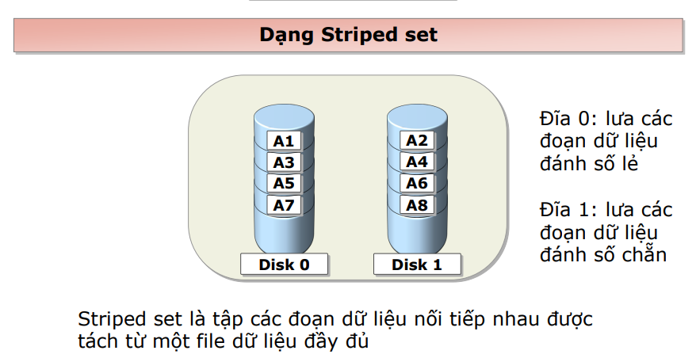
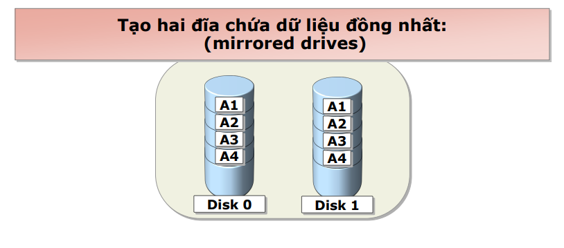
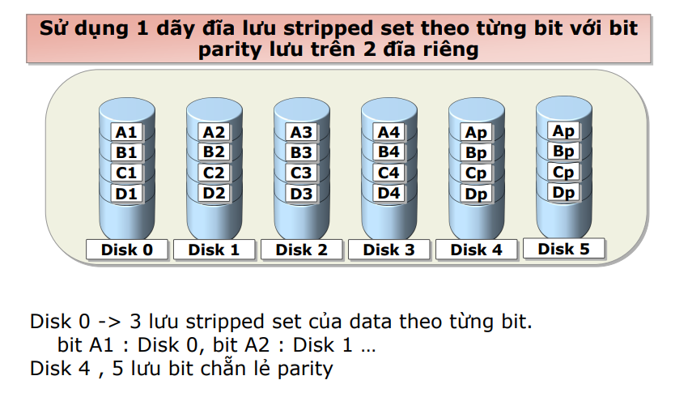
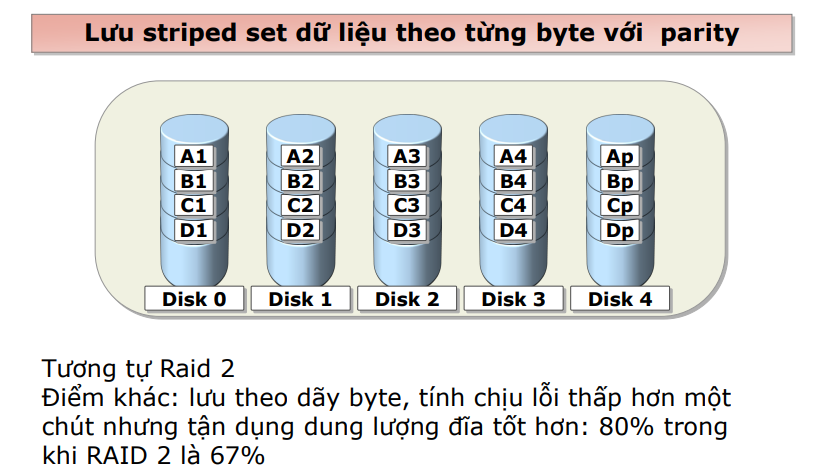
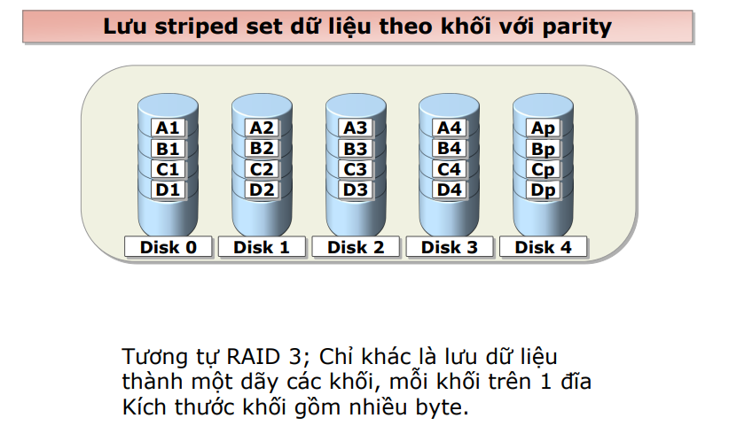
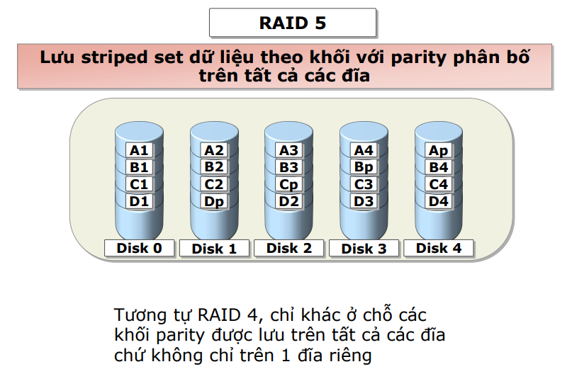
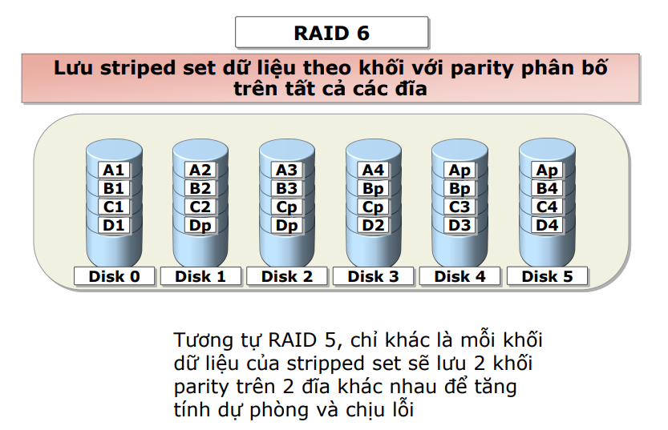
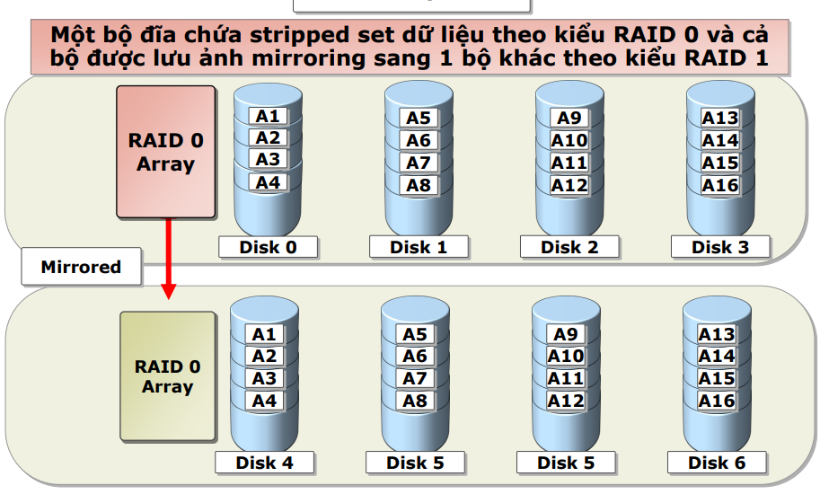
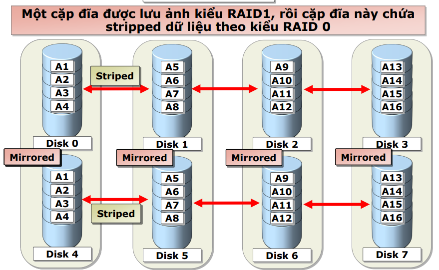

# RAID

## Giới thiệu chung

RAID (hay Redundant Array of Independent Disks) là công nghệ phối hợp các ổ đĩa độc lập thành một dãy hoạt động như một đơn vị lưu trữ duy nhất, để tăng tính dự phòng, khả năng chịu lỗi và hiệu năng

RAID có cung cấp khả năng chịu lỗi qua 2 dạng cấu hình: 
- Disk mirroring (Lưu ảnh đĩa)
- Parity information (Lưu parity phát hiện và sửa lỗi)

RAID có thể hỗ trợ hiệu năng truy nhập bằng cách phân bổ truy nhập I\O trên nhiều đĩa cùng lúc

RAID có 1 số cấu hình theo nhiều mức level

**Chú ý:** RAID không nên dùng thay thế sao lưu backup

Các lựa chọn khi triển khai RAID:
- Hardware RAID: hỗ trợ từ phần cứng của máy tính
- Software RAID: hỗ trợ bằng phần mềm, HĐH

Khi lựa chọn RAID level, cân nhắc các yếu tố sau:
- Hiệu năng hệ thống
- Mức độ dự phòng
- Tận dụng dung lượng lưu trữ

## Các RAID level

1. RAID 0



2. RAID 1



3. RAID 2



4. RAID 3



5. RAID 4



6. RAID 5



7. RAID 6



8. RAID 0+1



9. RAID 1+0



### Nhận xét

- Các kiểu RAID hay được dùng là RAID 0, RAID 1, RAID 5, RAID 0+1 và RAID 1+0
- RAID 0 chứa stripped set
    - Tận dùng toàn bộ dung lượng và cho hiệu năng đọc cao
    - Khả năng chịu lỗi thấp, hỏng 1 trong 2 đĩa là mất dữ liệu
- RAID 1 sử dụng cặp đĩa mirrored
    - Hiệu năng đọc tốt
    - Có thể khôi phục nếu 1 đĩa bị lỗi
    - Chỉ tận dụng dung lượng được 50%
- RAID 3
    - Hiệu năng truy nhập rất cao
    - Có thể phục hồi nếu 1 đĩa bị lỗi, sử dụng 1 đĩa lưu parity
    - Ít dùng
- RAID 5
    - Hiệu năng đọc tốt nhưng ghi kém vì lưu tripped theo khối
    - Có thể phục hồi nếu 1 đĩa lỗi, tận dụng dung lượng giống RAID 3
- RAID 0+1
    - Hiệu năng truy nhập rất tốt
    - Có thể chịu lỗi 2 đĩa hoặc nhiều hơn nếu tất cả các đĩa bị lỗi đều thuộc cùng 1 dãy stripped set
    - Tận dụng dung lượng thấp: chỉ 50%
    - Tương đối ít dùng
- RAID 1+0
    - Hiệu năng truy nhập rất tốt
    - Có thể chịu lỗi 2 đĩa trở lên nếu 2 đãi mirrored không bị cùng lỗi
    - Tận dụng dung lượng: 50%
    - Sử dụng khi cần tăng hiệu năng và khả năng chịu lỗi, chi phí cho các dự phòng chấp nhận được


## RAID trong Linux

RAID được quản lý bằng gói ```mdadm``` trong hầu hết các bản Linux, để cài đặt ```mdadm``` ta sử dụng lệnh sau

```yum -y install mdadm```

1. Cách tạo RAID 0

Sử dụng lệnh:

```mdadm --create --verbose /dev/md0 --level=0 --raid-devices=2 /dev/sdb /dev/sdc```

hoặc: ```mdadm -C /dev/md0 -l raid0 -n 2 /dev/sd[b-c]```

2. Cách tạo RAID 1

Với 2 đĩa ghi dữ liệu, 1 đĩa dự phòng:

```mdadm --create --verbose /dev/md0 --level=1 --raid-devices=2 /dev/sd[b-c] --spare-devices=/dev/sdd```

3. Cách tạo RAID 4

Với 4 đĩa ghi dữ liệu và 1 đĩa dự phòng:

```mdadm --create --verbose /dev/md0 --level=4 --raid-devices=4 /dev/sdb /dev/sdc /dev/sdd /dev/sde spare-devices = /dev/sdf```

4. Cách tạo RAID 5

Với 3 đĩa và 1 đĩa dự phòng:

```mdadm --create --verbose /dev/md0 --level=5 --raid-devices=3 /dev/sd[b-d] --spare-devices=/dev/sde```