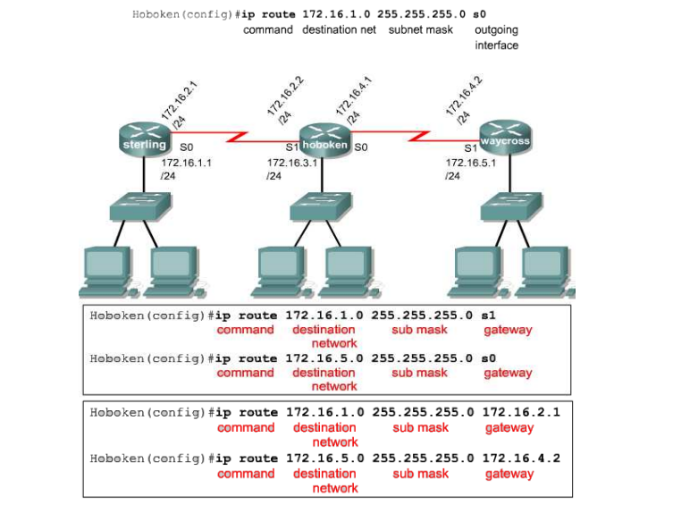

# Định tuyến

## IP Routing

- Định tuyến: chuyển tiếp gói tin đến mạng đích dựa trên địa chỉ đích trong gói tin
- Router: thiết bị dùng để chuyển tiếp gói tin đến mạng đích (định tuyến)
- Định tuyến tĩnh: được cấu hình bởi người quản trị, rất phức tạp khi cấu hình mạng lớn và khi có nhiều sự thay đổi
- Định tuyến động: sử dụng giao thức định tuyến, các thông số về mạng được học/cập nhật từ các router khác, tuyến có thể thay đổi khi topology hoặc traffic thay đổi

Định tuyến tĩnh có thể chia thành 3 giai đoạn:
- Người quản trị mạng cấu hình định tuyến
- Router cài đặt tuyến vào bảng định tuyến
- Gói tin được định tuyến dựa trên thông tin định tuyến

## Non-Directly Connected Network

- Default Route: sử dụng khi không biết địa chỉ của mạng đích. Cấu hình static như sau:

```ip route 0.0.0.0 0.0.0.0 [next-hop-address | outgoing interface]```

## Hai tham số dùng trong định tuyến

**Metric**

Là tham số được sử dụng để chọn đường đi tốt nhất cho việc định tuyến. Đây là giá trị mà bất kỳ giao thức định tuyến nào cũng phải dùng để tính toán đường đi đến mạng đích

Trong trường hợp có nhiều đường đi đến một mạng đích thì đường nào có mtric thấp hơn sẽ được chọn để đưa vào bảng định tuyến. Mỗi giao thức định tuyến có 1 kiểu metric khác nhau

**AD**

AD (Administrative Distance) là giá trị quy ước dùng để chỉ độ tin cậy của các giao thức định tuyến, giao thức nào có AD nhỏ hơn sẽ được xem là đáng tin cậy hơn. Trong trường hợp router học được 1 mạng đích thông qua nhiều giao thức định tuyến khác nhau, thì tuyến của giao thức định tuyến nào có AD nhỏ nhất sẽ được chọn và đưa vào bảng định tuyến

## Định tuyến tĩnh

Trong cấu hình định tuyến tĩnh, người quản trị phải cấu hình thủ công chỉ ra đường đi đến tất cả các mạng đích trên các router trong hệ thống. Định tuyến tĩnh không có hoạt động gửi thông tin cập nhật như định tuyến động

Để cấu hình định tuyến tĩnh, chúng ta sử dụng cú pháp sau:

```sh
Router(config)#ip route <destination-network> <subnet-mask> {next-hop-address|out-bound-interface>} [distance]
```

- Destination-network: địa chỉ mạng đích cần tới
- Subnet-mask: Subnet mask của destination-network
- Next-hop-address: địa chỉ IP của cổng trên router kế tiếp có kết nối trực tiếp với router đang xét
- Out-bound-interface: cổng của router sẽ gửi dữ liệu ra
- Distance: thay đổi giá trị AD cho tuyến này. Mặc định các tuyến tĩnh có AD = 1



## Default route

Default route nằm ở cuối bảng định tuyến và được sử dụng để gửi các gói tin đi trong trường hợp mạng đích không tìm thấy trong bảng định tuyến. 

Rất hữu dụng trong các mạng dạng "stub network" như kết nối từ mạng nội bộ ra ngoài Internet

## Định tuyến động

Routed Protocol: chứa thông tin về lớp mạng (như IP, IPX)

Routing Protocol: giao thức trao đổi giữa các router

VD:
- Routing Information Protocol (RIP)
- Interior Gateway Routing Protocol (IGRP)
- Enhanced Interior Gateway Routing Protocol (EIGRP)
- Open Shortest Path First

## Autonomous System (AS)

Tập hợp các mạng được quản lý thống nhất, sử dụng cùng chính sách định tuyến, được định danh bởi các AS number

Mạng Internet được chia thành các AS dễ quản lý hơn. Mỗi AS có những quy luật và chính sách riêng

## Routing Protocol

- Xây dựng và duy trì các bảng định tuyến về các mạng học được cùng với các port liên quan
- Học các tuyến, chọn tuyến tốt nhất vào bảng định tuyến, loại bỏ tuyến không hợp lệ. Router sử dụng thông tin trong bảng định tuyến để chuyển tiếp gói tin
- Khi topology có sự thay đổi, thông tin định tuyến cũng thay đổi
- Khi tất cả các router cùng có thông tin như nhau, mạng được coi là hội tụ (converged). Cần có sự hội tụ càng nhanh càng tốt vì sẽ giảm được khoảng thời gian các router có thông tin định tuyến không chính xác

Có 2 phương pháp định tuyến cơ bản:
- Distance vector: quan tâm đến chiều và khoảng cách đến các link trong mạng
- Link-state: tạo lại chính xác topology của toàn bộ mạng

*Distance vector:* gửi tất cả hoặc một phần bảng định tuyến đến các router lân cận theo chu kỳ, ngay cả khi không có sự thay đổi. Giao thức: RIP, IGRP, EIGRP

*Link-state:* gửi thông tin cập nhật (trigger update) khi có sự thay đổi; cập nhật theo chu kỳ với khoảng thời gian dài hơn (VD 30p). Khi 1 tuyến hay link thay đổi, thiết bị phát hiện sự thay đổi tạo 1 bản tin LSA (link-state advertisement). LSA được gửi đến tất cả các thiết bị lân cận. Mỗi thiết bị sẽ tạo một bản sao của LSA, cập nhật link-state database và chuyển tiếp LSA đến các thiết bị lân cận khác. Cơ chế này (flooding LSA) sẽ tạo các database chính xác tại các thiết bị định tuyến trước khi cập nhật bảng định tuyến. Link-state thường dùng databse để tạo bảng định tuyến với tuyến ngắn nhất. Giao thức: OSPF, IS-IS

**RIP**

Sử dụng số chặng (hop) để tính khoảng cách và hướng đến các link. Nếu có nhiều đường đến đích, RIP chọn đường có số hop ít nhất (mỗi link đều coi là 1 hop). RIP không định tuyến được quá 15 hop.

RIPv1 không bao gồm subnet mask trong cập nhật định tuyến nên yêu cầu tất cả các thiết bị trong mạng sử dụng cùng subnet mask (classful routing). RIPv2 bao gồm subnet mask trong cập nhật định tuyến (classless routing), các subnet khác nhau trong cùng 1 mạng có thể dùng những subnet mask khác nhau (variable-length subnet masking - VLSM)

**IGRP** (classful routing) 

Là giao thức định tuyến được phát triển bởi Cisco, sử dụng cho các mạng lớn hơn khả năng cho phép của RIP.

IGRP có thể chọn đường dựa trên trễ, băng thông, tải và độ tin cậy.

**EIGRP**

Là giao thức cải tiến của IGRP. RIGRP cung cấp các cơ chế như fast convergence, low overhead bandwidth. EIGRP sử dụng 1 số chức năng của giao thức link-state nên còn được gọi là giao thức lai (hybrid protocol).

**OSPF** (link-state prtocol)

Phát triển bởi IETF năm 1988. OSPF sử dụng cho những mạng lớn, hay thay đổi mà RIP không thể đáp ứng.

**IS-IS** (link-state protocol)

Sử dụng để định tuyến những giao thức khác IP

Giao thức định tuyến trong AS: IGP, ngoài AS: EGP

**BGP** (Border Gateway Protocol)

Là 1 ví dụ về giao thức EGP. BGP trao đổi thông tin định tuyến giữa các AS, đồng thời đảm bảo không bị vòng lặp. BGP định tuyến dựa trên network policy, rules


