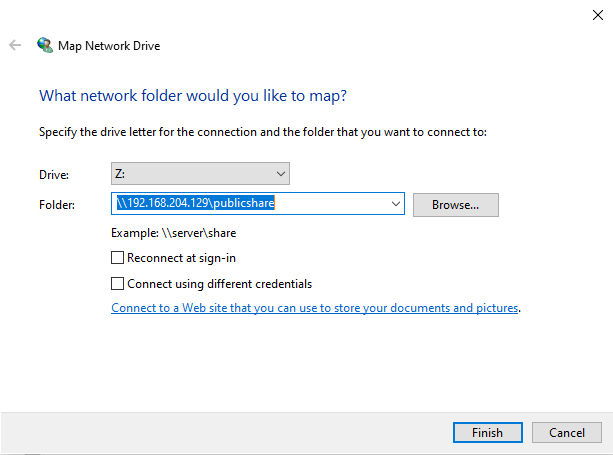
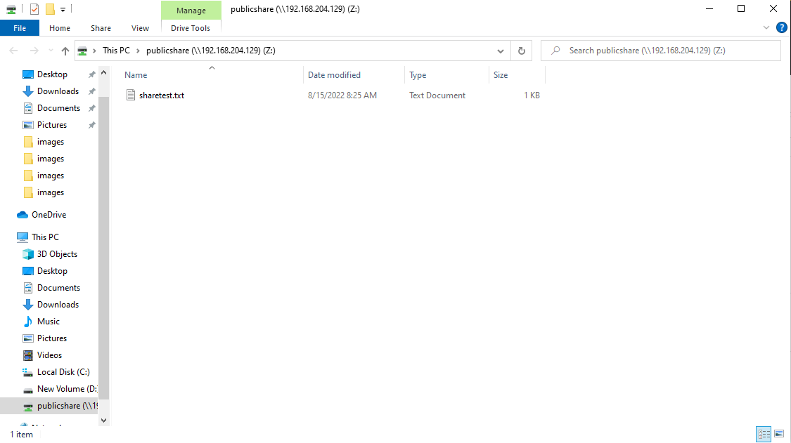

# Samba Server và sử dụng giao thức SMB để chia sẻ file qua mạng

## Samba Server

### Giới thiệu chung

Máy chủ Samba được xem là một máy chủ tệp tin (file server) sử dụng trong mạng nội bộ. Là nơi lưu trữ tập trung các thông tin của tổ chức, doanh nghiệp bất kỳ và thường được cài đặt trên hệ điều hành Linux hoặc Windows. Samba server hoạt động chủ yếu dựa trên giao thức SMB (Server Message Block Protocol)

### Cách thức hoạt động của giao thức SMB

Giao thức SMB (hay CIFS) hoạt động trong mạng Internet dựa trên giao thức TCP/IP. Và đem đến cho người dùng toàn quyền trong việc tạo 1 tập tin với các quyền hạn như Read Only, Read/Write, đặt mật khẩu, khóa 1 tập tin,...

SMB cũng hỗ trợ các tính năng khác như:
- Phát hiện các máy chủ sử dụng SMB trên mạng (browsw network)
- Xác thực truy cập file, thư mục chia sẻ
- Thông báo sự thay đổi file và thư mục
- Xử lý các thuộc tính mở rộng của file
- Hỗ trợ Unicode

### Dịch vụ

Samba bao gồm các dịch vụ:
- **smbd**: cung cấp dịch vụ chia sẻ tệp và máy in cho các Windows Client. Ngoài ra nó còn chịu trách nhiệm xác thực người dùng, khóa tài nguyên và chia sẻ dữ liệu thông qua giao thức SMB. Cổng mặc định mà máy chủ lắng nghe lưu lượng SMB là TCP 139 và 445 
- **nmbd**: hiểu và trả lời NetBIOS qua các yêu cầu dịch vụ bởi SMB trong các hệ thống dựa trên Windows. Cổng mặc định mà máy chủ lắng nghe lưu lượng NMB là UDP 137
- **winbindd**: là dịch vụ phân giải thông tin người dùng và nhóm nhận được từ máy chủ chạy Windows. Điều này giúp cho người dùng Windows và thông tin các nhóm có thể hiểu được bởi các nền tảng Linux và UNIX. Nó cho phép người dùng Windows xuất hiện và hoạt động như người dùng Linux

Cả **winbindd** và **smbd** đều được đóng gói với các bản phân phối của Samba, nhưng dịch vụ **winbindd** được kiểm soát tách biệt từ dịch vụ **smbd**

## Chia sẻ file qua mạng sử dụng giao thức SMB

### Cài đặt Samba server

1. Sử dụng lệnh sau để cài đặt Samba

```yum -y install samba```

```sh
systemctl enable smb
systemctl enable nmb
systemctl start smb
systemctl start nmb
```

2. Cấu hình firewall trên server cho phép samba thông qua

```sh
firewall-cmd --permanent --zone=public --add-service=samba
firewall-cmd --reload
```

3. Chia sẻ 1 thư mục public 

File cấu hình mặc định của samba lưu tại /etc/samba/smb.conf, ta backup file này lại và tạo file cấu hình mới như sau:

```sh
mv /etc/samba/smb.conf /etc/samba/cmb.conf.bak
vi /etc/samba/smb.conf
```

Copy paste đoạn nội dung này vào:

```sh
[global]
workgroup = WORKGROUP
server string = My Samba Server
netbios name = centos
security = user
map to guest = bad user
dns proxy = no

[PublicShare]
path = /samba/publicshare
browsable = yes
writable = yes
guest ok = yes
read only = no
```

Tiếp đến, tạo 1 thư mục để chia sẻ:

```sh
mkdir -p /samba/publicshare/
chmod -R 755 /samba/publicshare/
chown -R nobody:nobody /samba/publicshare/
```

Sau khi hoàn tất thiết lập thì khởi động lại samba server

4. Kết nối đến Samba server bằng Windows

Chuột phải vào **This PC** ở máy Windows, chọn **Map network drive**, điền địa chỉ IP của máy chủ samba và đường dẫn tới share folder



Kết nối thành công:




