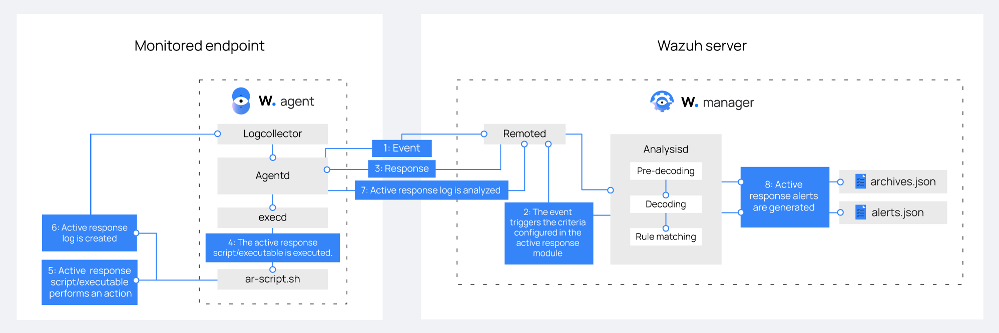

# Active Response

Security teams thường xuyên gặp phải vấn đề trong việc xác định các vấn đề và đưa ra giải pháp một cách nhanh chóng trong thời gian thực. Điều này khiến cho vấn đề lại càng làm họ khó nắm bắt được toàn cảnh vấn đề đã xảy ra. 

Wazuh SIEM và XDR platform nâng cao khả năng đáp trả sự cố với:
- Cung cấp tầm nhìn thời gian thực với security event
- Reducing alert fatigue (?)
- Các phản hồi tự động đến mối nguy hại
- Các script phản hồi 

Wazuh có 1 active response module hỗ trợ cho security team tự động đáp trả dựa trên các điều kiện kích hoạt cụ thể, cho phép họ quản lý các sự cố bảo mật hiệu quả hơn.

Các hành động phản hồi tự động chắc chắn rằng các sự cố ưu tiên lớn được xác định và khắc phục chúng trong thời gian ngắn nhất có thể. Điều này rất giá trị với các môi trường nơi bảo mật được đề cao.

Thêm vào đó, module cũng bao gồm 1 số "out-of-the-box" scripts mà hỗ trợ phản hồi lại mối nguy hại và xử lý chúng. Ví dụ, 1 vài scripts block truy nhập mạng đáng ngờ và xóa các file bất hợp pháp trên endpoint được giám sát. Những hành động này giảm tải cho security team và giúp họ quản lý sự cố tốt hơn.

Wazuh active response module thực thi những script này trên endpoint được giám sát khi 1 alert của rule chỉ định (ID, level, hay rule group) kích hoạt. Ta có thể đặt bất kỳ script nào mà muốn sử dụng để đáp lại 1 alert, tuy nhiên vẫn nên cân nhắc kỹ trước khi thực hiện các hành động này.

Các Loại active response:
- Stateless
- Stateful

**Stateless** active responses là những hành động thực hiện 1 lần mà không có event nào được định nghĩa để đảo ngược hoặc ngừng nó lại. Trong khi **Stateful** response đảo ngược hoặc stop những hành động này sau 1 khoảng thời gian.

