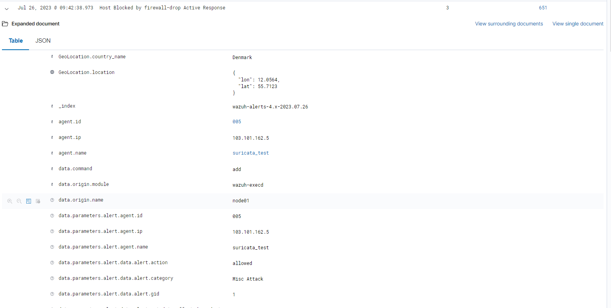

# Block SSH brute-force attack với active response

Wazuh sử dụng active response module để chạy script hoặc executables trên endpoint được giám sát, thực hiện hành động trên những cảnh báo cụ thể. Trong trường hợp này, chúng ta giả định 1 SSH brute-force attack và cấu hình để active response module chặn địa chỉ IP của kẻ tấn công. Mục tiêu là ngăn chặn SSH brute force attack. Active response module thực thi 1 script để chặn địa chỉ IP của kẻ tấn công khi rule id ```5763``` - ```SSHD brute force trying to get access to the system``` trigger

## Trên Wazuh server

Wazuh có 1 tập các script để sử dụng cho active response. ```firewall-drop``` là 1 trong số đó, nó sử dụng cho Linux/Unix endpoint, bằng cách tạo 1 rule trong iptables để block địa chỉ IP khả nghi.

1. Mở file cấu hình ```/var/ossec/etc/ossec.conf``` trên server, đảm bảo khối command sau được đặt dưới thẻ ```<ossec_config>```

```sh
<command>
  <name>firewall-drop</name>
  <executable>firewall-drop</executable>
  <timeout_allowed>yes</timeout_allowed>
</command>
```

2. Thêm đoạn sau vào cùng file đó

```sh
<ossec_config>
  <active-response>
    <command>firewall-drop</command>
    <location>local</location>
    <rules_id>5763</rules_id>
    <timeout>180</timeout>
  </active-response>
</ossec_config>
```

3. Restart wazuh manager

```sh
systemctl restart wazuh-manager
```

## Kiểm tra

Ta có thể kiểm tra log mà wazuh agent thực hiện active response script bằng cách dùng lệnh sau trên agent

```sh
tail -f /var/ossec/log/active-response.log
```

Hoặc, khi có active response được kích hoạt, trên UI cũng xuất hiện alert như sau

