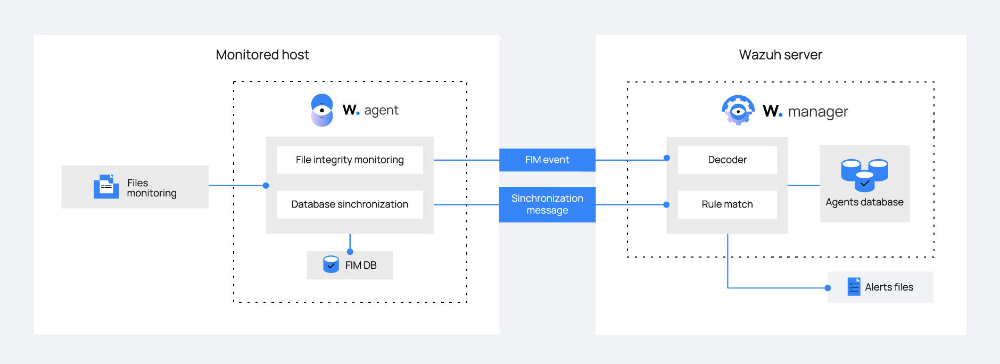

# Cách thức hoạt động

FIM module chạy định kỳ quét trên những đường dẫn được chỉ định và giám sát chúng nếu có thay đổi trong thời gian thực. Ta có thể cài đặt đường dẫn nào để giám sát trong thiết lập của Wazuh agent và mânger

FIM lưu trữ file checksum và các thuộc tính khác trong local FIM database. Trong khi quét, Wazuh agent báo cáo bất kỳ thay đổi nào được tìm thấy trong đường dẫn giám sát. FIM module tìm kiếm các sự thay đổi tệp bằng cách so sánh checksum của 1 tệp với checksum của nó mà wazuh lưu trữ và các giá trị thuộc tính. Nó khởi tạo 1 cảnh báo nếu nó tìm thấy sự chênh lệch.

Wazuh FIM module sử dụng 2 database để thu thập dữ liệu FIM event, như sự kiện tạo file, thay đổi, và dữ liệu xóa. Một trong số đó là SELite-based local database, trên node được giám sát, dữ liệu này được lưu ở:
- Windows: ```C:\Program Files (x86)\ossec-agent\queue\fim\db```
- Linux: ```/var/ossec/queue/fim/db```
- MacOS: ```/Library/Ossec/queue/fim/db```

Cái còn lại là 1 agent database trên Wazuh server. Nó sử dụng ID của agent để xác định database. Service này lưu trữ database tại ```/var/ossec/queue/db```



FIM module giữ Wazuh agent và Wazuh server database đồng bộ với nhau. Nó luôn cập nhật file inventory trong Wazuh server với dữ liệu data khả dụng ở Wazuh agent. 1 up-to-date Wauh server database cho phép phục vụ API queries liên quan đến FIM. Phương thức đồng bộ hóa chỉ cập nhật Wazuh server với thông tin từ Wazuh agent như checksumn và thuộc tính của file mà đã thay đổi.

Wazuh agent và manager có FIM module kích hoạt và pre-configure theo mặc định. Mặc dù vậy, ta nên review cấu hình này để chắc chắn là ta biết nó đang theo dõi file/đường dẫn nào.

