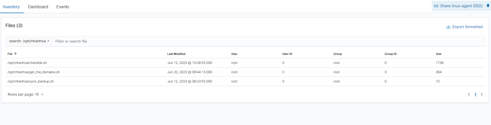
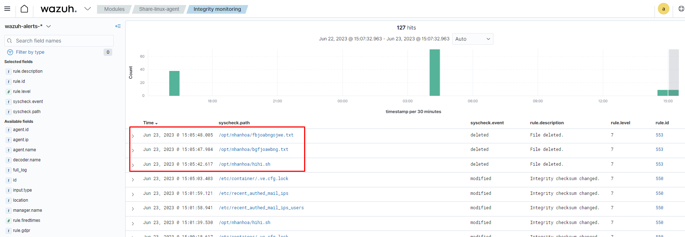
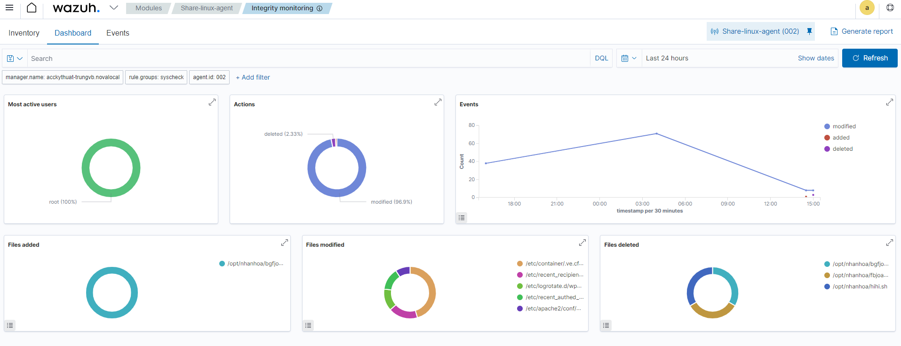
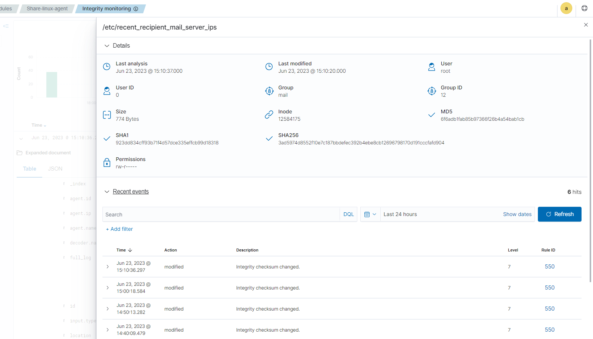

# Cách cấu hình FIM module

FIM module chạy các đợt quét trên hđh như Windows, Linux,.... Có cả global setting và setting đặc thù cho OS của endpoint. Chúng ta sẽ đề cập đến những settings này và những OS được hỗ trợ trong phần **Basic settings**

Ta phải chỉ định đường dẫn nơi FIM module giám sát việc tạo, thay đổi, xóa tệp hoặc cấu hình tệp mà ta muốn theo dõi. Ta có thể làm điều này ở Wazuh server hoặc Wazuh agent configuration file (file ```ossec.conf```).

Ta phải thiết lập file và đường dẫn để giám sát với tùy chọn [directories](https://documentation.wazuh.com/current/user-manual/reference/ossec-conf/syscheck.html#reference-ossec-syscheck-directories). Ta có thể bao gồm nhiều file và directory, tách nhau bởi dấu phẩy, hoặc thêm chúng ở nhiều dòng khác nhau. Ta có thể cấu hình FIM directory sử dụng ```*``` và ```?``` wildcards giống như khi dùng câu lệnh trong terminal. Ví dụ: ```C:\Users\*\Downloads```.

Bất kể khi nào FIM module chạy 1 đợt quét, nó sẽ kích hoạt cảnh báo nếu nó tìm thấy tệp bị thay đổi và dựa trên thuộc tính tệp thay đổi. Ta có thể xem những cảnh báo này trên Wazuh dashboard.

Ở phần sau, ta sẽ cùng tìm hiểu cách cấu hình FIM module để giám sát file và directory, Thay thế ```FILEPATH/OF/MONITORED/FILE``` và ```FILEPATH/OF/MONITORED/DIRECTORY``` với đường dẫn file muốn giám sát

1. Thêm cấu hình sau vào Wazuh agent configuration file:

```sh
<syscheck>
   <directories>FILEPATH/OF/MONITORED/FILE</directories>
   <directories>FILEPATH/OF/MONITORED/DIRECTORY</directories>
</syscheck>
```

2. Khởi động lại agent

```sh
# Linux
systemctl restart wazuh-agent
# Windows
Restart-Service -Name wazuh
```

**Inventory**



**Events**



**Dashboard**



**Detail**

