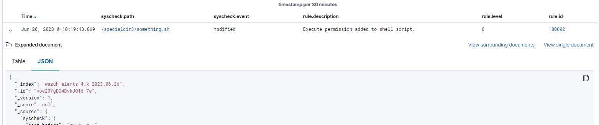
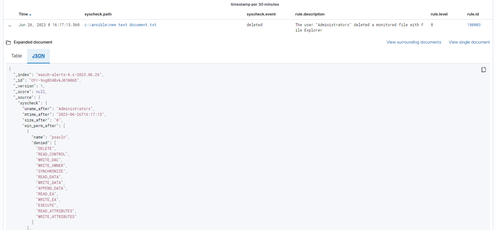

# Creating custom FIM rules

Ta có thể sử dụng Wauh custom FIM rule để theo dõi sự thay đổi đến files và directories dựa trên những tiêu chí cụ thể, như tên file, permissions, hay nội dung. Ví dụ, ta có thể tjao 1 rule phát hiện những thay đổi đến file hoặc file cấu hình quan trọng trong hệ thống. Khi 1 user hay process thay đổi chúng, Wazuh sẽ trigger 1 cảnh báo đặc biệt chỉ rõ chi tiết của thay đổi.

Tạo những custom FIM rules để giám sát có thể mở rộng khả năng phát hiện của FIM module. Điều này khiến nó đơn giản hơn để xác định và phản hồi những lỗ hổng bảo mật như vi phạm dữ liệu, insider threat, và các biện pháp tấn công khác liên quan đến sửa đổi tệp.

Bài này sẽ giới thiệu cách để sử dụng các trường được giải mã từ FIM event trong custom rules. Nó giải thích ý nghĩa của những trường được giải mã của FIM event trong Wazuh alert.

## Kết nối FIM fields với Wazuh alerts

Trường (fields) là thông tin mà Wazuh decoder trích xuất từ event Wazuh server nhận được. Mỗi loại event có những trường riêng. Decoder (bộ giải mã) xác định cúng với 1 tên trường (field name). Wazuh server biên dịch những trường này thành trường cảnh báo (alert fields) và gửi chúng đến Wazuh indexer để lưu trữ.

**Bảng các trường tương ứng của FIM alerts**

Bảng sau đây đưa ra các trường tương ứng giữa decoded FIM field và alert field

|FIM field|Alert field|Field description|
|:-|:-|:-|
|file|path|Đường dẫn file của event hiện tại|
|size|size_after|File size của event hiện tại|
|hard_links|hard_links|Danh sách hard links của file|
|mode|mode|FIM event mode|
|perm|perm_after, win_perm_after|File permissions|
|uid|uid_after|User ID của người sử hữu file|
|gid|gid_after|Group ID sở hữu file|
|uname|uname_after|Tên người sở hữu file|
|gname|gname_after|Tên group sở hữu file|
|md5|md5_after|Giá trị băm MD5 của file trong event hiện tại sau khi bị thay đổi|
|sha1|sha1_after|Giá trị băm sha1 của file trong event hiện tại sau khi bị thay đổi|
|sha256|sha256_after|Giá trị băm sha256 của file trong event hiện tại sau khi bị thay đổi|
|mtime|mtime_after|Thời điểm file thay đổi|
|inode|inode_after|Inode của file trong sự kiện hiện tại|
|changed_content|diff|Báo cáo thay đổi của file|
|changed_fields|changed_attributes|Trường thay đổi trong file như quyền, nội dung, và thuộc tính liên quan khác|
|win_attributes|attres_after|Thuộc tính file như hidden, read-only, và các thuộc tính liên quan khác|
|tag|tag|Custom tag được thêm vào 1 sự kiện cụ thể|
|user_id|audit.user.id|ID của user mà trigger sự kiện|
|user_name|audit.user.name|Tên của user trigger sự kiện|
|group_id|audit.group.id|Group ID trigger sự kiện|
|group_name|audit.group.name|Group name trigger sự kiện|
|process_name|audit.process.name|Tên tiến trình chạy bởi 1 user mà trigger event|
|process_id|audit.process.id|ID của process trigger event|
|ppid|audit.process.ppid|Parent ID của process trigger event|
|effective_uid|audit.effective.user_id|ID của user sử dụng process trigger event|
|effective_name|audit.effective_user.name|Tên của user sử dụng process trigger event|
|parent_name|audit.process.parent_name|Tên parent process mà trigger event|
|cwd|audit.process.cwd|Current work directory của process trigger event|
|parent_cwd|audit.process.parent_cwd|Current work directory của parent process|
|audit_uid|audit.login_user.id|ID của người dùng đăng nhập vào hệ thống mà trigger event|
|audit_name|audit.login_user.name|Tên của người dùng đăng nhập vào hẹ thống mà trigger event|
|arch|arch|Kiến trúc registry (32 hoặc 64 bits)|
|value_name|value_name|Registry value name|
|value_type|value_type|Registry value type|
|entry_type|entry_type|Registry entry type|

## Custom FIM rules examples

Trong ví dụ dưới đây, ta sẽ trình bày cách để có thể customize FIM rule mặc định của Wazuh. Ta có thể thấy cách tạo custom rules với decoded FIM field và field mà nó tương ứng trong Wazuh alert.

**Wazuh server**

Thực hiện các bước sau trên Wazuh server

1. Tạo 1 file ```fim_specialdir3.xml``` trong ```/var/ossec/etc/rules/```

```sh
touch /var/ossec/etc/rules/fim_specialdir3.xml
```

2. Thêm rule sau đây vào file vừa tạo. Rule này trigger 1 alert khi quyền thực thi được thêm vào 1 shell script trong đường dẫn giám sát

```sh
<group name="syscheck">
  <rule id="180002" level="8">
    <if_sid>550</if_sid>
    <field name="file">.sh$</field>
    <field name="changed_fields">^permission$</field>
    <field name="perm" type="pcre">\w\wx</field>
    <description>Execute permission added to shell script.</description>
    <mitre>
      <id>T1222.002</id>
    </mitre>
  </rule>
</group>
```

3. Restart Wazuh server để áp dụng thay đổi

```sh
systemctl restart wazuh-manager
```

**Endpoint**

Thực hiện những bước sau ở đường dẫn được giám sát, ví dụ ```/specialdir3```

1. Tạo đường dẫn

```sh
mkdir /specialdir3
```

2. Thay đổi cấu hình agent tại ```/var/ossec/etc/ossec.conf``` để giám sát đường dẫn trên

```sh
<syscheck>
   <directories realtime="yes">/specialdir3</directories>
</syscheck>
```

3. Restart agent

```sh
systemctl restart wazuh-agent
```

**Kiểm tra alert**

Đến **Module > Intergrity monitoring** trên Wazuh dashboard để xem alert được tạo ra khi FIM module được trigger



Bên dưới là các alert field mà liên quan đến decoded FIM fields:

```sh
{
  "_index": "wazuh-alerts-4.x-2023.06.26",
  "_id": "voe29YgBO4BvkJ016-7e",
  "_version": 1,
  "_score": null,
  "_source": {
    "syscheck": {
      "perm_before": "rw-r--r--",
      "uname_after": "root",
      "mtime_after": "2023-06-26T10:19:35",
      "size_after": "31",
      "gid_after": "0",
      "mode": "realtime",
      "path": "/specialdir3/something.sh",
      "sha1_after": "e96a97de1090860df4db9190df3eeaf3b37610a0",
      "changed_attributes": [
        "permission"
      ],
      "gname_after": "root",
      "uid_after": "0",
      "perm_after": "rwxr-xr-x",
      "event": "modified",
      "md5_after": "5e5c493c13854fc37585f9760c795303",
      "sha256_after": "febeef4cec011b32e22d256ffc210275e505bfec7c53fd498fa657e7dd1dee7e",
      "inode_after": 2359299
    },
    "input": {
      "type": "log"
    },
    "agent": {
      "ip": "103.159.51.184",
      "name": "K8s-master-agent",
      "id": "001"
    },
    "manager": {
      "name": "acckythuat-trungvb.novalocal"
    },
    "rule": {
      "firedtimes": 1,
      "mail": false,
      "level": 8,
      "description": "Execute permission added to shell script.",
      "groups": [
        "syscheck"
      ],
      "mitre": {
        "technique": [
          "Linux and Mac File and Directory Permissions Modification"
        ],
        "id": [
          "T1222.002"
        ],
        "tactic": [
          "Defense Evasion"
        ]
      },
      "id": "180002"
    },
    "location": "syscheck",
    "decoder": {
      "name": "syscheck_integrity_changed"
    },
    "id": "1687749583.415584928",
    "full_log": "File '/specialdir3/something.sh' modified\nMode: realtime\nChanged attributes: permission\nPermissions changed from 'rw-r--r--' to 'rwxr-xr-x'\n",
    "timestamp": "2023-06-26T10:19:43.869+0700"
  },
  "fields": {
    "syscheck.mtime_after": [
      "2023-06-26T10:19:35.000Z"
    ],
    "timestamp": [
      "2023-06-26T03:19:43.869Z"
    ]
  },
  "highlight": {
    "agent.id": [
      "@opensearch-dashboards-highlighted-field@001@/opensearch-dashboards-highlighted-field@"
    ],
    "manager.name": [
      "@opensearch-dashboards-highlighted-field@acckythuat-trungvb.novalocal@/opensearch-dashboards-highlighted-field@"
    ],
    "rule.groups": [
      "@opensearch-dashboards-highlighted-field@syscheck@/opensearch-dashboards-highlighted-field@"
    ]
  },
  "sort": [
    1687749583869
  ]
}
```

### Trigger file deleteion alert

Xóa file có thể liên quan đến mất dữ liệu quan trọng hoặc file hệ thống khi thực hiện 1 cách tai nạn hoặc không được cấp quyền. Nếu 1 attacker đạt được quyền truy nhập vào hệ thống và xóa file quan trọng, nó có thể khiến hệ thống bị vô hiệu hóa, gây mất dữ liệu hoặc downtime.

Phần này chúng ta sẽ thực hiện với endpoint là windows

**Wazuh server**

1. Tạo 1 file ```fim_win_test.xml``` tại ```/var/ossec/etc/rules/``` directory

```sh
touch /var/ossec/etc/rules/fim_win_test.xml
```

2. Thêm rule sau vào file vừa tạo bên trên. Rule này sẽ trigger alert khi 1 user xóa file với File Explorer.

```sh
<group name="syscheck">
  <rule id="180003" level="8">
    <if_sid>553</if_sid>
    <field name="process_name">explorer.exe$</field>
    <field name="uname">Administrators$</field>
    <match>deleted</match>
    <description>The user "$(uname)" deleted a monitored file with File Explorer</description>
    <mitre>
      <id>T1070.004</id>
      <id>T1485</id>
    </mitre>
  </rule>
</group>
```

3. Restart Wazuh server

```sh
systemctl restart wazuh-manager
```

**Ở Windows endpoint**

1. Tạo directory cần giám sát

```sh
mkdir C:\test
```

2. Chỉnh sửa cấu hình agent ```C:\Program Files (x86)\ossec-agent\ossec.conf``` để giám sát đường dẫn trên

```sh
<syscheck>
   <directories whodata="yes">C:\test</directories>
</syscheck>
```

3. Restart agent

```sh
Restart-Service -Name wazuh
```



