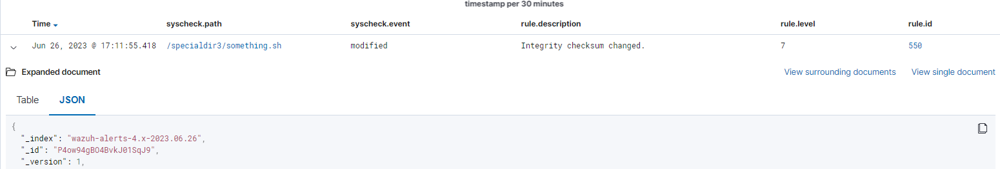

# Advanced settings

Trong bài này, chúng ta sẽ đề cập đến những cách setting nâng cao hơn 1 chút, mà có thể cung cấp khả năng điều khiển và tính linh hoạt tốt hơn cho FIM module.

## Who-data monitoring

Tính năng "who-data" cho phép FIM module thu thập thông tin về ai tạo ra thay đổi đến file được giám sát. Thông tin này bao gồm người tạo ra thay đổi và tên chương trình hoặc tiến trình đã sử dụng.

### Who-data monitoring on Linux

**Cách thức hoạt động**

Tính năng giám sát who-data sử dụng Linux Audit subsystem để lấy thông tin về ai tạo ra thay đổi trong đường dẫn được giám sát. Những thay đổi này tạo ra audit events. FIM module xử lý audit event và báo cáo chúng về Wazuh server. Tính năng này mở rộng trên thuộc tính ```realtime```. Có nghĩa là ```whodata``` giám sát theo thời gian thực.

**Cấu hình**

Ta cần phải cài đặt audit daemon ở endpoint trong trường hợp chưa có sẵn.

```sh
# Red Hat-based
yum install audit -y
# Debian-based
apt-get install auditd -y
```

Thực hiện các bước sau để kích hoạt giám sát who-data. Trong ví dụ này sẽ giám sát who-data cho ```/etc/```

1. Sửa cấu hình agent

```sh
<syscheck>
   <directories check_all="yes" whodata="yes" report_changes="yes">/etc</directories>
</syscheck>
```

2. Restart agent

```sh
systemctl restart wazuh-agent
```

3. Sử dụng lệnh sau để kiểm tra audit rule cho monitoring đã được áp dụng chưa

```sh
auditctl -l | grep wazuh_fim
```

Kết quả trả về như sau là ok

```sh
auditctl -w /etc -p wa -k wazuh_fim
```



Mở rộng chi tiết để đọc được thông tin về người thực hiện

```sh
      "audit": {
        "process": {
          "parent_name": "/bin/bash",
          "cwd": "/specialdir3",
          "parent_cwd": "/specialdir3",
          "name": "/usr/bin/vim.basic",
          "id": "7682",
          "ppid": "7615"
        },
        "login_user": {
          "name": "root",
          "id": "0"
        },
        "effective_user": {
          "name": "ubuntu",
          "id": "1000"
        },
        "user": {
          "name": "ubuntu",
          "id": "1000"
        },
        "group": {
          "name": "ubuntu",
          "id": "1000"
        }
      }
```

### Who-data monitoring on Windows

**Cách thức hoạt động**

Tính năng who-data monitoring sử dụng Microsoft auditing subsystem. Nó lấy thông tin liên quan đến người tạo ra thay đổi ở đường dẫn được giám sát. Những thay đổi này cung cấp audit events. FIM module xử lý các event này và báo cáo chúng đến Wazuh server.

**Cấu hình**

Để kích hoạt tính năng who-data, ta phải khai báo tag ```whodata="yes"``` bên dưới khối ```directories``` trong ```C:\Program Files (x86)\ossec-agent\ossec.conf```. Ta cần cấu hình Audit Policies và System Access Control List (SACLs) của mỗi đường dẫn được giám sát. Tuy nhiên Wazuh sẽ tự động thực hiện những cấu hình này cho đường dẫn cần giám sát

```sh
<syscheck>
  <directories check_all="yes" whodata="yes">C:\test</directories>
</syscheck>
```

FIM module cấu hình các Local Audit Policies và SACLs cần thiết để khởi động. Tuy nhiên, các service khác có thể thay đổi cấu hình này và khiến tính năng who-data không hoạt động. Để khắc phục vấn đề này, FIM phát hiện sự thay đổi cấu hình này và thay đổi tất cả đường dẫn đang giám sát với who-data thành real-time mode. 2 phương pháp khả dụng để phát hiện những thay đổi cấu hình này là:

1. Wazuh giám sát event cụ thể (ID 4719) mà Windows tạo ra khi 1 Audit Policies được thay đổi
2. Định kỳ, Wazuh kiểm tra Audit Policies và SACLs có được cấu hình như mong muốn hay không. Ta có thể thay đổi tần suất của việc này với ```windows_audit_interval```

Nếu Audit Policies và SACLs không tự cấu hình thì ta phải cấu hình thủ công, hướng dẫn ở [đây](https://documentation.wazuh.com/current/user-manual/capabilities/file-integrity/advanced-settings.html#manual-configuration-of-the-windows-audit-policies)

Bảng sau đây thể hiện các trường tương ứng giữa Audit và Alert khi who-data được sử dụng:

|Audit field|Alert field|Fields description|
|:-|:-|:-|
|User|audit.user.id, audit.user.name|Chứa ID và tên của user bắt đầu tiến trình mà thay đổi file được giám sát|
|Process ID|audit.process.id|Chứa ID của tiến trình sử dụng để thay đổi file được giám sát|
|Process name|audit.process.name|Chứa tên của tiến trình thay đổi file được giám sát|

**Tránh tràn bộ nhớ sự kiện who-data như thế nào?**

Do who-data là real-time monitoring nên có thể số lượng sự kiện gửi về là rất lớn, do đó ta phải có những phương pháp để tránh bị tràn thôn tin.

Ở phía Wazuh, biến ```syscheck.rt_delay``` trong cấu hình FIM giúp tránh mất sự kiện bằng cách thiết lập 1 khoảng trễ giữa chúng. Ta có thể cấu hình biến này ở file ```/var/ossec/etc/internal_options.conf``` trên Wazuh server. Giá trị cho phép của biến này là giá trị số, đơn vị là miliseconds.

## Recursion level

Ta có thể cấu hình recursion level tối đa cho phép cho 1 đường dẫn cụ thể bằng cách sử dụng thuộc tính ```recursion_level``` trong tùy chọn **directories**. Giá trị ```recursion_level``` phải nằm giữa 0 và 320.

Ví dụ:

```sh
<syscheck>
   <directories check_all="yes" recursion_level="3">FILEPATH/OF/MONITORED/DIRECTORY</directories>
</syscheck>
```

Như bên trên ta cấu hình ```recursion_level``` là 3. Hãy theo dõi tree directory ví dụ như sau:

```sh
FILEPATH/OF/MONITORED/DIRECTORY
├── file_0.txt
└── level_1
    ├── file_1.txt
    └── level_2
        ├── file_2.txt
        └── level_3
            ├── file_3.txt
            └── level_4
                ├── file_4.txt
                └── level_5
                    └── file_5.txt
```

Vậy FIM sẽ tạo alert cho ```file_3.txt``` và tất cả file ở các level 1, 2, 3.

Để tắt tính năng recursion và khởi tạo alert cho những files ở trong đường dẫn được giám sát, hãy set ```recursion_level``` thành ```0```. Mặc định thì con số này là 256, có thể chỉnh sửa ở tham số ```syscheck.default_max_depth``` trong file cấu hình internal đã nhắc đến ở trên.

## Process priority

Để thay đổi CPU usage của FIM module trên endpoint được giám sát, sử dụng tùy chọn ```process_priority``` trong cấu hình agent. Ta có thể làm điều này ở cả Windows, Linux, hay macOS.

Process priority scale cho Wazuh FIM module trong dải từ -20 đến 19 trên mỗi agent. Mặc định ```process_priority``` value được đặt là 10. Thiết lập ```process_priority``` value trong 1 agent cao hơn mặc định sẽ khiến độ ưu tiên FIM module của nó thấp hơn, CPU resource ít hơn, và khiến nó chạy chậm hơn.

Ta cần phải thay đổi Wazuh agent configuration file để cấu hình process priority của FIM module.

## Database storage

Wazuh sử dụng SQLite database để lưu trữ thông tin liên quan đến FIM event như thông tin về việc tạo, thay đổi, và xóa file. Khi Wazuh agent start, FIM module thực hiện quét và tạo database cho agent đó. Mặc định thì database trên agent được lưu ở file ```/var/ossec/queue/fim/db```

Ta có thể cấu hình database storage options bằng thuộc tính ```database```. Giá trị cho phép của thuộc tính này là ```disk``` và ```memory```. Tùy chọn storage khả dụng ở Windows, macOS và Linux.

Ví dụ:

```sh
<syscheck>
   <database>memory</database>
</syscheck>
```

Việc lưu trữ dữ liệu ở memory sẽ giúp hiệu suất cao hơn nhiều nhưng lại không thể lưu trữ được dữ liệu đó.

## Đồng bộ hóa

FIM module giữ database của Wazuh agent và Wazuh server luôn đồng bộ với nhau thông qua synchronization messages. Nó luôn cập nhật file inventory trong Wazuh server với dữ liệu khả dụng đến Wazuh agent.

Bất kể khi nào Wazuh agent service start, module này sẽ rebuild FIM database của agent, chạy 1 full scan, và đồng bộ kết quả cập nhật file inventory trên Wazuh server. Module đồng bộ các directories được giám sát với ```realtime``` hoặc ```whodata``` ngay lập tức, trong khi các dữ liệu khác cần 1 full scan trước khi đồng bộ hóa. Module không báo cáo đến Wazuh server những thay đổi trong file được giám sát mà thực hiện khi service không chạy.

Ta có thể thấy bên dưới là thiết lập đồng bộ mặc định ở file ```/var/ossec/etc/ossec.conf```:

```sh
<syscheck>
  <synchronization>
    <enabled>yes</enabled>
    <interval>5m</interval>
    <max_interval>1h</max_interval>
    <max_eps>10</max_eps>
  </synchronization>
</syscheck>
```

Bảng dưới đây mô tả các thuộc tính được hỗ trợ của tùy chọn ```synchronization```

|Attribute|Default value|Allowed values|Description|
|:-|:-|:-|:-|
|enabled|yes|yes, no|Kích hoạt đồng bộ hóa FIM database|
|interval|5m|Số lớn hơn 0 và hậu tố s/m/h/d|Thiết lập khoảng thời gian giữa 2 lần đồng bộ, nếu fail thì việc đồng bộ được lặp lại đến khi đạt ```max_interval```|
|max_interval|1h|Lớn hơn hoặc bằng interval và hậu tố s/m/h/d|Chỉ định con số cao nhất giữa 2 lần đồng bộ|
|response_timeout|30|Số lớn hơn 0|Thời gian mà tin nhắn đến manager sẽ bị coi là timeout, nếu điều này xảy ra thì 1 phiên đồng bộ mới sẽ được khởi tạo|
|queue_size|16384|Số nguyên nằm giữa 2 và 1000000|Chỉ định queue size của lời phản hồi đồng bộ của manager|
|response_timeout|10|Số nguyên nằm giữa 0 và 1000000, với 0 nghĩa là disable|Thiết lập thông lượng tối đa của tin nhắn đồng bộ|

