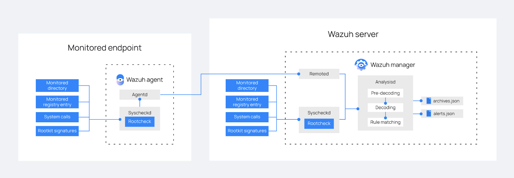

# Rootkits behavior detection

Wazuh sử dụng Rootcheck module để phát hiện các điểm bất thường mà có thể là dấu hiệu của malware trong 1 endpoint. Mặc định, rootcheck scan mỗi 12h, tuy vậy ta có thể điều chỉnh tần suất này tùy nhu cầu.

## Cách thức hoạt động

Hình ảnh bên dưới mô tả các bước mà Wazuh thực hiện để phát hiện hành vi gây hại trên 1 endpoint được giám sát.
1. Sau khi ta cài đặt 1 Wazuh agent trên 1 endpoint, agent sử dụng Rootcheck module để giám sát hành vi bất thường trên các đường dẫn được chỉ định, registry entries, và system calls
2. Wazuh manager phân tích logs được gửi từ agent. Việc phân tích bao gồm pre-decoding, decoding, và ánh xạ logs với các rule đã được định nghĩa
3. Khi 1 log khớp với rule nào đó, Wazuh manager tạo cảnh báo trong file ```/var/ossec/logs/alerts/alerts.log``` và ```/var/ossec/log/alerts/alerts.json```

Ta có thể sử dụng tùy chọn ```<logall>``` trong Wazuh server configuration file ```/var/ossec/etc/ossec.conf```. Khi tùy chọn này được kích hoạt, Wazuh manager lưu trữ tất cả logs từ endpoint được giám sát, bất kể chúng có kích hoạt cảnh báo hay không,



### Kiểm tra các tiến trình đang chạy

1 tiến trình độc hại có thể ngăn chặn chính nó bị liệt kê ở trong danh sách các tiến trình đang chạy, ví dụ, bằng cách thay thế ```ps``` command với 1 phiên bản trojan. Rootcheck phân tích tất cả PID, tìm kiếm sự chênh lệch sử dụng các system call như ```getsid``` và ```getpgid```

Ví dụ, diamorphine là 1 kernel-mode rootkit mà có thể che giấu chính nó và các tiến trình khác khỏi ```ps``` command. Giả sử dụng ta cài đặt nó và che giấu 1 process, ta sẽ nhận được thông báo như sau:

```sh
** Alert 1668497757.1838662: - ossec,rootcheck,
2022 Nov 15 09:35:57 (Ubuntu) any->rootcheck
Rule: 521 (level 11) -> 'Possible kernel level rootkit'
Process '659' hidden from /proc. Possible kernel level rootkit.
title: Process '659' hidden from /proc.
```

### Kiểm tra các port ẩn

Malware có thể sử dụng các port ẩn để giao tiếp với kẻ tấn công. Rootcheck quét mỗi port trong hệ thống sử dụng hàm ```bind()``` của ngôn ngữ C. Nếu nó không thể bind đến 1 port và port đó không nằm trong ```netstat``` output, điều này có nghĩa là malware đang sử dụng chúng.

### Kiểm tra các tệp và quyền bất thường

Wazuh quét toàn bộ hệ thống để tìm kiếm các tệp và quyền bất thường. 1 ví dụ là file được sở hữu bởi ```root```, nhưng mà có quyền write cho các user khác. Rootcheck phân tích ```suid``` files, hidden directories, và các file khác để kiểm tra các quyền bất thường.

### Kiểm tra các tệp ẩn sử dụng system call

Wazuh quét toàn bộ hệ thống, so sánh sự khác nhau giữa kích thước stat và kích thước tệp sử dụng lệnh gọi ```fopen``` và ```read```. Wazuh cũng so sánh số lượng nodes trong mỗi directory với đầu ra của ```opendir``` và ```readdir```. Nếu có bất kỳ kết quả nào không khớp, vậy có thể đó là malware.

Bên dưới đây là 1 ví dụ về cảnh báo được khởi tạo bởi Rootcheck khi nó phát hiện ra điều bất thường trong filesystem:

```sh
** Alert 1668497750.1838326: - ossec,rootcheck,pci_dss_10.6.1,gdpr_IV_35.7.d,
2022 Nov 15 09:35:50 (Ubuntu) any->rootcheck
Rule: 510 (level 7) -> 'Host-based anomaly detection event (rootcheck).'
Rootkit 't0rn' detected by the presence of file '/usr/bin/.t0rn'.
title: Rootkit 't0rn' detected by the presence of file '/usr/bin/.t0rn'.
```

Mặc định, Rootcheck module giám sát các đường dẫn sau đây:

|Unix|/bin, /sbin, /usr/bin, /usr/sbin, /dev, /lib, /etc, /root, /var/log, /var/mail, /var/lib, /var/www, /usr/lib, /usr/include, /tmp, /boot, /usr/local, /var/tmp và /sys|
|Windows|C:\WINDOWS and C:\Program Files|

### Quét đường dẫn /dev

Đường dẫn ```/dev``` chỉ nên bao gồm các tệp device-specific. Wazuh phân tích tất cả tệp ở trong đường dẫn này vì malware có thể sử dụng phân vùng này để che giấu tệp

Ví dụ, nếu ta tạo 1 tệp ẩn trong đường dẫn ```/dev```, nó sẽ kích hoạt cảnh báo như sau trong Wazuh:

```sh
** Alert 1668498534.1862633: - ossec,rootcheck,pci_dss_10.6.1,gdpr_IV_35.7.d,
2022 Nov 15 09:48:54 (Ubuntu) any->rootcheck
Rule: 510 (level 7) -> 'Host-based anomaly detection event (rootcheck).'
File '/dev/.hidden' present on /dev. Possible hidden file.
title: File present on /dev.
file: /dev/.hidden
```

### Quét giao diện network

Wazuh quét bất kỳ giao diện network nào trong 1 hệ thống với promiscuous mode. Nó kiểm tra đầu ra của lệnh ```ifconfig```. Nếu 1 giao diện trong chế độ promiscuous, nó sẽ bắn cảnh báo. 1 network interface trong promiscuous mode có thể là malware.

### Rootkit checks

Rootcheck thực hiện 1 vài kiểm tra sử dụng CSDL: ```rootkit_files.txt```, ```rootkit_trojan.txt```, và ```win_malware_rcl.txt```. Ta có thể cập nhật những signature này bằng cách thêm các signature để thực hiện rootkit check sử dụng thông tin khả dụng mới nhất. Chúng ta mô tả cách mình có thể làm điều này ở phần sau

## Cách thức cấu hình tùy chọn cho Rootcheck

Để cấu hình các tùy chọn cho Rootcheck, chỉnh sửa tệp ```/var/ossec/etc/ossec.conf``` trên Wazuh server.

Dưới đây là ví dụ cơ bản về cấu hình Rootcheck database sử dụng để phát hiện rootkits, đặc biệt là rootkit files, và trojans. 2 databases ```rootkit_trojans.txt``` và ```rootkit_files.txt``` phải chứa trojan và rootkit signatures:

```sh
<rootcheck>
  <rootkit_files>etc/shared/rootkit_files.txt</rootkit_files>
  <rootkit_trojans>etc/shared/rootkit_trojans.txt</rootkit_trojans>
</rootcheck>
```

Sử dụng ```rootkit_files.txt``` để chỉ định đường dẫn đã biết đến các tệp sử dụng bởi rootkits. Rootcheck quét những đường dẫn này và khởi tạo cảnh báo khi phát hiện bất kỳ file nào. Ta có thể thêm nhiều entries vào file và mỗi entry sẽ phải có định dạng thế này

```sh
file_path ! Rootkit_Name ::
```

Ví dụ:

```sh
#Reptile
reptile/reptile_cmd         ! Reptile rootkit ::
reptile/reptile_rc          ! Reptile rootkit ::
reptile/reptile_shell       ! Reptile rootkit ::
reptile/reptile_start       ! Reptile rootkit ::
lib/udev/reptile            ! Reptile rootkit ::
```

File ```rootkit_trojans.txt``` chứa signature của các tệp mà rootkits có trojan. Rootcheck quét các tệp trong database này tìm kiếm các chuỗi chỉ định và khởi tạo cảnh báo khi chúng khớp nhau. Signature phải theo format sau:

```sh
# This is a comment
file_name !string_to_search!Description
```

Ví dụ dưới đây phát hiện trojan trong common Linux binary:

```sh
# Common binaries and public trojan entries
ls          !bash|^/bin/sh|dev/[^clu]|\.tmp/lsfile|duarawkz|/prof|/security|file\.h!
env         !bash|^/bin/sh|file\.h|proc\.h|/dev/|^/bin/.*sh!
echo        !bash|^/bin/sh|file\.h|proc\.h|/dev/[^cl]|^/bin/.*sh!
chown       !bash|^/bin/sh|file\.h|proc\.h|/dev/[^cl]|^/bin/.*sh!
chmod       !bash|^/bin/sh|file\.h|proc\.h|/dev/[^cl]|^/bin/.*sh!
chgrp       !bash|^/bin/sh|file\.h|proc\.h|/dev/[^cl]|^/bin/.*sh!
cat         !bash|^/bin/sh|file\.h|proc\.h|/dev/[^cl]|^/bin/.*sh!
```

Trong trường hợp false positives, tạo 1 rule với ```level 0``` và sử dụng regex pattern để khớp các log chỉ định mà false positives. Ví dụ:

```sh
<rule id="100100" level="0">
  <if_group>rootcheck</if_group>
  <match>/dev/.blkid.tab</match>
  <description>Ignore false positive for /dev/.blkid.tab</description>
</rule>
```

