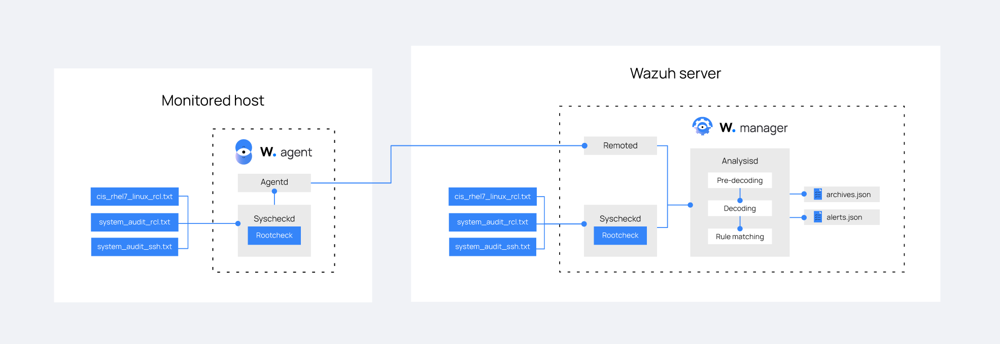

# Rootcheck

Kể từ Wazuh v3.9.0, SCA module mới thay thế cho Rootcheck khi thực hiện chính sách giám sát

Wazuh theo dõi các file cấu hình để chắc chắn chúng đáp ứng các tiêu chuẩn về chính sách bảo mật. Agent thực hiện scan định kỳ để phát hiện ứng dụng mà có thể tồn đọng lỗ hổng, chưa cập nhật, hoặc cấu hình chưa chính xác

## Cách thức hoạt động

Rootcheck cho phép định nghĩa chính sách để kiểm tra xem agent có đạt được tiêu chí yêu cầu không



Rootcheck engine có thể thực hiện những kiểm tra sau đây:
- Kiểm tra 1 process có đang chạy không?
- Kiểm tra 1 file có tồn tại không?
- Kiểm tra 1 file có bao gồm 1 pattern hoặc 1 Windows registry key có chứa 1 chuỗi hay không?

Những chính sách dưới đây được phát triển sử dụng những kiểm tra bên trên:

|Policy|Description|
|:-|:-|
|cis_debian_linux_rcl.txt|Based on CIS Benchmark for Debian Linux v1.0|
|cis_rhel5_linux_rcl.txt|Based on CIS Benchmark for Red Hat Enterprise Linux 5 v2.1.0|
|cis_rhel6_linux_rcl.txt|Based on CIS Benchmark for Red Hat Enterprise Linux 6 v1.3.0|
|cis_rhel7_linux_rcl.txt|Based on CIS Benchmark for Red Hat Enterprise Linux 7 v1.1.0|
|cis_rhel_linux_rcl.txt|Based on CIS Benchmark for Red Hat Enterprise Linux v1.0.5|
|cis_sles11_linux_rcl.txt|Based on CIS Benchmark for SUSE Linux Enterprise Server 11 v1.1.0|
|cis_sles12_linux_rcl.txt|Based on CIS Benchmark for SUSE Linux Enterprise Server 12 v1.0.0|
|system_audit_rcl.txt|Web vulnerabilities and exploits|
|win_audit_rcl.txt|Check registry values|
|system_audit_ssh.txt|SSH Hardening|
|win_applications_rcl.txt|Check if malicious applications are installed|

Các cảnh báo liên quan đến chính sách trên bao gồm:
- 512: Windows Audit
- 514: Windows Application
- 516: Unix Audit

Database the dõi policy và compliance thường được duy trì ở manager, sau đó phân tán ra các agent.

Ví dụ 1 rule policy đã tồn tại như sau:

```sh
# PermitRootLogin not allowed
# PermitRootLogin indicates if the root user can log in via ssh.
$sshd_file=/etc/ssh/sshd_config;

[SSH Configuration - 1: Root can log in] [any] [1]
f:$sshd_file -> !r:^# && r:PermitRootLogin\.+yes;
f:$sshd_file -> r:^#\s*PermitRootLogin;
```