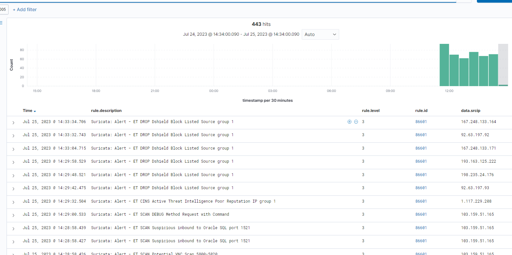

# Xử lý các cuộc tấn công mạng với Suricata và Wazuh XDR

Các thiết bị ngày nay tồn tại với số lượng và chủng loại lớn hơn rất nhiều so với trước đây. Với việc số node trên mạng lưới internet không ngừng tăng lên, tìm kiếm và xử lý mối nguy cơ trong thời gian thực rất khó khăn. May thay, công nghệ ngày nay đã phát triển để có thể loại bỏ rào cản này.

Và thứ mà bài viết này muốn nói tới chính là giải pháp Extended Detection and Response (XDR). XDR platform phân tích dữ liệu từ sự kiện được khởi tạo từ endpoint được giám sát để phát hiện các hoạt động bất chính và phản hồi về chúng. Phản hồi tự động được đưa ra để ưu tiên cảnh báo với các mối nguy nhanh nhất có thể.

Suricata là 1 hệ thống phát hiện xâm nhập mà có thể phân tích các sự kiện network và khởi tạo cảnh báo khi phát hiện những sự kiện đáng ngờ hay hành vi bất hợp pháp. Bằng cách tích hợp Suricata với Wazuh active response module, người quản trị có thể tăng cường tính năng Wazuh XDR trong môi trường của họ. Hành động phản hồi tự động có thể được áp dụng lên các sự kiện nhất định được phát hiện bởi Suricata trên endpoint được giám sát.

## Cấu hình Suricata

### 1. Trên CentOS 7 endpoint

Giả dụ, đây là endpoint của nạn nhân và với Wazuh agent được cài đặt trên đó. Chúng ta sử dụng Suricata để giám sát network traffic cho server này. Để cài đặt Suricata, ta thực hiện các bước dưới đây:

```sh
sudo yum clean all
sudo yum -y install epel-release wget jq
curl -O https://copr.fedorainfracloud.org/coprs/jasonish/suricata-6.0/repo/epel-7/jasonish-suricata-6.0-epel-7.repo
sudo yum -y install suricata
wget https://rules.emergingthreats.net/open/suricata-6.0.3/emerging.rules.tar.gz
sudo tar zxvf emerging.rules.tar.gz
sudo rm /etc/suricata/rules/* -f
sudo mv rules/*.rules /etc/suricata/rules/
sudo rm -f /etc/suricata/suricata.yaml
sudo wget -O /etc/suricata/suricata.yaml https://packages.wazuh.com/4.3/suricata.yml
```

### 2. Đặt network interface ta muốn giám sát vào file cấu hình của Suricata ở ```/etc/suricata/suricata.yaml```

Tìm từ khóa ```af-packet:```, bên dưới nó, ta sẽ thấy biến ```interface```. Thay thế giá trị của biến đó với tên của interface trên endpoint mà ta giám sát. Ví dụ:

```sh
ifconfig
```

```sh
eth0: flags=4163<UP,BROADCAST,RUNNING,MULTICAST>  mtu 1500
        inet 103.101.162.5  netmask 255.255.255.0  broadcast 103.101.162.255
        ether fa:16:3e:81:6c:84  txqueuelen 1000  (Ethernet)
        RX packets 1814932  bytes 382197998 (364.4 MiB)
        RX errors 0  dropped 0  overruns 0  frame 0
        TX packets 78926  bytes 7442666 (7.0 MiB)
        TX errors 0  dropped 0 overruns 0  carrier 0  collisions 0
```

Theo đó, xâu ```interface``` trong file cẫu hình sẽ phải đặt là ```eth0```

```sh
af-packet:
  - interface: eth0
```

### 3. Chỉnh sửa Suricata service configuration file ```/etc/sysconfig/suricata``` để chỉ định interface Suricata sẽ lắng nghe. Trong ví dụ này là eth0

```sh
# Add options to be passed to the daemon
OPTIONS="-i eth0 --user suricata "
```

### 4. Chạy ```suricata-update``` trên CentOS endpoint để cài đặt và cập nhật Emerging Threat rules

```sh
sudo suricata-update
```

### 5. Chỉnh sửa file cấu hình ```/etc/suricata/suricata.yaml``` để chỉ định rule mà Suricata sử dụng

```sh
default-rule-path: /var/lib/suricata/rules
rule-files:
 - suricata.rules
```

### 6. Start Suricata

```sh
sudo systemctl daemon-reload
sudo systemctl enable suricata
sudo systemctl start suricata
```

### 7. Cài đặt Apache trên CentOS endpoint

Để thực hiện giả định DoS attack trên CentOS endpoint, chúng ta cài đặt Apache webserver.

Thực hiện các lệnh sau:

```sh
sudo yum update httpd
sudo yum install httpd
# sudo firewall-cmd --permanent --add-service=http
# sudo firewall-cmd --permanent --add-service=https
# sudo firewall-cmd --reload
sudo systemctl enable httpd 
sudo systemctl start httpd
```

## Thực hiện trên Wazuh server

Để quản lý tập trung cấu hình của tất cả endpoint với Suricata được cài đặt, ta cần tạo 1 group mới tên ```Suricata``` và thêm CentOS agent vào đó

### 1. Tạo agent group tên ```Suricata```

```sh
sudo /var/ossec/bin/agent_groups -a -g Suricata -q
```

### 2. Lấy ID của agent mà ta muốn add vào group

```sh
sudo /var/ossec/bin/manage_agents -l
```

### 3. Add agent vào group Suricata

```sh
sudo /var/ossec/bin/agent_groups -a -i <AGENT_ID> -g Suricata -q
```

### 4. Thêm cấu hình sau đây vào Suricata group shared agent configuration file tại ```/var/ossec/etc/shared/Suricata/agent.conf```

```sh
<agent_config>
  <localfile>
    <log_format>json</log_format>
    <location>/var/log/suricata/eve.json</location>
  </localfile>
</agent_config>
```

### 5. Mở rộng JSON decoder cho Suricata

Trong Suricata logs, trường ```src_ip``` nắm giữ IP address của tác nhân gây hại. Wazuh ```firewall-drop``` active response script lại tìm kiếm ```srcip``` ở trong cảnh báo để kích hoạt active response. Để chắc chắn rằng ```src_ip``` được xử lý bởi active response scripts, chúng ta cần cấu hình 1 custom decoder để ánh xạ ```src_ip``` với ```srcip```. Để làm điều này, thực hiện các bước sau đây:

Thêm decoders bên dưới đây vào local decoders file nằm ở ```/var/ossec/etc/decoders/local_decoder.xml```

```sh
<decoder name="json">
  <prematch>^{\s*"</prematch>
</decoder>

<decoder name="json_child">
  <parent>json</parent>
  <regex type="pcre2">"src_ip":"([^"]+)"</regex>
  <order>srcip</order>
</decoder>

<decoder name="json_child">
  <parent>json</parent>
  <plugin_decoder>JSON_Decoder</plugin_decoder>
</decoder>
```

Restart Wazuh-manager service

```sh
systemctl restart wazuh-manager
```

### 6. Tạo custome rules từ Suricata alerts

Trên Wazuh server, chúng ta tạo custom rules để phát hiện sự hoạt động của Nmap scripting engine và GoldenEye DoS attack từ Suricata alerts. Những rule này sẽ được sử dụng bởi active response module để kích hoạt ```firewall-drop``` script trên CentOS agent. Script này thêm địa chỉ IP gây hại vào firewall block list trên agent được giám sát

Thêm rule sau vào file ```/var/ossec/etc/rules/local_rules.xml```:

```sh
<group name="custom_active_response_rules,">
  <rule id="100200" level="12">
    <if_sid>86600</if_sid>
    <field name="event_type">^alert$</field>
    <match>ET DOS Inbound GoldenEye DoS attack</match>
    <description>GoldenEye DoS attack has been detected. </description>
    <mitre>
      <id>T1498</id>
    </mitre>
  </rule>

  <rule id="100201" level="12">
    <if_sid>86600</if_sid>
    <field name="event_type">^alert$</field>
    <match>ET SCAN Nmap Scripting Engine User-Agent Detected (Nmap Scripting Engine)</match>
    <description>Nmap scripting engine detected. </description>
    <mitre>
      <id>T1595</id>
    </mitre>
  </rule>
</group>
```

Restart service

```sh
systemctl restart wazuh-manager
```

### 7. Cấu hình active response

Wazuh hỗ trợ 1 script gọi là ```firewall-drop``` mà có thể thêm địa chỉ IP trích xuất từ 1 alert vào firewall block list của endpoint được giám sát. Thiết lập ```firewall-drop``` active response trên Wazuh server sử dụng các bước sau:

Mở Wazuh server configuration file ```/var/ossec/etc/ossec.conf``` và chắc chắn rằng phần ```command``` cho ```firewall-drop``` đang tồn tại. Hoặc thêm nó vào nếu như chưa có:

```sh
<ossec_config>
  <command>
    <name>firewall-drop</name>
    <executable>firewall-drop</executable>
    <timeout_allowed>yes</timeout_allowed>
  </command>
</ossec_config>
```

Chỉnh sửa file bên trên với thành phần sau đây:

```sh
<ossec_config>  
  <active-response>
    <command>firewall-drop</command>
    <location>local</location>
    <rules_id>100200, 100201</rules_id>
    <timeout>180</timeout>
  </active-response>
</ossec_config>
```

Trong đó:
- ```location```: Chỉ định nơi mà active response command được thực thi. Để thực thi script trên wazuh agent, ta sử dụng ```local```
- ```rules_id```: Giới hạn thực thi script chỉ với rule 100200 hoặc 100201
- ```timeout```: Chỉ định thời gian thực hiện của active response command trước khi nó bị đảo ngược

Ok, giờ restart wazuh-manager thôi

```sh
sudo systemctl restart wazuh-manager
```

