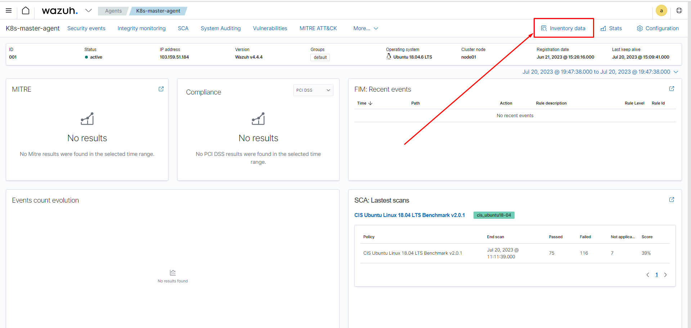
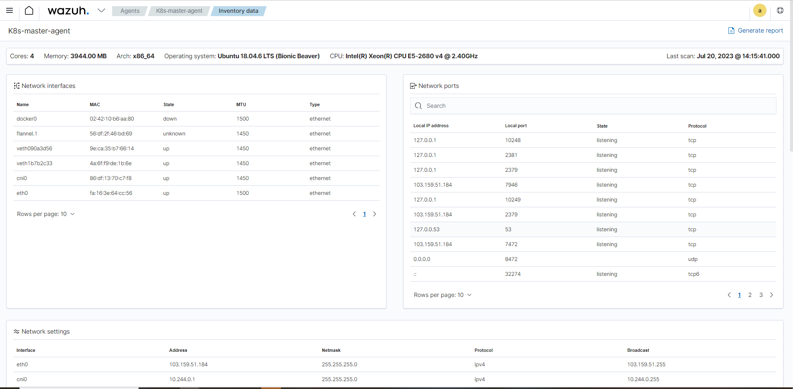
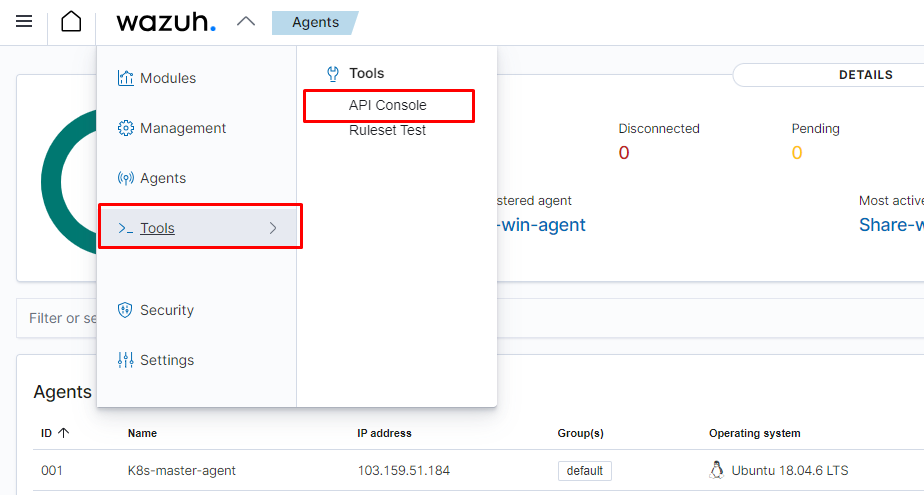
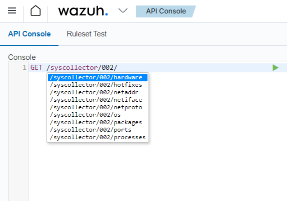
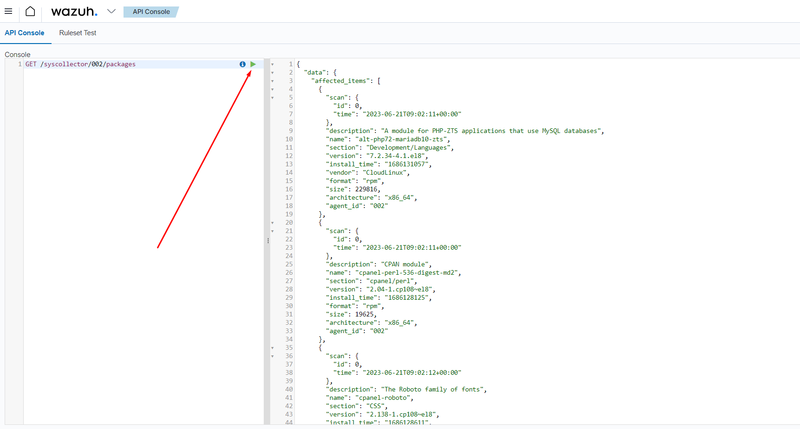
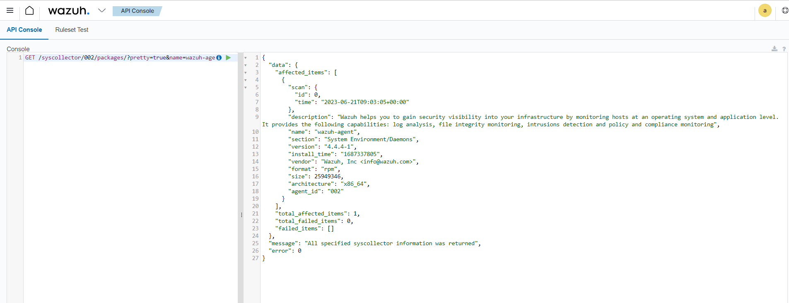

# System inventory

1 system inventory là 1 tài nguyên mà chứa thông tin về phần cứng, phần mềm và các thành phần liên quan khác của hạ tầng IT. Giữ 1 inventory bao gồm tất cả thành phần này giúp tổ chức có 1 cái nhìn bao quát hơn về phần cứng và phần mềm trong môi trường của họ. 

Để duy trì system inventory tập trung, Wazuh agent thu thập thông tin hệ thống từ endpoint được giám sát và gửi chúng đến Wazuh server. Wazuh Syscollector module chịu trách nhiệm thu thập này từ agent. Dữ liệu mà Wazuh agent thu thập bao gồm thông tin phần cứng, OS, các phần mềm được cài đặt, những giao diện mạng, port, và các tiến trình đang chạy. Wazuh agent cũng có thể thu thập dữ liệu về Windows updates từ Windows endpoints. Ta có thể thiết lập những loại thông tin gì được thu thập, loại gì thì được bỏ qua.

Người dùng có thể khởi tạo báo cáo system inventory từ Wazuh dashboard, thứ có thể rất giá trị cho công cuộc tìm kiếm mối đe dọa hay quy hoạch hạ tầng. Thông tin bên trong bản báo cáo có thể được sử dụng để xác định các ứng dụng, tiến trình, dịch vụ không mong muốn, và cả malware nữa.

## Cách thức hoạt động

Như đã đề cập ở trên, Wazuh agent sử dụng Syscollector module để thu thập thông tin liên quan từ endpoint được giám sát. Mỗi khi agent start trên endpoint được giát sát, Syscollector module sẽ định kỳ scan và thu thập dữ liệu trên system properties được định nghĩa trong config. Dữ liệu đầu tiên sẽ được lưu trữ tạm ở local database trên endpoint đó.

Agent sau đó chuyển tiếp các dữ liệu mới từ local database đến Wazuh server. Mỗi agent sử dụng 1 database riêng trên Wazuh server. Wazuh server cập nhật bảng tương ứng của inventory database trên Wazuh server sử dụng thông tin mà agent gửi tới. Ví dụ, Wazuh server lưu trữ thông tin liên quan đến phần cứng ở bảng gọi là ```sys_hwinfo```

Wazuh dashboard tự động hiển thị dữ liệu lưu trữ trong inventory database. Tuy vậy, ta có thể truy vấn database sử dụng Wazuh API hoặc công cụ ```SQLite```. Thêm vào đó, Vulnerability Detector module sử dụng các packages và thông tin Windows updates trong inventory để phát hiện lỗ hổng và patched software trên endpoint được giám sát.

## Thiết lập

Syscollector module được kích hoạt mặc định trên tất cả endpoint mà Wazuh agent được cài đặt. Ta có thể tìm thấy cấu hình này trên agent ở file:
- Linux: ```/var/ossec/etc/ossec.conf```
- Windows: ```C:\Program Files (x86)\ossec-agent\ossec.conf```
- macOS: ```/Library/Ossec/ossec.conf```

Ta cũng có thể sử dụng cấu hình tập trung để tạo nên thay đổi vào module Syscollector. Ví dụ, với group ```default``` sử dụng file cấu hình được đặt tại ```/var/ossec/etc/shared/default/agent.conf``` trên Wazuh server. Bất kỳ thiết lập nào thực hiện với file này sẽ có tác dụng trên tất cả agent.

Đoạn dưới đây là đoạn cấu hình mặc định của Syscollector trên agent:

```sh
<!-- System inventory -->
   <wodle name="syscollector">
     <disabled>no</disabled>
     <interval>1h</interval>
     <scan_on_start>yes</scan_on_start>
     <hardware>yes</hardware>
     <os>yes</os>
     <network>yes</network>
     <packages>yes</packages>
     <ports all="no">yes</ports>
     <processes>yes</processes>

     <!-- Database synchronization settings -->
     <synchronization>
       <max_eps>10</max_eps>
     </synchronization>
   </wodle>
```

Trong đó:
- ```<disabled>```: chỉ định Syscollector có được kích hoạt hay không
- ```<interval>```: chỉ định thời gian giữa 2 lần quét
- ```<scan_on_start>```: chỉ định 1 system scan ngay lập tực sau khi restart Wazuh service trên endpoint
- ```<hardware>```: tùy chọn kích hoạt hay không thu thập thông tin phần cứng
- ```<os>```: tùy chọn kích hoạt hay không OS scan
- ```<network>```: kích hoạt hay không network scan
- ```<packages>```: kích hoạt hay không package scan
- ```<ports all="no">```: kích hoạt hay không port scan. Tùy chọn ```all``` cho phép chỉ phép wazuh scan chỉ scan các port đang lắng nghe nếu được đặt giá trị là ```no```. Nếu muốn scan tất cả các port thì đặt là ```yes```
- ```<processes>```: kích hoạt hay không scan process
- ```<max_eps>```: cho phép tùy chỉnh thông lượng event tối đa. Mặc định là 10events/s

## Viewing system inventory data

### Wazuh dashboard

Ta có thể xem system inventory của mỗi endpoint được giám sát từ Wazuh dashboard. Để làm điều này, chọn 1 agent từ Wazuh dashboard và vào ```inventory data``` ở góc phải trên





### Truy vấn agent inventory database

Syscollector module chạy scan định kỳ và gửi dữ liệu cập nhật dưới dạng JSON về Wazuh server. Wazuh server phân tích và lưu trữ dữ liệu này trong 1 database riêng biệt cho mỗi endpoint. Database bao gồm các bảng mà lưu trữ mỗi loại thông tin phần cứng. Ta có thể truy vấn database sử dụng Wazuh API hoặc ```SQLite``` tool.

#### Sử dụng Wazuh API

Ta có thể truy vấn Wazuh inventory data sử dụng Wazuh API như hoặc Wazuh API GUI trên dashboard hoặc 1 command line tool như ```cURL``` để truy vấn database

Với Wazuh API GUI, ở trên Wazuh dashboard, hãy chọn **Wazuh** > **Tool** > **API Console**, sau đó nhập:

```sh
GET /syscollector/<AGENT_ID>/
```

*Trong đó ```<AGENT_ID>``` là ID của agent*

Khi đó Wazuh dashboard sẽ gợi ý 1 danh sách các bảng mà ta có thể truy vấn:





Ví dụ, ta có thể sử dụng lệnh ```GET /syscollector/<AGENT_ID>/packages``` để truy vấn inventory data cho các package được cài đặt trên endpoint. Sau khi gõ thì click vào nút mũi tên màu xanh bên cạnh để truy vấn



Xa hơn nữa, ta có thể truy vấn inventory data cho thông tin chỉ định về bất kỳ đặc tính nào. Ví dụ, lệnh dưới đây truy vấn package inventory để kiểm tra ```wazuh-agent``` package:

```sh
GET /syscollector/<AGENT_ID>/packages?pretty=true&name=wazuh-agent
```

Trong đó:
- ```packages```: tham chiếu đến bảng package trong inventory database, thứ mà chứa thông tin về các phần mềm được cài đặt hiện tại trên endpoint
- ```name=wazuh-agent``` chỉ định tên package ```wazuh-agent```. Ta có thể sử dụng các thuộc tính và giá trị khác nhau ở đây
- ```pretty=true```: chắc chắn là utput được định dạng cho dễ đọc



#### Sử dụng cURL

Đầu tiên phải lấy JWT đã (phần này đã được giới thiệu rồi)

```sh
TOKEN=$(curl -u <USER>:<PASSWORD> -k -X GET "https://<WAZUH_SERVER_IP>:55000/security/user/authenticate?raw=true")
```

Sau đó ta có thể truy vấn thông tin của endpoint bằng định dạng lệnh curl như thế này

```sh
curl -k -X GET "https://<WAZUH_SERVER_IP>:55000/syscollector/<AGENT_ID>/<SYSCOLLECTOR_PROPERTY>?pretty=true" -H "Authorization: Bearer $TOKEN"
```

Tương tự, lệnh sau sẽ giúp ta lọc ```wazuh-agent``` package

```sh
curl -k -X GET "https://<WAZUH_SERVER_IP>:55000/syscollector/010/packages?pretty=true&name=wazuh-agent" -H  "Authorization: Bearer $TOKEN"
```

## Sử dụng thông tin Syscollector để trigger cảnh báo

Ta có thể tạo rule để kích hoạt cảnh báo dựa trên thông tin thu thập được bởi Syscollector module và thể hiện thông tin trong mô tả của cảnh báo. Để làm điều này, đặt trường ```<decoded_as>``` thành ```syscollector``` trong phần khai báo rule. Syscollector sử dụng event ID ```221``` và rule level ```0```, vì vậy theo mặc định, nó không thể hiện ở trên Wazuh dashboard. Sử dụng thẻ ```<if_sid>221</if_sid>``` trong 1 custom rule, ta có thể tạo rule, để thông báo về Wazuh dashboard.

Ví dụ, rules sau được trigger khi 1 port được mở, thay đổi, hoặc đóng:

```sh
<group name="syscollector,">
  <!-- ports -->
  <rule id="100310" level="3" >
      <if_sid>221</if_sid>
      <field name="type">dbsync_ports</field>
      <description>Syscollector ports event.</description>
  </rule>

  <rule id="100311" level="3" >
      <if_sid>100310</if_sid>
      <field name="operation_type">INSERTED</field>
      <description>The port: $(port.local_port), with local ip: $(port.local_ip) has been opened. Syscollector creation event detected.</description>
  </rule>

  <rule id="100312" level="3" >
      <if_sid>100310</if_sid>
      <field name="operation_type">MODIFIED</field>
      <description>The port: $(port.local_port), with local ip: $(port.local_ip) has been modified. Syscollector modification event detected.</description>
  </rule>

  <rule id="100313" level="3" >
      <if_sid>100310</if_sid>
      <field name="operation_type">DELETED</field>
      <description>The port: $(port.local_port), with local ip: $(port.local_ip) has been closed. Syscollector deletion event detected.</description>
  </rule>
</group>
```

