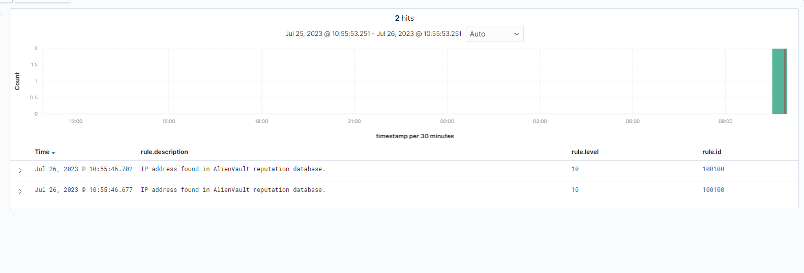

# Blocking a known malicious actor

Trong bài viết này, chúng ta sẽ tìm hiểu cách để block địa chỉ IP khả nghi từ việc truy nhập tài nguyên web trên 1 web server. 

Trường hợp này sử dụng 1 public IP reputation database mà bao gồm những địa chỉ IP của 1 vài tác nhân bất hợp pháp. 1 IP reputation database là 1 tổng hợp của các địa chỉ IP mà bị đánh dấu là đáng ngờ. Chúng ta sẽ thêm IP của 1 endpoint bất kỳ vào reputation database. Sau đó, cấu hình Wazuh để block endpoint này khỏi truy nhập tài nguyên web trên Apache webserver trong vòng 60s. Đây chính là 1 cách để cảnh cáo kẻ tấn công không nên tiếp tục hành vi bất chính.

Trong use case này, chúng ta sử dụng 2 tính năng là **Wazuh CDB list** và **active response**

## Cấu hình

### Monitored endpoint

Trong bài này sẽ sử dụng endpoint là CentOS 7. Đầu tiên cần cài đặt apache

```sh
yum update -y
yum install httpd -y
```

Nếu firewall đang bật, hãy chắc chắn rằng nó đã enable port cho http/https

Khởi động Apache

```sh
systemctl start httpd
```

Sử dụng lệnh ```curl``` hoặc mở trình duyệt truy cập để chắc chắn apache đã hoạt động.

Thêm đoạn sau vào ```/var/ossec/etc/ossec.conf``` trên agent để giám sát Apache access log:

```sh
<localfile>
  <log_format>syslog</log_format>
  <location>/var/log/httpd/access.log</location>
</localfile>
```

Khởi động lại agent

```sh
systemctl restart wazuh-agent
```

### Wazuh server

Ta cần thực hiện các bước sau trên Wazuh server để thêm địa chỉ IP của "attacker" endpoint vào CDB list, và cấu hình rules cũng như active response

1. Tải và cấu hình CDB list

Update

```sh
yum update && sudo yum install -y wget
```

Tải Alienvault IP reputation database

```sh
wget https://raw.githubusercontent.com/firehol/blocklist-ipsets/master/alienvault_reputation.ipset -O /var/ossec/etc/lists/alienvault_reputation.ipset
```

Thêm IP của "attacker" vào IP reputation database: (thay <attacker_IP> bằng IP mà bạn muốn sử dụng)

```sh
echo "<ATTACKER_IP>" >> /var/ossec/etc/lists/alienvault_reputation.ipset
```

Tải 1 script để convert định dạng ```.ipset``` thành định dạng danh sách ```.cdb```

```sh
sudo wget https://wazuh.com/resources/iplist-to-cdblist.py -O /tmp/iplist-to-cdblist.py
```

Convert tệp ```alienvault_reputation.ipset``` thành dạng ```.cdb```:

```sh
sudo /var/ossec/framework/python/bin/python3 /tmp/iplist-to-cdblist.py /var/ossec/etc/lists/alienvault_reputation.ipset /var/ossec/etc/lists/blacklist-alienvault
```

*Tùy chọn:* Xóa các tệp không cần thiết nữa

```sh
sudo rm -rf /var/ossec/etc/lists/alienvault_reputation.ipset
sudo rm -rf /tmp/iplist-to-cdblist.py
```

Thiết lập quyền và sở hữu cho file blacklist

```sh
sudo chown wazuh:wazuh /var/ossec/etc/lists/blacklist-alienvault
```

2. Cấu hình active response module để block địa chỉ IP bất chính

Thêm 1 custom rule để kích hoạt 1 Wazuh active response script vào file ```/var/ossec/etc/rules/local_rules.xml``` ở Wazuh server:

```sh
<group name="attack,">
  <rule id="100100" level="10">
    <if_group>web|attack|attacks</if_group>
    <list field="srcip" lookup="address_match_key">etc/lists/blacklist-alienvault</list>
    <description>IP address found in AlienVault reputation database.</description>
  </rule>
</group>
```

Chỉnh sửa tệp ```/var/ossec/etc/ossec.conf``` để thêm list ```etc/lists/blacklist-alienvault``` vào ```<ruleset>``` option

```sh
<ossec_config>
  <ruleset>
    <!-- Default ruleset -->
    <decoder_dir>ruleset/decoders</decoder_dir>
    <rule_dir>ruleset/rules</rule_dir>
    <rule_exclude>0215-policy_rules.xml</rule_exclude>
    <list>etc/lists/audit-keys</list>
    <list>etc/lists/amazon/aws-eventnames</list>
    <list>etc/lists/security-eventchannel</list>
    <list>etc/lists/blacklist-alienvault</list>

    <!-- User-defined ruleset -->
    <decoder_dir>etc/decoders</decoder_dir>
    <rule_dir>etc/rules</rule_dir>
  </ruleset>

</ossec_config>
```

3. Thêm khối active response vào file ```/var/ossec/etc/ossec.conf``` trên Wazuh server

```sh
<ossec_config>
  <active-response>
    <command>firewall-drop</command>
    <location>local</location>
    <rules_id>100100</rules_id>
    <timeout>180</timeout>
  </active-response>
</ossec_config>
```

4. Restart wazuh manager

```sh
systemctl restart wazuh-manager
```

## Kiểm thử

Trên "attacker" endpoint, thực hiện truy vấn đến web:

```sh
curl http://<WEBSERVER_IP>
```



