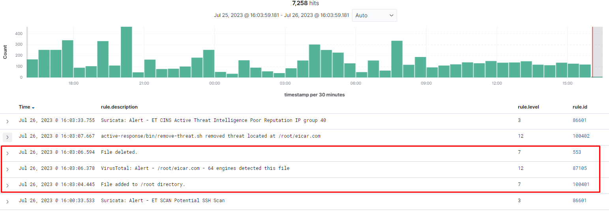

# Detecting and removing malware using VirusTotal integration

Wazuh sử dụng integrator module để kết nối đến các API bên ngoài và các công cụ cảnh báo như VirusTotal.

Trong use case này, chúng ta sử dụng Wazuh FIM module để giám sát 1 directory và VirusTotal API để scan các tệp trong directory đó. Sau đó, cấu hình Wazuh để kích hoạt active response script và loại bỏ các tệp mà VirusTotal phát hiện là bất hợp pháp. Chúng ta kiểm thử với cả CentOS endpoint và Windows endpoint

Ta cần 1 VirusTotal API key trong use case này để xác thực Wazuh đến VirusTotal API, điều này đã được giới thiệu ở bài viết về malware detection

## Cấu hình cho Linux endpoint

### Linux endpoint

Thực hiện các bước sau đây để giám sát thời gian thực các thay đổi trong đường dẫn ```/root``` của Linux endpoint. Các bước này cũng bao gồm cài đặt các package cần thiết và tạo active response script mà loại bỏ các tệp gây hại

1. Tìm khối ```<syscheck>``` trong file cấu hình Wazuh agent ```/var/ossec/etc/ossec.conf```. Hãy chắc chắn rằng ```<disabled>``` được thiết lập là ```no```. Điều này kích hoạt Wazuh FIM để giám sát các thay đổi trên đường dẫn.

2. Thêm đoạn sau dưới khối ```<syscheck>``` để giám sát real-time ```/root``` directory

```sh
<directories realtime="yes">/root</directories>
```

3. Cài đặt ```jq``` là 1 tiện ích mà xử lý JSON đầu vào từ active response script

```sh
yum update -y
yum install -y jq
```

4. Tạo active response script ```/var/ossec/active-response/bin/remove-threat.sh``` để loại bỏ các tệp gây hại từ endpoint

```sh
#!/bin/bash

LOCAL=`dirname $0`;
cd $LOCAL
cd ../

PWD=`pwd`

read INPUT_JSON
FILENAME=$(echo $INPUT_JSON | jq -r .parameters.alert.data.virustotal.source.file)
COMMAND=$(echo $INPUT_JSON | jq -r .command)
LOG_FILE="${PWD}/../logs/active-responses.log"

# Analyze command
if [ ${COMMAND} = "add" ]
then
 # Send control message to execd
 printf '{"version":1, "origin":{"name":"remove-threat","module":"active-response"},"command":"check_keys", "parameters":{keys":[]}}\n'
 read RESPONSE
 COMMAND2=$(echo $RESPONSE | jq -r .command)
 if [ ${COMMAND2} != "continue" ]
 then
  echo "`date '+%Y/%m/%d %H:%M:%S'` $0: $INPUT_JSON Remove threat active response aborted" >> ${LOG_FILE}
  exit 0;
 fi
fi

# Removing file
rm -f $FILENAME
if [ $? -eq 0 ]; then
 echo "`date '+%Y/%m/%d %H:%M:%S'` $0: $INPUT_JSON Successfully removed threat" >> ${LOG_FILE}
else
 echo "`date '+Y/%m/%d %H:%M:%S'` $0: $INPUT_JSON Error removing threat" >> ${LOG_FILE}
fi

exit 0;
```

5. Thay đổi permission và ownership

```sh
sudo chmod 750 /var/ossec/active-response/bin/remove-threat.sh
sudo chown root:wazuh /var/ossec/active-response/bin/remove-threat.sh
```

6. Restart agent

```sh
sudo systemctl restart wazuh-agent
```

### Wazuh server

Thực hiện các bước sau trên Wazuh server để cảnh báo cho những thay đổi trong endpoint directory và kích hoạt VirusTotal integration. Những bước này cũng kích hoạt active response script khi 1 file khả nghi được phát hiện

1. Thêm rules sau vào ```/var/ossec/etc/rules/local_rules.xml``` trên Wazuh server. Những rule này cảnh báo về thay đổi trong đường dẫn ```/root``` mà được phát hiện bởi FIM:

```sh
<group name="syscheck,pci_dss_11.5,nist_800_53_SI.7,">
    <!-- Rules for Linux systems -->
    <rule id="100400" level="7">
        <if_sid>550</if_sid>
        <field name="file">/root</field>
        <description>File modified in /root directory.</description>
    </rule>
    <rule id="100401" level="7">
        <if_sid>554</if_sid>
        <field name="file">/root</field>
        <description>File added to /root directory.</description>
    </rule>
</group>
```

2. Thêm cấu hình sau vào Wazuh server ```/var/ossec/etc/ossec.conf``` để kích hoạt VirusTotal integration

```sh
<ossec_config>
  <integration>
    <name>virustotal</name>
    <api_key><YOUR_VIRUS_TOTAL_API_KEY></api_key> <!-- Replace with your VirusTotal API key -->
    <rule_id>100400,100401</rule_id>
    <alert_format>json</alert_format>
  </integration>
</ossec_config>
```

3. Vẫn trên file cấu hình đó, thêm đoạn sau

```sh
<ossec_config>
  <command>
    <name>remove-threat</name>
    <executable>remove-threat.sh</executable>
    <timeout_allowed>no</timeout_allowed>
  </command>

  <active-response>
    <disabled>no</disabled>
    <command>remove-threat</command>
    <location>local</location>
    <rules_id>87105</rules_id>
  </active-response>
</ossec_config>
```

4. Giờ lại phải thêm custom rule nữa ở ```/var/ossec/etc/rules/local_rules.xml``` để cảnh báo về kết quả của active response

```sh
<group name="virustotal,">
  <rule id="100402" level="12">
    <if_sid>657</if_sid>
    <match>Successfully removed threat</match>
    <description>$(parameters.program) removed threat located at $(parameters.alert.data.virustotal.source.file)</description>
  </rule>

  <rule id="100403" level="12">
    <if_sid>657</if_sid>
    <match>Error removing threat</match>
    <description>Error removing threat located at $(parameters.alert.data.virustotal.source.file)</description>
  </rule>
</group>
```

5. Cuối cùng, restart service

```sh
sudo systemctl restart wazuh-manager
```

### Giả định tấn công

1. Tải 1 EICAR test file vào ```/root``` directory trên Ubuntu endpoint

```sh
cd /root
curl -LO https://secure.eicar.org/eicar.com && ls -lah eicar.com
```

2. Quan sát trên Wazuh UI



## Cấu hình cho Windows endpoint

### Windows endpoint

Thực hiện các bước sau để cấu hình Wazuh giám sát các thay đổi theo thời gian thực trong ```/Downloads``` directory. Những bước này cũng cài đặt các package cần thiết và tạo active response script để loại bỏ các tệp độc hại.

1. Tìm kiếm khối ```<syscheck>``` trong Wazuh agent configuration file ```C:\Program Files (x86)\ossec-agent\ossec.conf```. Hãy chắc chắn rằng ```<disabled>``` được đặt thành ```no```. Điều này kích hoạt Wazuh FIM module để giám sát các thay đổi trên directory

2. Thêm đoạn sau trong khối ```<syscheck>```

```sh
<directories realtime="yes">C:\Users\<USER_NAME>\Downloads</directories>
```

3. Tải Python executable installer từ [Trang chủ Python](https://www.python.org/downloads/windows/)

4. Chạy Python installer. Hãy chắc rằng đã tick vào các tùy chọn sau:
- Installer launcher for all users
- Add Python 3.X to PATH

5. Một khi Python đã chạy xong, mở 1 PowerShell với quyền administrator và sử dụng ```pip``` để cài đặt PyInstaller:

```sh
pip install pyinstaller
pyinstaller --version
```

Chúng ta sử dụng Pyinstaller để convert active response Python script thành 1 ứng dụng có thể thực thi mà chạy được trên Windows endpoint

6. Tạo 1 active response script ```remove-threat.py``` để loại bỏ 1 tệp từ Windows endpoint

```sh
#!/usr/bin/python3

import os
import sys
import json
import datetime

if os.name == 'nt':
    LOG_FILE = "C:\\Program Files (x86)\\ossec-agent\\active-response\\active-responses.log"
else:
    LOG_FILE = "/var/ossec/logs/active-responses.log"

ADD_COMMAND = 0
DELETE_COMMAND = 1
CONTINUE_COMMAND = 2
ABORT_COMMAND = 3

OS_SUCCESS = 0
OS_INVALID = -1

class message:
    def __init__(self):
        self.alert = ""
        self.command = 0

def write_debug_file(ar_name, msg):
    with open(LOG_FILE, mode="a") as log_file:
        log_file.write(str(datetime.datetime.now().strftime('%Y/%m/%d %H:%M:%S')) + " " + ar_name + ": " + msg +"\n")

def setup_and_check_message(argv):

    # get alert from stdin
    input_str = ""
    for line in sys.stdin:
        input_str = line
        break


    try:
        data = json.loads(input_str)
    except ValueError:
        write_debug_file(argv[0], 'Decoding JSON has failed, invalid input format')
        message.command = OS_INVALID
        return message

    message.alert = data

    command = data.get("command")

    if command == "add":
        message.command = ADD_COMMAND
    elif command == "delete":
        message.command = DELETE_COMMAND
    else:
        message.command = OS_INVALID
        write_debug_file(argv[0], 'Not valid command: ' + command)

    return message


def send_keys_and_check_message(argv, keys):

    # build and send message with keys
    keys_msg = json.dumps({"version": 1,"origin":{"name": argv[0],"module":"active-response"},"command":"check_keys","parameters":{"keys":keys}})

    write_debug_file(argv[0], keys_msg)

    print(keys_msg)
    sys.stdout.flush()

    # read the response of previous message
    input_str = ""
    while True:
        line = sys.stdin.readline()
        if line:
            input_str = line
            break

    # write_debug_file(argv[0], input_str)

    try:
        data = json.loads(input_str)
    except ValueError:
        write_debug_file(argv[0], 'Decoding JSON has failed, invalid input format')
        return message

    action = data.get("command")

    if "continue" == action:
        ret = CONTINUE_COMMAND
    elif "abort" == action:
        ret = ABORT_COMMAND
    else:
        ret = OS_INVALID
        write_debug_file(argv[0], "Invalid value of 'command'")

    return ret

def main(argv):

    write_debug_file(argv[0], "Started")

    # validate json and get command
    msg = setup_and_check_message(argv)

    if msg.command < 0:
        sys.exit(OS_INVALID)

    if msg.command == ADD_COMMAND:
        alert = msg.alert["parameters"]["alert"]
        keys = [alert["rule"]["id"]]
        action = send_keys_and_check_message(argv, keys)

        # if necessary, abort execution
        if action != CONTINUE_COMMAND:

            if action == ABORT_COMMAND:
                write_debug_file(argv[0], "Aborted")
                sys.exit(OS_SUCCESS)
            else:
                write_debug_file(argv[0], "Invalid command")
                sys.exit(OS_INVALID)

        try:
            os.remove(msg.alert["parameters"]["alert"]["data"]["virustotal"]["source"]["file"])
            write_debug_file(argv[0], json.dumps(msg.alert) + " Successfully removed threat")
        except OSError as error:
            write_debug_file(argv[0], json.dumps(msg.alert) + "Error removing threat")


    else:
        write_debug_file(argv[0], "Invalid command")

    write_debug_file(argv[0], "Ended")

    sys.exit(OS_SUCCESS)

if __name__ == "__main__":
    main(sys.argv)
```

7. Convert active response Python script trên thành 1 Windows executable application. Chạy lệnh sau đây:

```sh
pyinstaller -F \path_to_remove-threat.py
```

8. Di chuyển ứng dụng ```.exe``` vừa tạo ra vào thư mục ```C:\Program Files (x86)\ossec-agent\active-response\bin```

9. Khởi động lại wazuh agent

```sh
Restart-Service -Name wazuh
```

### Wazuh server

Thực hiện các bước sau trên Wazuh server để cấu hình VirusTotal integration. Các bước này cũng kích hoạt active response script khi 1 file khả nghi được phát hiện

1. Thêm cấu hình sau vào ```/var/ossec/etc/ossec.conf``` trên Wazuh server để kích hoạt VirusTotal integration. Điều này kích hoạt truy vấn VirusTotal mỗi khi rule thuộc ```syscheck``` group được kích hoạt

```sh
<ossec_config>
  <integration>
    <name>virustotal</name>
    <api_key><YOUR_VIRUS_TOTAL_API_KEY></api_key> <!-- Replace with your VirusTotal API key -->
    <group>syscheck</group>
    <alert_format>json</alert_format>
  </integration>
</ossec_config>
```

2. Thêm khối sau vào file ```/var/ossec/etc/ossec.conf``` ở Wazuh server. Điều này kích hoạt active response ```remove-threat.exe``` thực thi khi VirusTotal trả về kết quả positive matches:

```sh
<ossec_config>
  <command>
    <name>remove-threat</name>
    <executable>remove-threat.exe</executable>
    <timeout_allowed>no</timeout_allowed>
  </command>

  <active-response>
    <disabled>no</disabled>
    <command>remove-threat</command>
    <location>local</location>
    <rules_id>87105</rules_id>
  </active-response>
</ossec_config>
```

3. Thêm rule sai vào file ```/var/ossec/etc/rules/local_rules.xml``` trên Wazuh server để cảnh báo về kết quả của active response 

```sh
<group name="virustotal,">
  <rule id="100092" level="12">
      <if_sid>657</if_sid>
      <match>Successfully removed threat</match>
      <description>$(parameters.program) removed threat located at $(parameters.alert.data.virustotal.source.file)</description>
  </rule>

  <rule id="100093" level="12">
    <if_sid>657</if_sid>
    <match>Error removing threat</match>
    <description>Error removing threat located at $(parameters.alert.data.virustotal.source.file)</description>
  </rule>
</group>
```

4. Restart service

```sh
sudo systemctl restart wazuh-manager
```

### Giả định tấn công

Download file test vào đường dẫn được giám sát

```sh
cd C:\Users\<USER_NAME>\Downloads
Invoke-WebRequest -Uri https://secure.eicar.org/eicar.com.txt -OutFile eicar.txt
```

