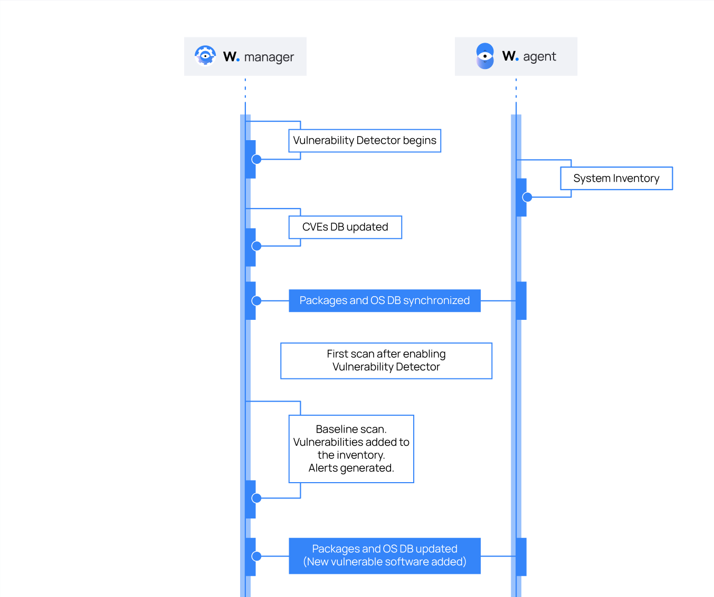
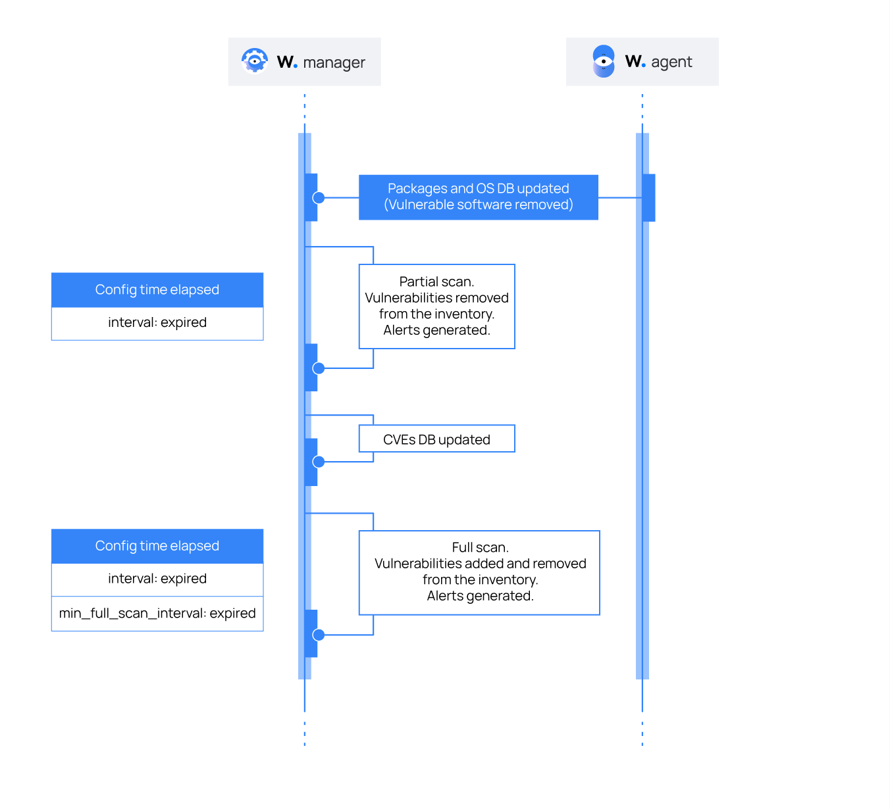

# Cách thức hoạt động của Wazuh Vulnerability Detector module

Để phát hiện lỗ hổng, Wazuh agent thu thập 1 danh sách các ứng dụng được cài đặt từ endpoint và định kỳ gửi chúng đến Wazuh server. Local SQLite database ở Wazuh server lưu trữ danh sách này. Ngoài ra, Wazuh server xây dựng 1 cơ sở dữ liệu lỗ hổng toàn cục từ các CVE repo công khai. Nó sử dụng database này để tham chiếu với dữ liệu ứng dụng của agent

1. Để start SQLite và mở cơ sở dữ liệu vulnerability sử dụng lệnh sau

```sh
sqlite3 /var/ossec/queue/vulnerabilities/cve.db
```

2. Liệt kê các bảng trong database sử dụng lệnh sau

```sh
sqlite> .tables
```

3. Lấy dữ liệu trong bảng bằng lệnh

```sh
sqlite> select * from <table>;
```

Wazuh server tự động tạo CSDL lỗ hổng toàn cục với dữ liệu từ các repo sau đây:
- [Canonical](https://canonical.com/): Sử dụng để pull CVEs cho Ubuntu Linux distro
- [RedHat](https://www.redhat.com/): Sử dụng để pull CVEs cho RedHat và CentOS Linux distro
- [Debian](https://www.debian.org/): Sử dụng để pull CVEs cho Debian Linux distro
- [ArchLinux](https://security.archlinux.org/): Sử dụng để pull CVEs cho Arch Linux distro
- [NVD](https://nvd.nist.gov/): Sử dụng để pull CVEs từ National Vulerability database
- [Wazuh](https://feed.wazuh.com/): Sử dụng để pull Microsoft Security Updates (MSU) và ALAS feeds. Feeds này chứa CVE và thông tin bản vá cho các sản phẩm của Microsoft và Amazon Linux. Chúng sử dụng Microsoft Update Catalog và Amazon Linux Security Center làm nguồn thông tin. Wazuh phân tích và định dạng lại dữ liệu trước khi đăng tải chúng lên Wazuh feed

Wazuh cập nhật CSDL này thường xuyên, đảm bảo là CVEs luôn up-to-date. Người dùng có thể thiết lập khoảng thời gian giữa các lần cập nhật.

Một khi Vulnerability Detector module đã tạo được CSDL lỗ hổng toàn cục chứa các CVE, tiến trình detection sẽ tìm kiếm các package có thể chứa lỗ hổng trong CSDL. Những inventory là duy nhất với mỗi agent. 1 package được đặt label là vulnerable khi version của nó khớp với version trong CVE. Các Alert sẽ thể hiện kết quả, và module lưu trữ kết quả trong 1 inventory cho mỗi agent. Inventory này chứa trạng thái hiện tại của mỗi agent và bao gồm các lỗ hổng mà được tìm thấy nhưng không được xử lý. Người dùng có thể truy xuất inventory để kiểm tra thông tin về các lỗ hổng này.

Với Microsoft Windows và các sản phẩm khác của Microsoft, Vulnerability Detector có tùy chọn ```hotfixes``` trong thiết lập syscollector trên Wazuh agent. Sử dụng tùy chọn này kích hoạt module phát hiện các package mà người dùng đã cập nhật. Khi Vulnerability Detector phát hiện 1 patch, nó sử dụng thông tin cung cấp bởi Microsoft để quyết định liệu CVE đó đã được xử lý hay chưa. Và loại bỏ CVE này khỏi danh sách lỗ hổng.

## Alert generation

Vulnerability Detector khởi tạo cảnh báo ngay trong quá trình scan với mỗi lỗ hổng được phát hiện. Ta có thể hình dung luồng của nó với hình sau đây



Vulnerability Detector cũng khởi tạo cảnh báo khi nó phát hiện các lỗ hổng mới hoặc khi người dùng fix các lỗ hổng đã phát hiện



## Compatibility matrix

Bảng sau thể hiện các OS và database CVE mà nó sử dụng tương ứng

|Distribution|Versions|Provider|
|:-|:-|:-|
|CentOS|5, 6, 7, 8, 9|RedHat, National Vulnerability Database|
|RedHat|5, 6, 7, 8, 9|RedHat, National Vulnerability Database|
|Ubuntu|14, 16, 18, 20, 22|Canonical, National Vulnerability Database|
|Debian|10, 11|Debian, National Vulnerability Database|
|Amazon Linux| Amazon Linux 1, 2| ALAS, NVD|
|Arch Linux|Rolling release|Arch, NVD|
|SUSE|11, 12, 15|SUSE, NVD|
|Windows|XP trở lên|NVD, MSU|
|macOS|macOS Sierra trở lên|NVD|