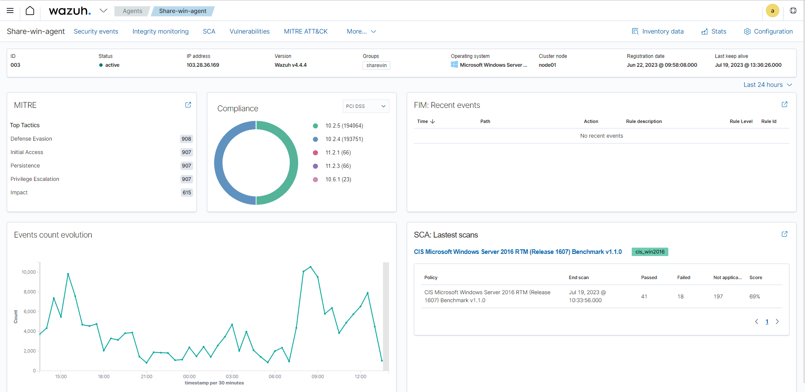

# Configuring and running scans

Chạy vulnerability scans trong Wazuh yêu cầu kích hoạt Vulnerability Detector module và thiết lập cho việc scan. Wazuh server có Vulnerability Detector module disabled theo mặc định khi ta cài đặt, trong khi Wazuh agent thì có Syscollector enabled sẵn. Các bước sau thể hiện cách để kích hoạt thành phần phát hiện lỗ hổng:

1. Thêm đoạn cấu hình sau vào ```share agent configuration file``` (sẽ được nói đến ở bài viết riêng). Ta có thể tìm nó ở ```/var/ossec/etc/shared/<group_name>/agent.conf``` trên Wazuh server:

```sh
<wodle name="syscollector">
   <disabled>no</disabled>
   <interval>1h</interval>
   <os>yes</os>
   <packages>yes</packages>
   <hotfixes>yes</hotfixes>
</wodle>
```

2. Kích hoạt Vulnerability Detector module ở Wazuh server configuration file tại ```/var/ossec/etc/ossec.conf```. Đặt giá trị của thẻ ```<enabled>``` thành ```yes``` cho Vulnerability Detector module và mỗi OS mà ta muốn scan. Ví dụ:

```sh
<vulnerability-detector>
   <enabled>yes</enabled>
   <interval>5m</interval>
   <min_full_scan_interval>6h</min_full_scan_interval>
   <run_on_start>yes</run_on_start>

   <!-- Ubuntu OS vulnerabilities -->
   <provider name="canonical">
      <enabled>yes</enabled>
      <os>trusty</os>
      <os>xenial</os>
      <os>bionic</os>
      <os>focal</os>
      <os>jammy</os>
      <update_interval>1h</update_interval>
   </provider>

   <!-- Debian OS vulnerabilities -->
   <provider name="debian">
      <enabled>yes</enabled>
      <os>buster</os>
      <os>bullseye</os>
      <update_interval>1h</update_interval>
   </provider>

   <!-- RedHat OS vulnerabilities -->
   <provider name="redhat">
      <enabled>yes</enabled>
      <os>5</os>
      <os>6</os>
      <os>7</os>
      <os>8</os>
      <os>9</os>
      <update_interval>1h</update_interval>
   </provider>

   <!-- Amazon Linux OS vulnerabilities -->
   <provider name="alas">
      <enabled>yes</enabled>
      <os>amazon-linux</os>
      <os>amazon-linux-2</os>
      <update_interval>1h</update_interval>
   </provider>

   <!-- Arch OS vulnerabilities -->
   <provider name="arch">
      <enabled>yes</enabled>
      <update_interval>1h</update_interval>
   </provider>

   <!-- Windows OS vulnerabilities -->
   <provider name="msu">
      <enabled>yes</enabled>
      <update_interval>1h</update_interval>
   </provider>

   <!-- Aggregate vulnerabilities -->
   <provider name="nvd">
      <enabled>yes</enabled>
      <update_from_year>2010</update_from_year>
      <update_interval>1h</update_interval>
   </provider>
</vulnerability-detector>
```

3. Khởi động lại wazuh-manager service

```sh
systemctl restart wazuh-manager
```

Vulnerability Detector khởi tạo logs trong Wazuh server mà kích hoạt cảnh báo. Mọi cảnh báo bao gồm các trường sau đây:
- **CVE:** định danh Common Vulnerabilites and Exposures cho mỗi lỗ hổng tương ứng
- **Title:** mô tả ngắn về tác động của vulnerability
- **Rationale:** Mô tả rộng về vulnerability
- **Severity:** Tác động của vulnerability trong thuật ngữ về bảo mật
- **Package:** Thông tin về package bị ảnh hưởng, bao gồm tại sao package này bị đánh dấu là có lỗ hổng
- **Published:** Ngày mà vulnerability được thêm vào
- **Updated:** Ngày mà vulnerability được update
- **CWE:** tham chiếu Common Weak Enumeration
- **CVSS:** Vulnerability dựa trên Common Vulnerability Scoring System (version 2 và 3)
- **Advisories IDs:** Red Hat security advisories
- **References:** URLs với thông tin bổ sung về vulnerability
- **Bugzilla references:** Link đến tham chiếu của vulnerability trong Bugzilla

Lên dashboard xem kết quả thôi

