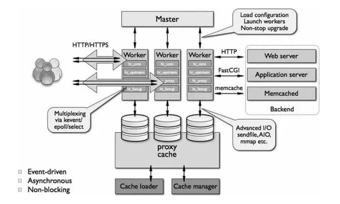

# So sánh Nginx và Apache webserver

## Giới thiệu chung về Nginx

#### 1. Nginx là gì?

Nginx là 1 webserver mã nguồn mở, trước đây nginx thường được sử dụng để phục vụ web http, tuy nhiên hiện nay nó thường được áp dụng vào reverse proxy, email proxy, load balancer cho các máy chủ http, tcp và udp

Ra đời vào tháng 10 năm 2004, nginx sử dụng kiến trúc sự kiện không đồng bộ. Nhờ đó mà nginx có được tốc độ, khả năng mở rộng và độ tin cậy vượt trội. Nginx có khả năng xử lý hàng trăm ngàn kết nối cùng lúc

Rất nhiều ông lớn trong làng công nghệ sử dụng nginx như Google, Netflix, Adobe,.... Theo W3techs, nginx chiếm 42,1% tổng lượng webserver trên toàn thế giới

#### 2. Cách thức hoạt động

Trước tiên, chúng ta cần hiểu cách thức hoạt động của webserver. Khi có yêu cầu mở 1 website, trình duyệt sẽ liên lạc với server chứa website đó. Server thực hiện việc tìm kiếm file được yêu cầu và gửi kết quả về cho browser. Nginx hoạt động theo kiến trúc bất đồng bộ (Asynchronous) và thúc đẩy sự kiện (Event Driven). Kiến trúc này là những Luồng (Threads) được quản lý trong 1 tiến trình, mỗi tiến trình hoạt động dựa vào các thực thể nhỏ hơn - Worker Connections

Worker Process sẽ nhận các truy vấn từ Worker Connections và gửi các truy vấn đó đến Process cha - Master Process. Master Process sẽ trả lại kết quả cho những yêu cầu đó. Một Worker Connections có khả năng xử lý được 1024 yêu cầu tương tự nhau cùng lúc. Do đó nginx có thể đáp ứng được hàng ngàn yêu cầu mà không gặp khó khăn gì.

Nginx đặc biệt hiệu quả khi hoạt động trong môi trường tìm kiếm, thương mại điện tử, cloud storage

#### 3. Một số tính năng của Nginx

- Có khả năng xử lý cùng 1 lúc hơn 10000 kết nối với bộ nhớ thấp
- Phục vụ tệp tin tĩnh và lập chỉ mục cho chúng
- Dùng bộ đệm cache để tăng tốc reverse proxy, cân bằng tải đơn giản và khả năng chịu lỗi
- Hỗ trợ tăng tốc với bộ nhớ đệm của WSGI, SCGI, FastCGI và các máy chủ Memcached
- Có cấu hình linh hoạt và khả năng lưu lại nhật ký truy vấn
- Chuyển hướng lỗi 3XX - 5XX
- Sử dụng biểu thức chính quy (Regular Expressions) để viết lại URL
- Hạn chế tỷ lệ đáp ứng truy vấn
- Giới hạn truy vấn từ 1 địa chỉ hoặc số kết nối đồng thời
- Có khả năng nhúng mã PERL
- Tương thích và hỗ trợ IPv6
- Hỗ trợ WebSockets
- Hỗ trợ truyền tải MP4 và FLV
- Rewrite URL

## Giới thiệu chung về Apache

#### 1. Apache là gì?

Apache hay Apache HTTP Server là một webserver mã nguồn mở được sử dụng rất phổ biến. Được phát triển bởi Apache Software Foundation, mọi yêu cầu được gửi đến server đều qua phương thức HTTP

Apache là phần mềm đa nền tảng khi tương thích với rất nhiều hệ điều hành như Unix, Windows, Novell Netware,...

Khi mới phát hành, Apache là chương trình máy chủ mã nguồn mở duy nhất có khả năng cạnh tranh với chương trình máy chủ tương tự của Sun Java System Web Server. Đến nay, Apache đã trở thành webserver phổ biến nhất, chiếm tổng hơn 44% máy chủ trên toàn thế giới

#### 2. Cách thức hoạt động

Nhiệm vụ chính của Apache là thiết lập kết nối giữa server và browser (firefox, chrome, safari,...), sau đó chịu trách nhiệm chuyển file qua lại giữa chúng (client-server)

Khi người dùng muốn tải 1 trang trên website, browser sẽ gửi request đến server và Apache sẽ trả lại kết quả cùng đầy đủ các thành phần để hiển thị trang web đó. Như đã nói, server và client giao tiếp với nhau qua HTTP protocol và Apache chịu trách nhiệm đảm bảo quá trình này diễn ra trơn tru và bảo mật

Apache là một nền tảng module có độ tùy biến cao. Do đó, quản trị viên hoàn toàn có thể thêm hoặc bớt các module để mở rộng tính năng cho server của mình

Apache đặc biệt hiệu quả khi hoạt động với các trang web động như WordPresss

#### 3. Tính năng của Apache

Ngoài các tính năng tương tự như nginx, apache còn hỗ trợ thêm 1 vài mở rộng:

- Digest access authentication
- CGI
- Administrative console
- .htaccess

## Apache và Nginx

|Tiêu chí|Apache|Nginx|
|:-|:-|:-|
|Hiệu suất|Apache có thể xử lý tốt các nội dung động, tuy nhiên không vượt trội so với nginx|Nginx xử lý các nội dung tĩnh tốt hơn hẳn Apache, với các nội dung động, Nginx sẽ đẩy cho process bên ngoài như php-fpm xử lý|
|Tính tương thích|Hoạt động trên mọi hđh Unix-based và cả Windows|Mọi hđh Unix-based, vẫn hỗ trợ Windows tuy nhiên hiệu suất không cao|
|Bảo mật|Chú trọng bảo mật, thường xuyên cập nhật|Tương tự Apache|
|Cấu hình|Cho phép cấu hình riêng cho từng thư mục sử dụng file .htaccess|Không cho phép cấu hình gì thêm|
|Cách cấu hình|Sử dụng đường dẫn file hệ thống|Sử dụng các URI|
|Module tính năng|Hỗ trợ nhiều module được cài sẵn (nặng)|Cho phép cài thêm module|
|Cộng đồng|Nhiều tài liệu, hướng dẫn, cộng đồng lớn giúp dễ dàng tìm kiếm câu hỏi|Tương tự Apache|

## Apache hay Nginx?

Như đã trình bày ở trên, Apache và Nginx đều có điểm mạnh yếu riêng. Tùy vào nhu cầu mà người dùng có thể lựa chọn cài đặt webserver nào

Tuy vậy, có một lựa chọn khác là kết hợp cả Apache và Nginx để tận dụng điểm mạnh của cả 2 webserver này. Điều đang được nói đến ở đây là Reverse proxy Nginx-Apache. Cách này sẽ tận dụng được tốc độ xử lý nhanh của Nginx để xử lý tất cả các yêu cầu từ khách hàng. Đối với nội dung động, Nginx sẽ gửi chúng cho Apache xử lý và hiển thị kết quả được Apache trả về cho người dùng