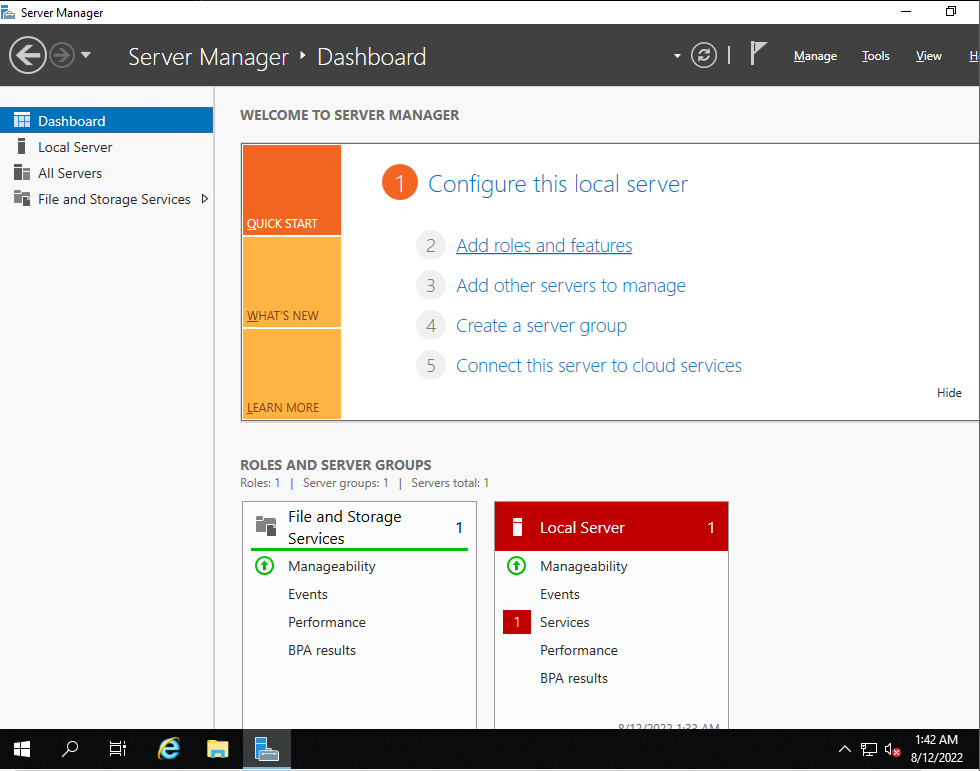
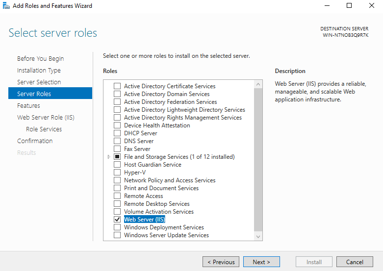
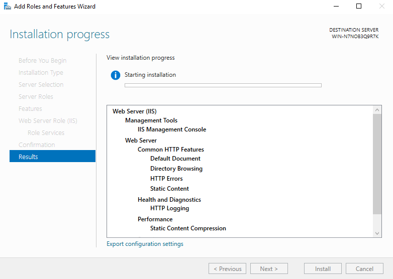
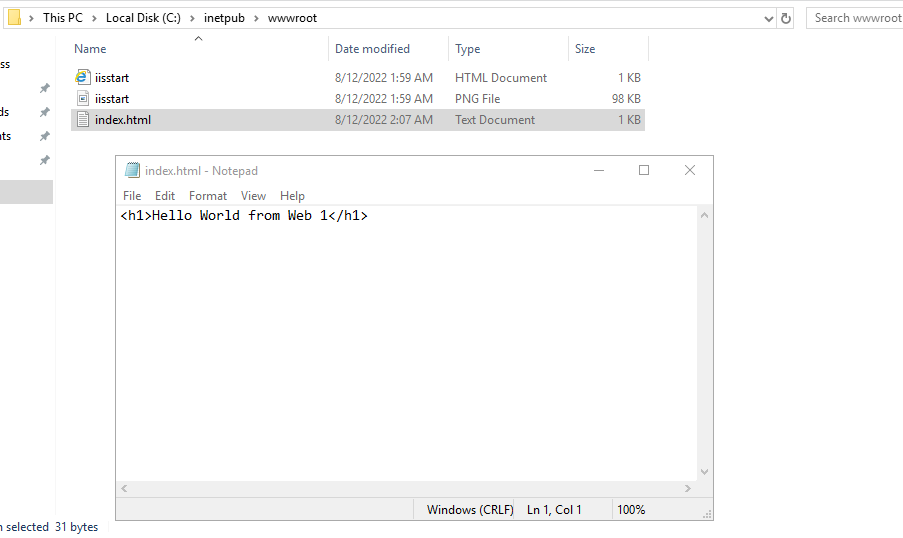
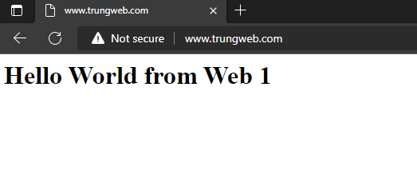
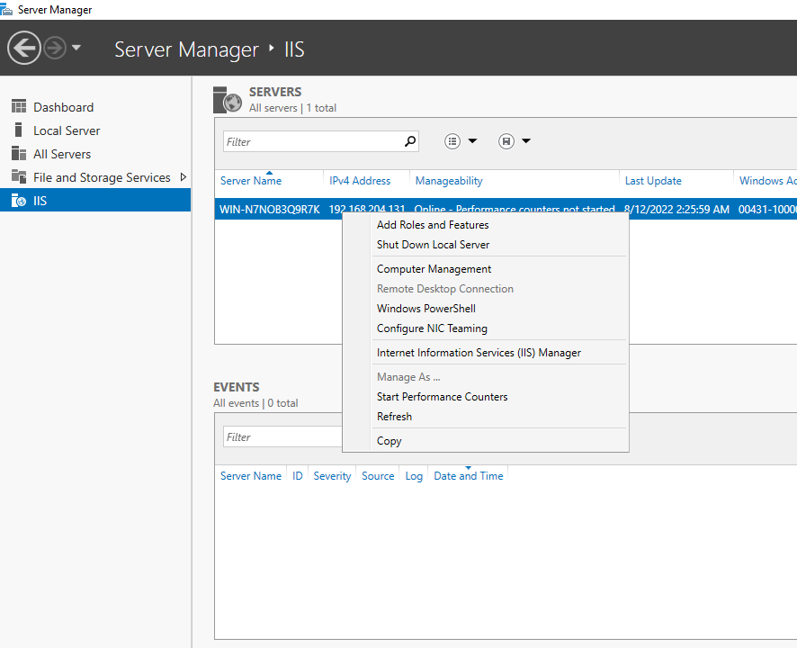
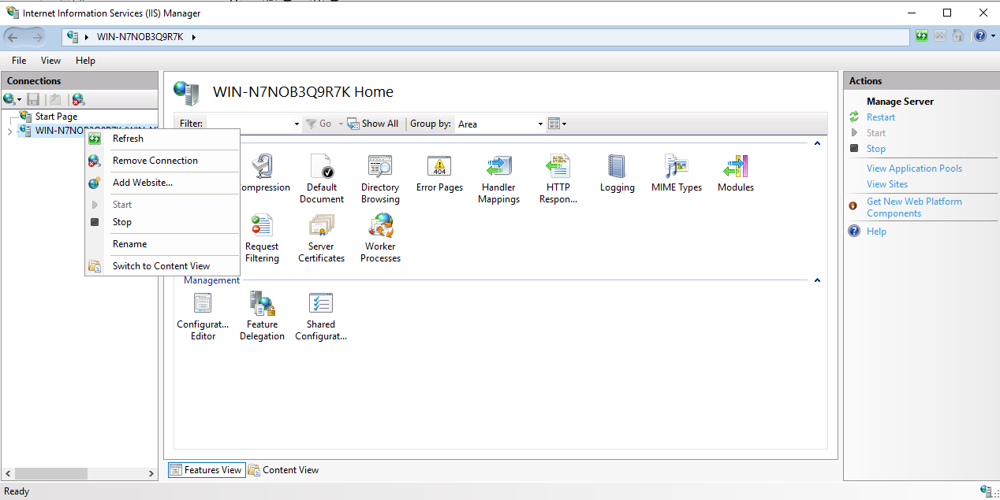
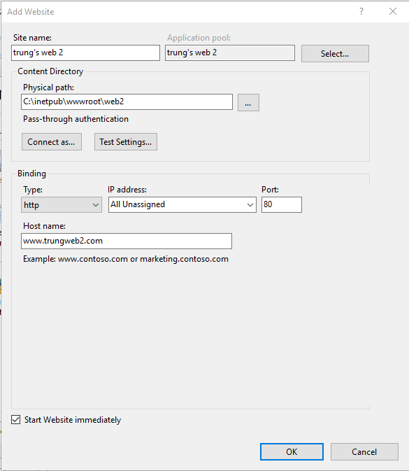
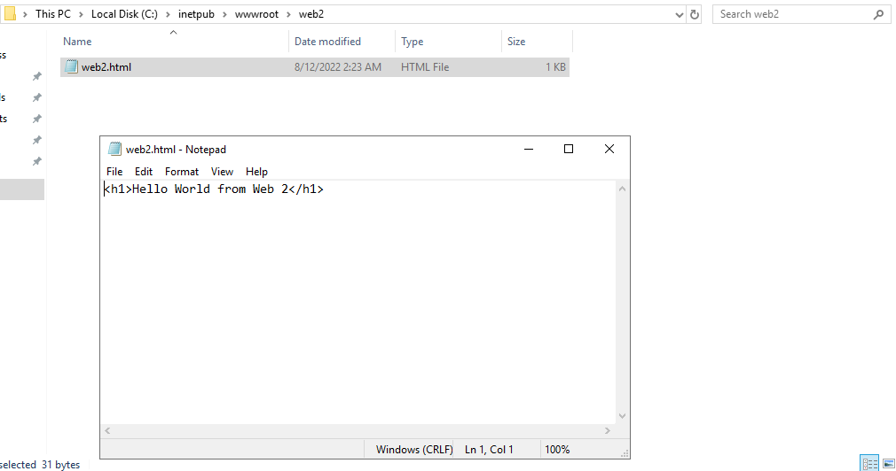
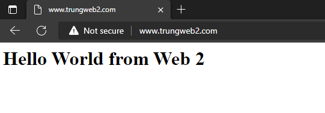

# Cài đặt webserver IIS trên Windows Server 2019

## Cài đặt IIS

1. Ở giao diện quản lý của windows server, chọn ```add roles and features```



2. Tick chọn ```Web Server (IIS)```



3. Next và Install, sau đó chờ quá trình cài đặt hoàn tất



4. Ở đường dẫn ```C:\inetpub\wwwroot\```, tạo 1 file html để kiểm tra hoạt động của IIS



5. Truy cập trang web bằng địa chỉ IP hoặc bằng tên miền của server



## Tạo thêm web trong IIS

1. Ở giao diện quản lý của windows server, chọn ```IIS```, chuột phải vào server và chọn ```Internet Information Service (IIS) Manager``` để vào trình quản lý IIS



2. Click chuột trái chọn máy tính muốn add thêm website, sau đó chuột phải vào và chọn ```Add Website...```



3. Cấu hình thông tin website mới



4. Tạo 1 file html ở đường dẫn của website mới để kiểm tra hoạt động



5. Truy cập trang web mới tạo bằng tên miền đã cấu hình 

