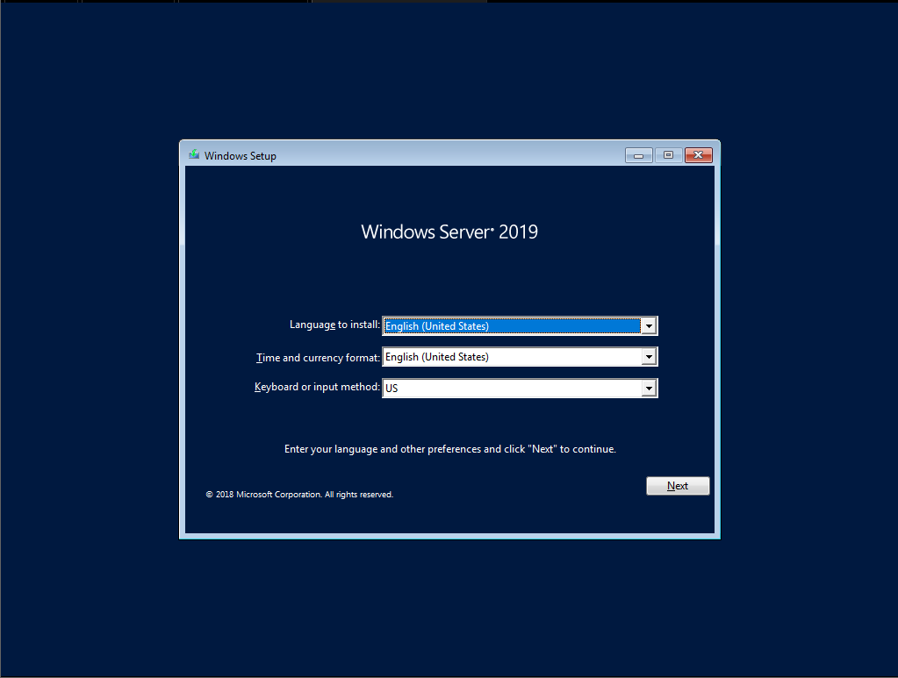
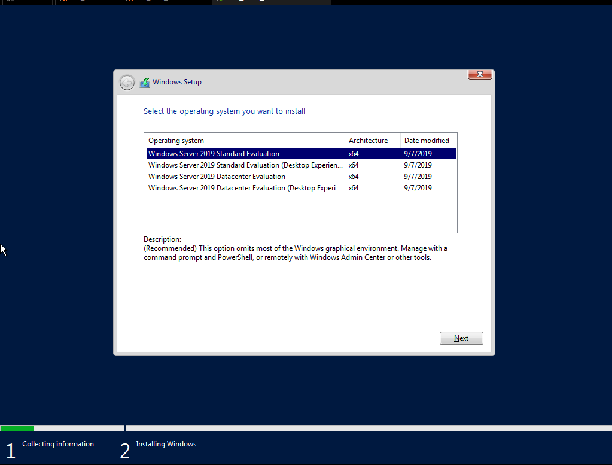
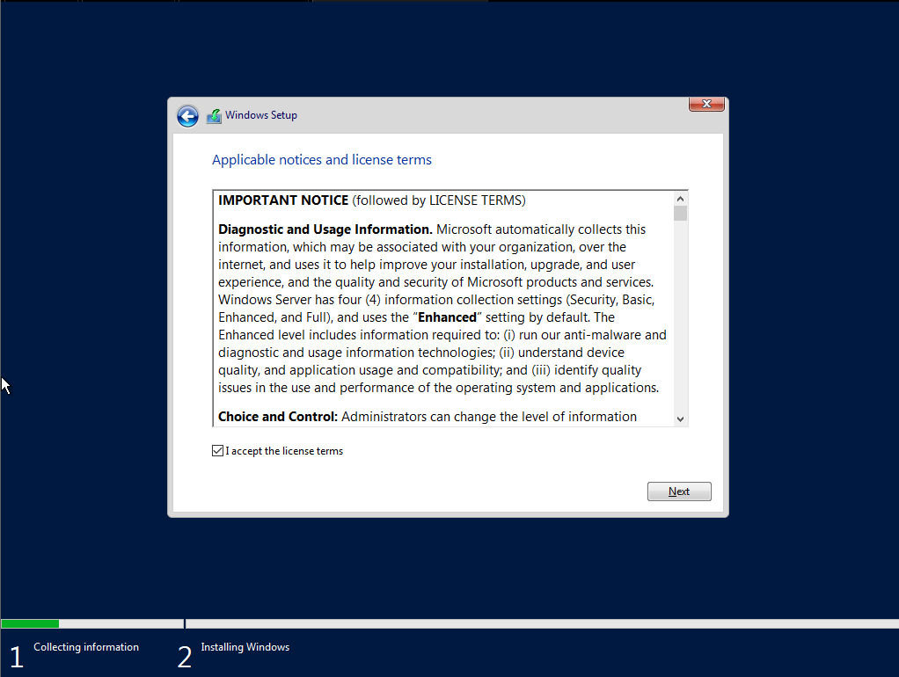
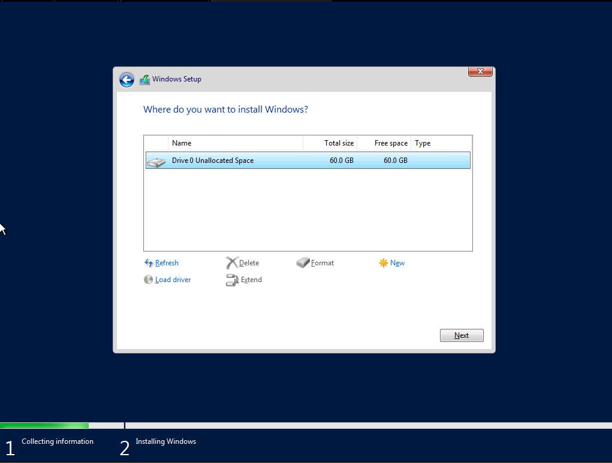
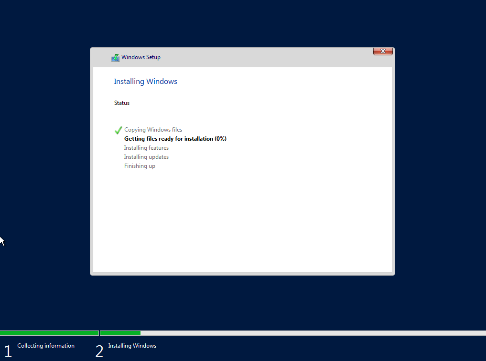
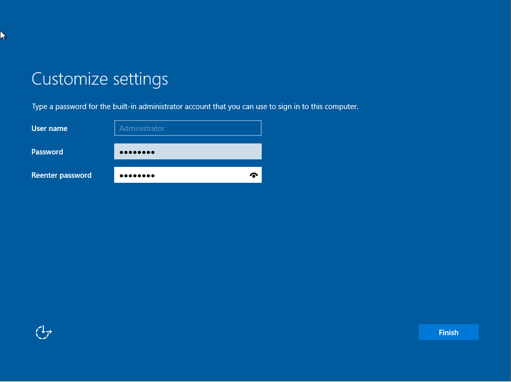
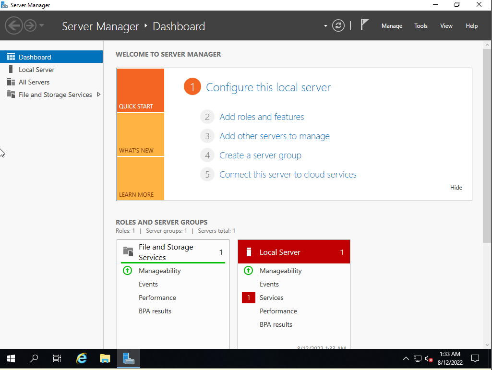

# Cài đặt Windows Server 2019

## Tạo máy ảo VMware chuẩn bị cho việc cài đặt Windows server 2019

Các bước tạo máy ảo thực hiện như bình thường

## Cài đặt Windows server 2019 trên máy ảo VMware

1. Download file iso cài đặt tại

https://www.microsoft.com/en-us/evalcenter/download-windows-server-2019

2. Đưa đĩa cài vào, khởi động máy ảo VMware

3. Lựa chọn ngôn ngữ

4. Chọn phiên bản hệ điều hành

5. Chấp nhận điều khoản dịch vụ

6. Chọn kiểu cài đặt hđh, ở đây ta chọn custom để cài đặt mới

7. Chọn ổ đĩa cài đặt hđh

8. Chờ đợi quá trình cài đặt hoàn tất

9. Đặt mật khẩu cho tài khoản admin

10. Hoàn tất, giao diện trình quản lý của windows server

