# Cài đặt WordPress lên IIS

#### 1. Cài đặt PHP

- Mở ```IIS Manager``` -> Chọn ```Get New Web Platform Components```

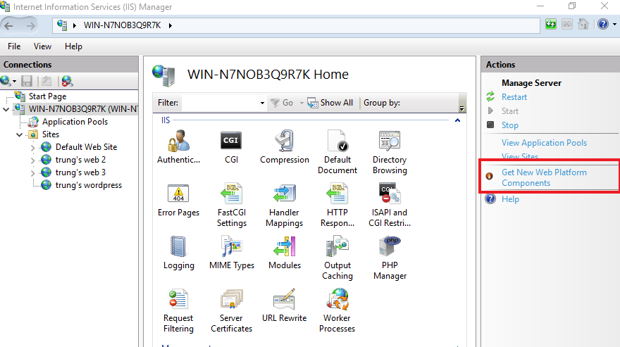

- Tải về ```Web Platform Installer```

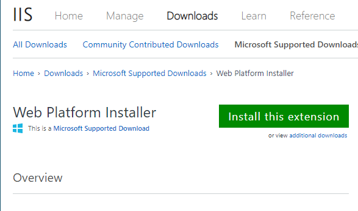

- Mở ```Web Platform Installer```


- Tìm kiếm và cài đặt phiên bản PHP mong muons (với WordPress thì nên cài PHP 7.4 trở lên)

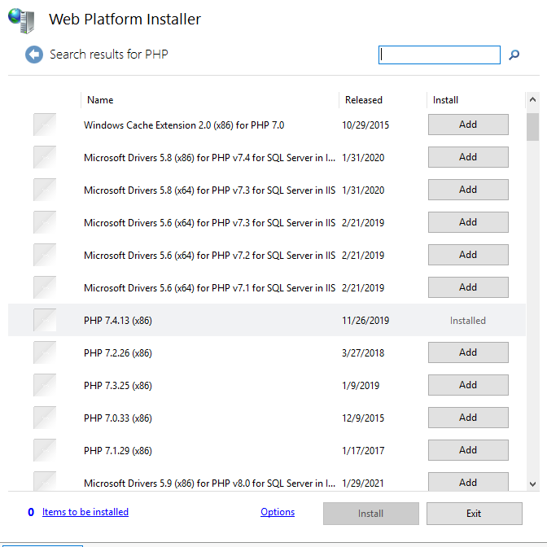

- Tải và cài đặt ```PHP Manager``` tại [đây](https://www.iis.net/downloads/community/2018/05/php-manager-150-for-iis-10)

#### 2. Cài đặt MariaDB

- Tải MariaDB tại trang chủ [MariaDB](https://mariadb.org/download/?t=mariadb&p=mariadb&r=10.6.5&os=windows&cpu=x86_64&pkg=msi&m=inet)

- Chạy file cài đặt

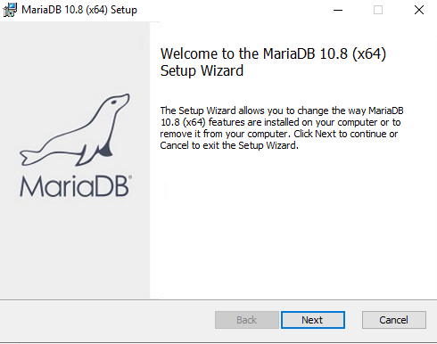

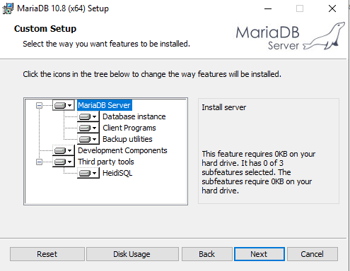

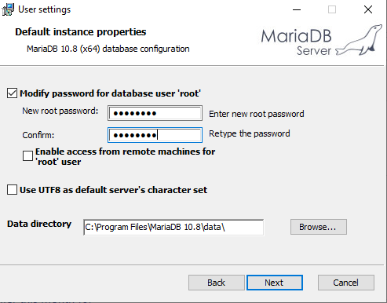

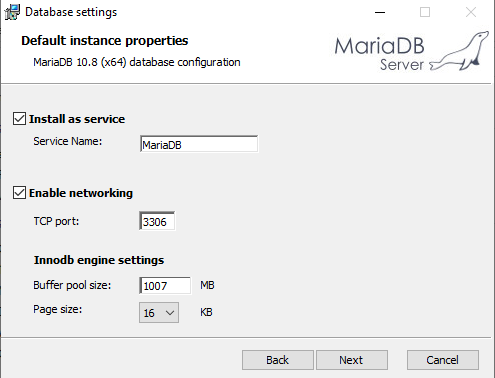

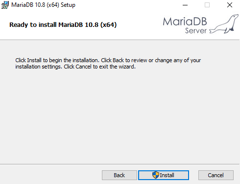

- Sau khi cài đặt hoàn tất, vào ```HeidiSQL```, chọn ```New``` để tạo Session mới và đổi tên cũng như thông tin của Session vừa tạo như trong ảnh sau:

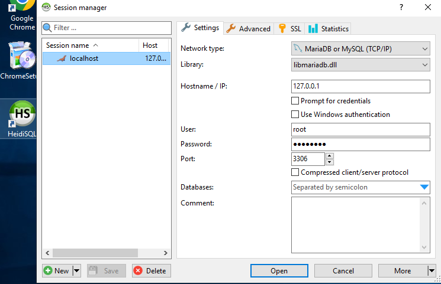

- Chuột phải vào Session vừa tạo, chọn ```Create new``` -> ```Database``` (hoặc sử dụng query cho lẹ)

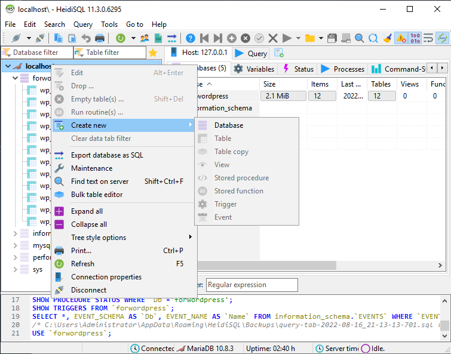

- Chọn ```Manager user```

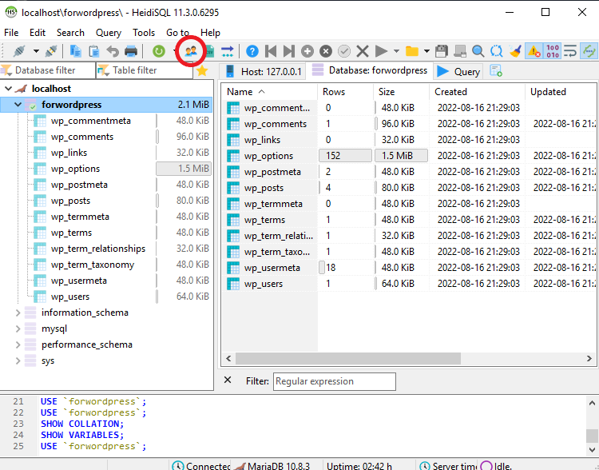

- Chọn ```Add``` để thêm user mới với tên là ```admindb```, "From host" để ```Access from everywhere``` và mật khẩu tự chọn, cũng như cấp toàn quyền cho user này bằng cách tick vào ```Global privileges```

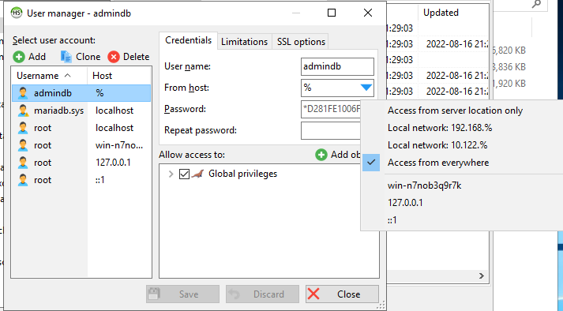

#### 3. Cài đặt WordPress

- Tải xuống source code WordPress tại trang chủ [WordPress](https://wordpress.org/download/)

- Tạo 1 thư mục ở đường dẫn ```C:\inetpub\wwwroot\```, giải nén và copy toàn bộ nội dung của file nén wordpress đã tải vào thư mục vừa tạo

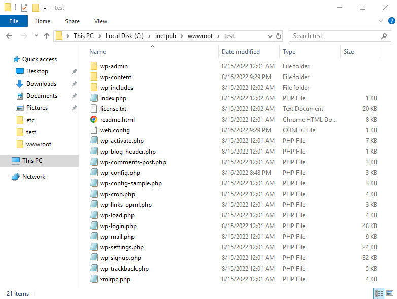

- Copy file ```wp-config-example.php``` và paste ngay tại đó với tên ```wp-config.php```, đồng thời sửa những nội dung sau phù hợp với database vừa tạo


#### 4. Tạo website quan trị WordPress

- Vào ```IIS Manager```, chuột phải vào ```Sites``` và chọn ```Add Website```

- Điền thông tin và dẫn Physical path tới thư mục chứa source code WordPress

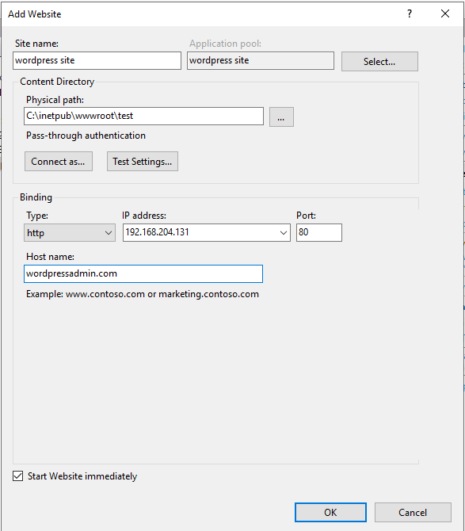

- Chọn ```Connect as...``` -> ```Specific user``` -> ```Set``` sau đó nhập user và pass của tài khoản Administrator của server

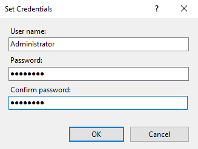

- Ở giao diện ```IIS Manager```, vào sites vừa tạo cho wordpress và vào phần ```PHP Manager```

- Nhấn vào ```View recommendations``` và tích chọn tất cả các option rồi ấn ```OK```

#### 5. Truy cập trang quản trị WordPress

- Truy cập vào đường dẫn ```<tên_miền>:80/wp-admin``` để vào trang quản trị WordPress

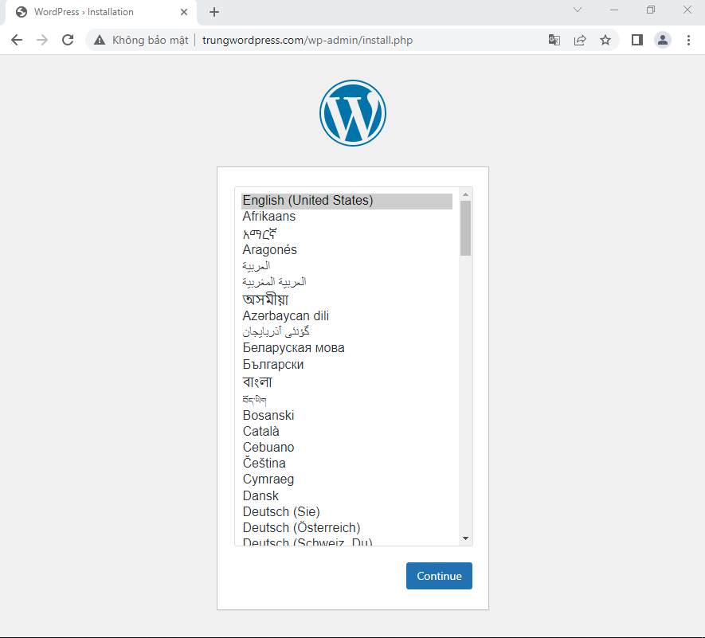

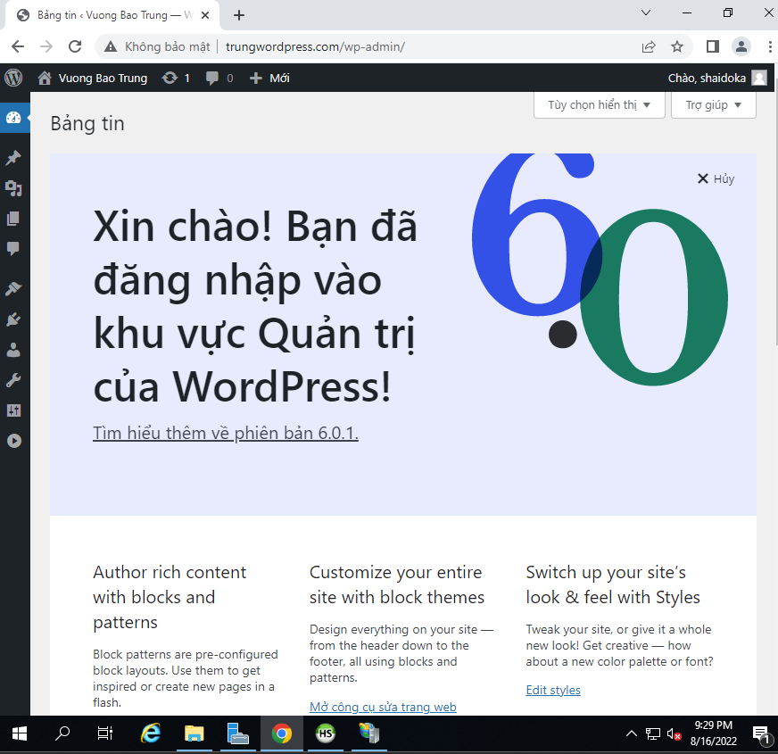