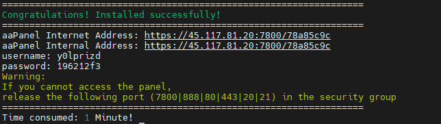

# Cài đặt aaPanel trên hđh CentOS 7

- Update hệ thống, tắt các dịch vụ có khả năng xung đột cổng

```sh
yum -y update
systemctl stop httpd
systemctl disable httpd
systemctl stop nginx
systemctl disable nginx
```

- Tải và cài đặt aaPanel 

```sh
yum -y install wget
wget -O install.sh http://www.aapanel.com/script/install_6.0_en.sh
bash install.sh
```



*Thông tin đăng nhập có thể thay đổi sau nhưng vẫn nên lưu lại*

