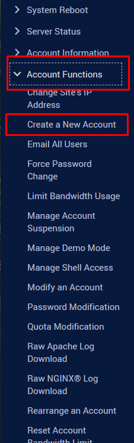
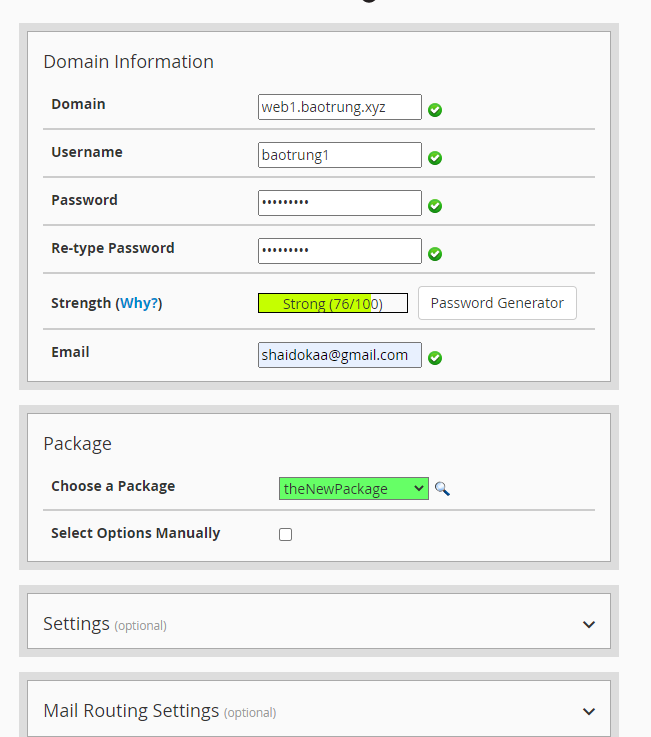
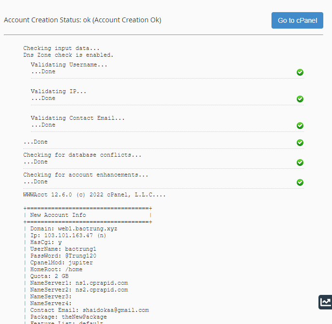
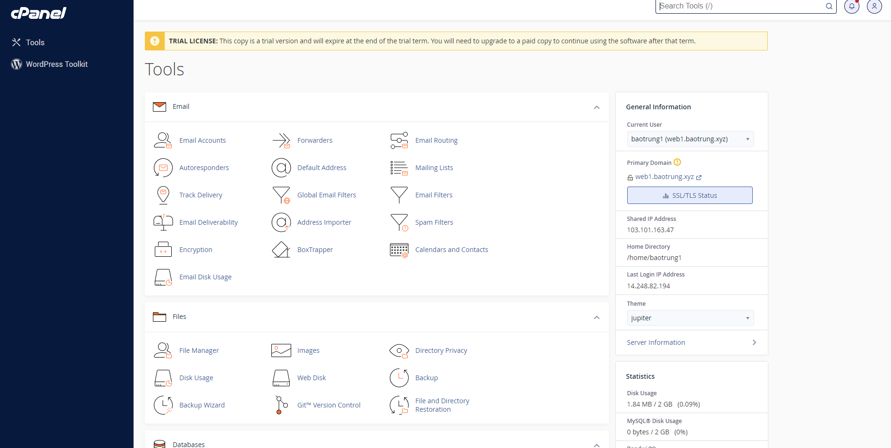
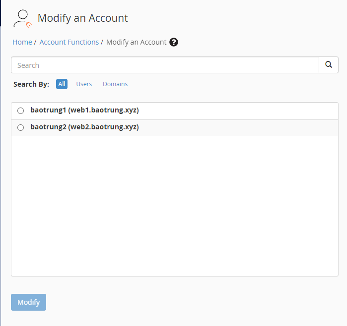
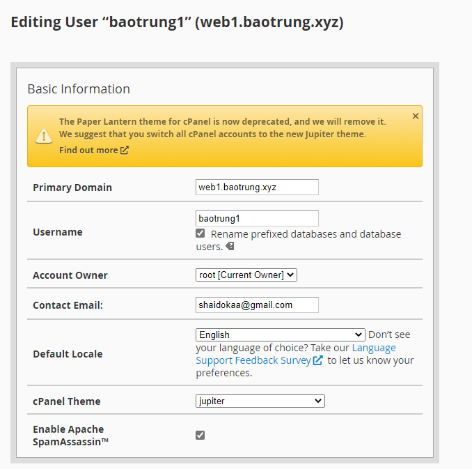
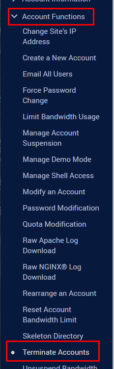
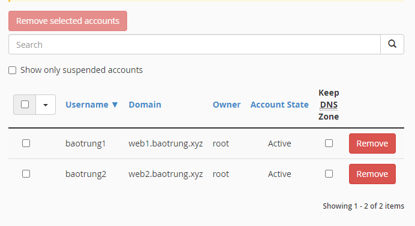
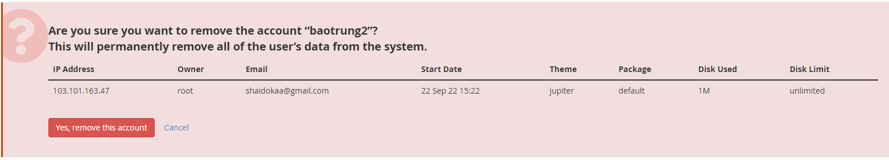

# Account trong cPanel

#### 1. Tạo Account

- Mỗi Account ứng với 1 domain/subdomain
- Trên thanh **Navigation**, chọn ```Account Functions``` -> ```Create a New Account```



- Nhập các thông tin cho account và chọn gói package, sau đó ```Create``` để tạo mới account



- OK



- Trang quản trị cPanel của Account



#### 2. Chỉnh sửa Account

- Vẫn tại mục ```Account Functions```, chọn ```Modify an Account```


- Chọn account muốn chỉnh sửa



- Chỉnh sửa thông tin sau đó nhấn ```Save```




#### 3. Xóa Account

- Tiếp tục tại phần ```Account Functions```, chọn ```Terminate Accounts```



- Nhấn nút ```Remove``` ở cạnh account muốn xóa



- Nhấn ```Yes, remove this account``` sau khi đã chắc chắn

