# Backup và Restore trong cPanel

### Full Backup/Restore

- cPanel cung cấp các tùy chọn để sao lưu và khôi phục lại dữ liệu
- Để truy cập, chọn ```Backup``` trong mục ```FILES```


- Để sao lưu toàn bộ, chọn ```Download a Full Account Backup```, chọn vị trí lưu đích, lựa chọn thông báo và chọn ```Generate Backup``` để tiến hành tạo bản sao lưu

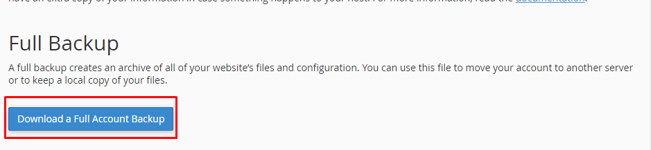

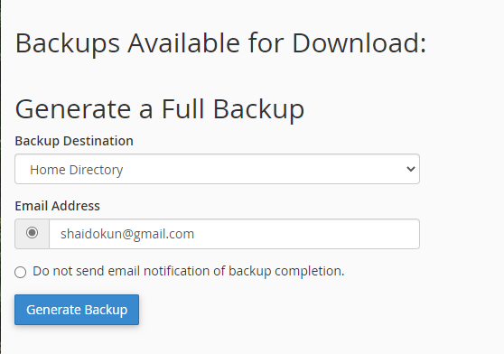

- Quá trình Backup đang diễn ra

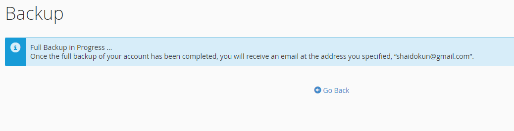

- Sau khi backup xong thì chọn bản backup muốn download về, bản backup này có thể sử dụng để di chuyển hosting sang server khác hoặc sử dụng để lưu giữ 1 bản sao của file/folder


- Để Restore từ file full backup, ta đăng nhập vào giao diện quản trị WHM, chọn ```Transfers``` -> ```Transfer or Restore a cPanel Account```

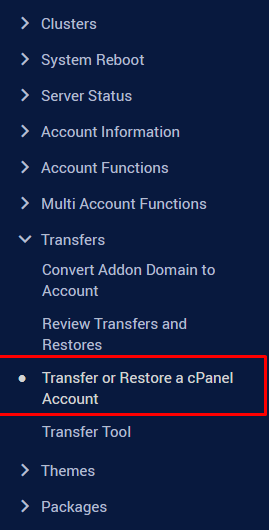

- Tùy chỉnh các option để trước khi tiến hành Restore

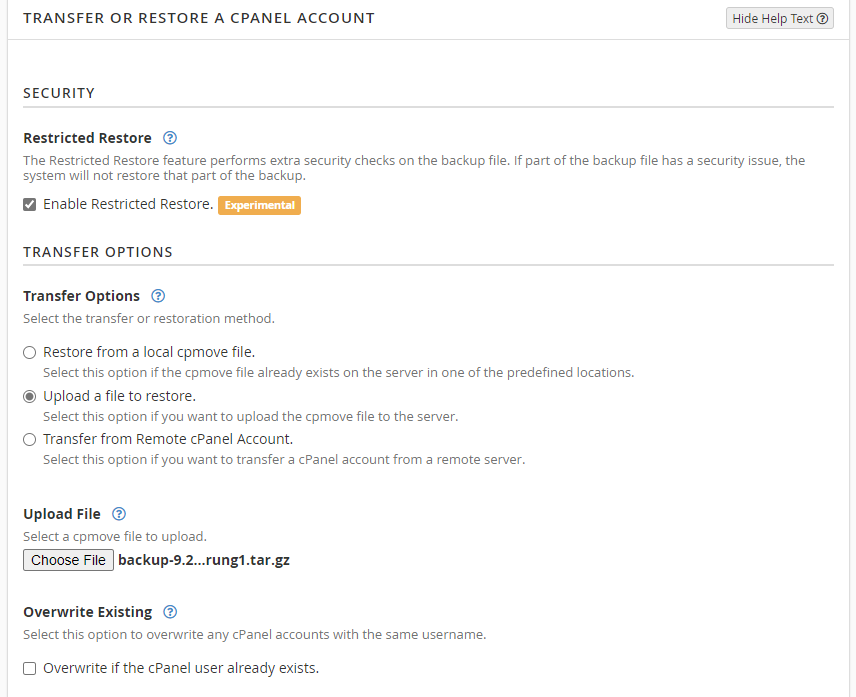

- Trong đó:
    - **Restricted Restore:** là chức năng khiến hệ thống thực hiện thêm các kiểm tra bảo mật trên tệp tin backup. Nếu 1 phần của tệp tin có 1 vấn đề nào về bảo mật, hệ thống sẽ không thực hiện khôi phục phần đó của tệp tin lưu trữ. Lựa chọn này sẽ làm giảm những rủi ro của việc di chuyển file từ những nguồn không quen thuộc
    - **Transfer Options:** lựa chọn phương thức transfer/restore (từ local cpmove file/upload 1 cpmove file để restore/ di chuyển dữ liệu từ account cPanel từ xa)
    - **Overwrite Existing:** nếu bạn muốn overwrite account với dữ liệu ở trong backup file, hãy chọn option này
    - Cuối cùng, chọn sẽ thay thế toàn bộ địa chỉ IP của server cũ bằng địa chỉ mới hay chỉ thay thế các bản ghi A cơ bản được cung cấp bởi cPanel ở trong tệp tin zone
    - Sau khi chắc chắn, chọn ```Restore``` để tiến hành khôi phục

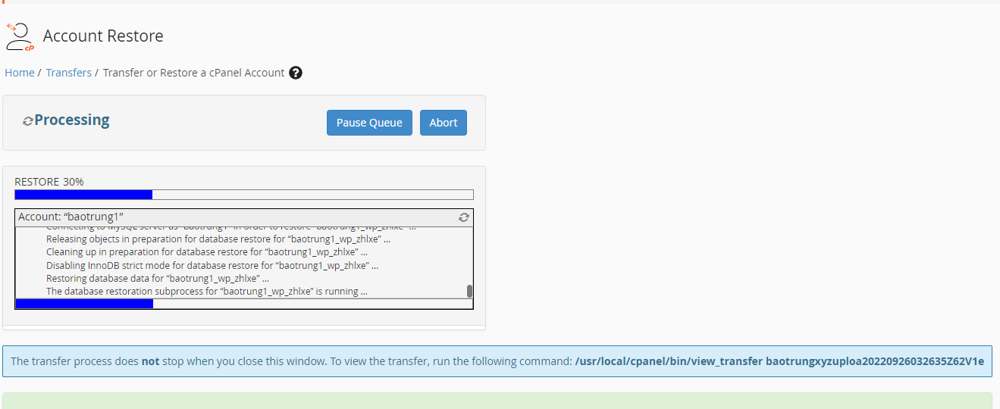

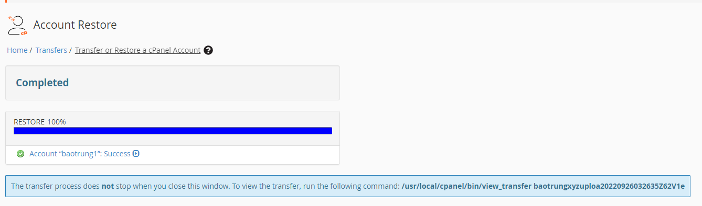

### Partial Backup/Restore

- Với sao lưu từng phần cũng tương tự, ta chọn bản sao lưu muốn tải về và quá trình download sẽ được diễn ra tự động

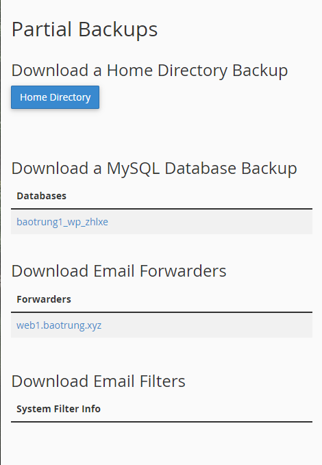

- Muốn khôi phục, ta chỉ cần chọn file sao lưu đã được tải về từ trước và nhấn ```Upload```

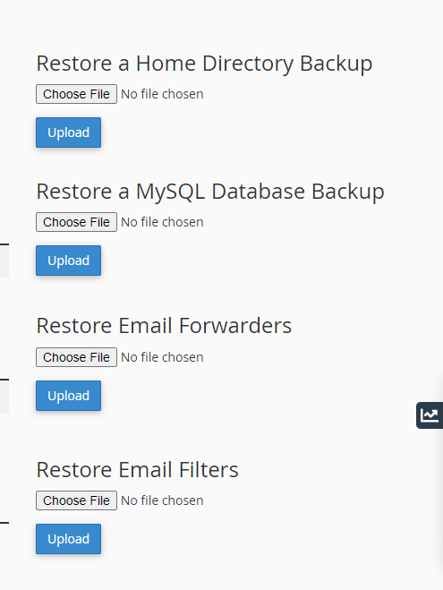

- Tạo 1 vài bài viết trước khi backup


- Chọn Database muốn tải bản backup về

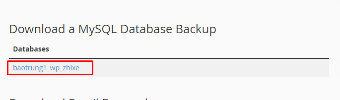

- Xóa bài viết trên wordpress trước khi restore


- Chọn file backup rồi nhấn upload để restore

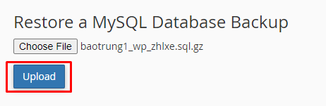

- Restore thành công

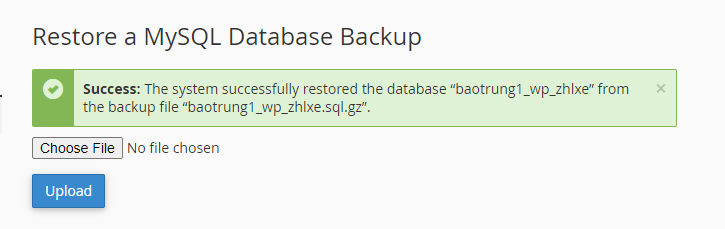

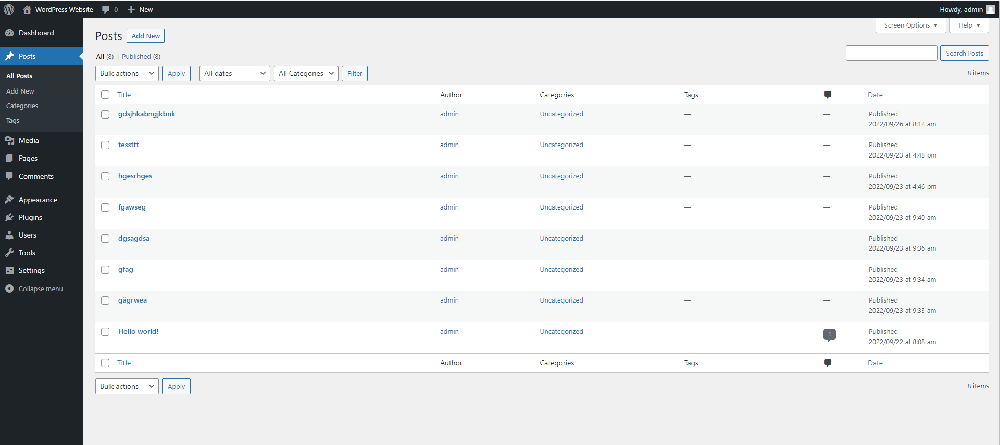

