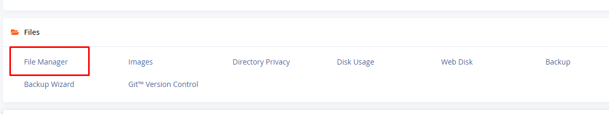
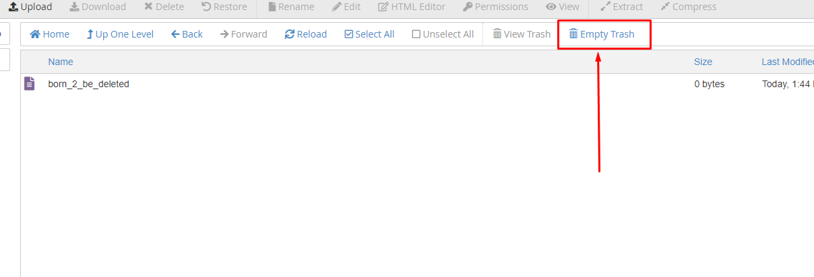
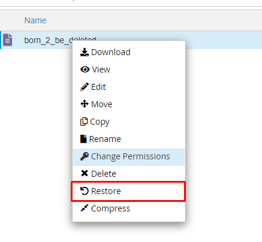

# Xóa bỏ trash trong cPanel

- Để xóa bỏ trash trong cPanel (dọn sạch thùng rác), hãy thực hiện theo các bước sau:

- Truy cập ```File Manager```



- Chọn ```View Trash```

- Chọn ```Empty Trash``` nếu muốn xóa toàn bộ file trong thùng rác



- Hoăc chuột phải vào và chọn ```Restore``` để phục hồi



