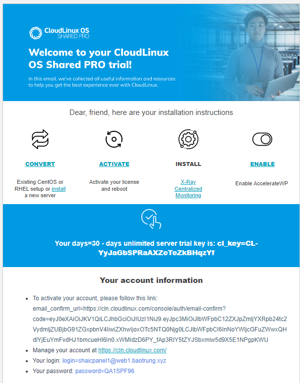

# Cài đặt CloudLinux trên VPS sử dụng WHM/cPanel

CloudLinux OS là hđh được thiết kế dành riêng cho các nhà cung cấp dịch vụ hosting, bắt đầu được phát triển từ năm 2009 bởi CloudLinux Inc. CloudLinux sử dụng nền tảng lõi của OpenVZ và hoàn toàn tương thích với các gói phần mềm của CentOS/RHEL. Về mặt tính năng và đặc tính kỹ thuật, CloudLinux được thiết kế để làm tăng sự ổn định cũng như tăng khả năng bảo mật của máy chủ, đồng thời tối ưu hóa khả năng xử lý của máy chủ bằng cách phân chia giới hạn tài nguyên CPU, RAM, IO đến từng tài khoản hosting. Hai thành phần quan trọng nhất của CloudLinux là Lightweight Virtualized Environment (LVE) và CageFS

**Lightweight Virtualized Environment (LVE)** là công nghệ lõi có nhiệm vụ phân chia, giới hạn tài nguyên máy chủ cho từng tài khoản hosting nhằm hạn chế việc 1 tài khoản sử dụng quá nhiều tài nguyên dẫn đến quá tải hệ thống máy chủ hosting

**CageFS** là công nghệ nổi trội của CloudLinux có nhiệm vụ tạo ra các phân vùng hệ thống ảo tránh các tài khoản hosting có thể nhìn thấy nhau, từ đó ngăn chặn hoàn toàn việc chiếm quyền cũng như can thiệp đến dữ liệu các tài khoản khác trong cùng hệ thống

## Các bước cài đặt

**Bước 1: Chuẩn bị License CloudLinux**

- Đăng ký bản thử nghiệm 30 ngày tại đây [Cloud Linux](https://www.cloudlinux.com/trial/)



**Bước 2: Cài đặt CloudLinux OS**

- SSH vào VPS với quyền root và chạy các lệnh sau

```sh
wget https://repo.cloudlinux.com/cloudlinux/sources/cln/cldeploy
sh cldeploy -k <your_key>
reboot
```

*Bị lỗi ở đoạn này với thông báo là conflict phiên bản kernel dù đã update kernel lên mới nhất*

- Sau khi khởi động lại, ta dùng lệnh sau để check phiên bản CloudLinux

```sh
cat /etc/redhat-release
```

**Bước 3: Thiết lập CloudLinux trên WHM/cPanel**

- Truy cập trang quản trị WHM, tìm đến phần CloudLinux LVE Manager 

