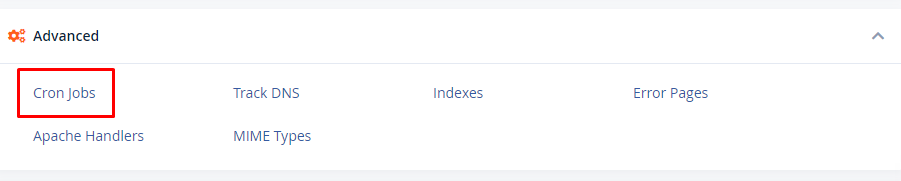
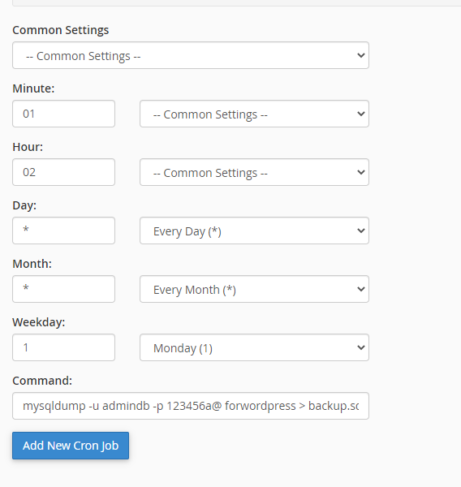
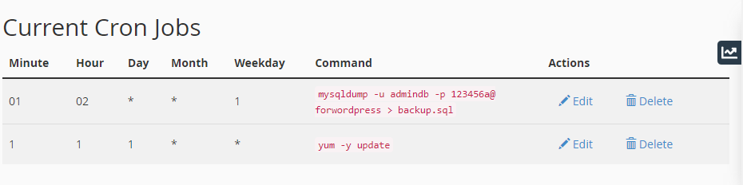

# Quản lý Cronjobs trong cPanel

- Cronjobs giúp thực thi các lệnh 1 cách tự động khi tới điều kiện thời gian đã thiết lập trước

- Để mở trang quản lý Cronjobs, truy cập trang cPanel, ở tab ```ADVANCED```, chọn ```Cron jobs```



- Nhập thông tin Cron jobs và chọn ```Add New Cron job``` để tạo Cron jobs



- Quản lý Cron jobs


